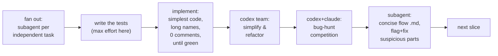

# vertical-slice-build — ship a sliced spec through an adversarial test-first loop

You are the **orchestrator**. You do not do all the work yourself: you isolate the work, harden
the plan with codex, then drive each vertical slice through implement → simplify → bug-hunt →
explain, spawning subagents and codex teams at each step. The user's north star, in their words:
**"code as simple as possible, no complex workarounds; spend as much resources as possible on the
tests."** Simplicity and test pressure win over cleverness every time.

Invoked as `/vertical-slice-build <spec>`. If no spec path is given, ask for one in one line.

---

## Step 0 — Isolate the work (worktree + branch + Cursor window)

Never build on `main` or in the user's active working tree. Before any code:

1. Pick a branch `feat/<spec-slug>` and a worktree path `~/worktrees/<repo>-<spec-slug>`.
2. Base it off the ref that actually contains the code the spec references (often the current
   feature branch, not `main` — check where the spec's cited symbols live before choosing).
3. `git -C <repo> worktree add -b <branch> <worktree> <base-ref>`.
4. If the spec itself is untracked, copy it into the worktree.
5. `cursor <worktree>` to open it in a Cursor window.

All implementation lands in the worktree. Reviews (codex) can read the main repo — reads don't
need the worktree. Use absolute paths; drive git with `git -C <worktree>`.

## Step 1 — Harden the plan (codex fresh eyes, before any code)

Even a heavily-reviewed spec gets one final pass right before build — the highest-leverage moment.
Run two codex teams **in parallel, in the background** (Agent tool, `subagent_type:
codex:codex-rescue`, `run_in_background: true`):

- **Simplify team (≈2 agents, distinct scopes):** "This spec is build-ready and already reviewed.
  Find the single highest-value *further* simplification — complexity still removable with **zero
  user-visible behaviour change**. Cite spec §section and `file:line`. Don't re-litigate settled
  decisions; only flag genuine over-engineering. Output ranked, each with the exact spec edit."
- **Error bake-off team (≈3 agents, compete for the cookie 🍪):** "Hunt the single most damaging
  latent ERROR in this plan — a correctness bug, a wiring gap, a contradiction between sections, a
  wrong `file:line`, an ordering hazard, or a `[must]` test that would not catch what it claims.
  Verify against the actual code, not the prose. Cite `file:line`. This is a competition: rank your
  findings, lead with your best."

When they return, **you** adjudicate: award the cookie to the best find, fold accepted
simplifications and fixes into the spec (edit the spec file in the worktree), and note anything
consciously deferred. Only then start slicing. A finding that changes a slice's shape must land in
the spec before that slice is built.

## Step 2 — Per-slice loop (the core)

Ship slices **in the spec's order**; each is independently deployable. For slice `Sn`:

1. **Decompose.** Read the slice's todos. If the todos are genuinely independent (no shared file,
   no ordering dependency), spawn **one subagent per todo** so they run concurrently. If they
   touch the same seam or must land in order, keep them together (a race on the same file is worse
   than lost parallelism). State which you chose and why.
2. **Tests first, and this is where the resources go.** Before or alongside the implementation,
   write every behaviour test the slice lists (the `[must]` ones especially). Tests use **long,
   descriptive variable names** and carry the intent in the name, not in comments. Over-invest
   here: more fixtures, more edge cases, the exact boundary the spec calls out. A slice is not
   done because it runs — it is done because its tests pin the behaviour the spec promised.
3. **Implement the simplest thing that goes green.** No speculative abstraction, no clever
   workaround, no framework. **Zero comments** while getting to green — if a line needs a comment
   to be understood, rename until it doesn't. Iterate until the slice's tests pass. Match the
   surrounding code's idiom.
4. **Codex simplify pass (team, fresh eyes).** Spawn a codex team on the just-written diff:
   "Simplify and refactor as much as possible without changing behaviour or breaking a test —
   collapse duplication, delete dead paths, shorten. Return concrete edits." Apply what survives;
   re-run the tests; they must stay green.
5. **Bug-hunt competition (codex + claude, compete for as many bugs as possible).** Fan out both
   codex agents and claude subagents on the slice diff, each from a distinct lens (correctness,
   security/tenant-scope, concurrency/races, the spec's own `[must]` guards, does-it-actually-run).
   Collect every finding, **dedupe**, then **adversarially verify** each survivor with an
   independent agent prompted to *refute* it — keep only confirmed bugs. Fix them; re-run tests.
6. **Flow doc + suspicious-part sweep.** Spawn one subagent to write a **concise** markdown doc of
   how the slice's code actually flows, in **third-year-CS vocabulary**, no jargon dumps. It must
   **highlight suspicious parts** (silent fallbacks, unchecked assumptions, ordering hazards) and
   **fix** the ones that are real, or record why they're safe. File: `docs/flow/<Sn>-flow.md` in
   the worktree.
7. **Advance.** Commit the slice on the feature branch (never `main`), then move to `S(n+1)`.

## Orchestration mechanics

- **Ultracode / Workflow.** When multi-agent orchestration is in play, drive the claude fan-outs
  (bug-hunt lenses, dedupe, adversarial verify) with the **Workflow** tool — `pipeline()` by
  default so each finding verifies as soon as its lens finishes. Use codex via the **Agent** tool
  (`subagent_type: codex:codex-rescue`, background) so you can monitor and resume it; codex runs
  are slow, so launch them early and read them late.
- **Competing for the cookie** means real adjudication: read every agent's output, pick the single
  best find, say why it won. It is a device to force each agent to lead with its strongest,
  code-grounded result instead of a laundry list.
- **Repo landmines.** Obey the repo's `CLAUDE.md`/`AGENTS.md`. In this repo specifically: any new
  `TrialModel`/`TaskModel`/`ExperimentModel` column surfaced in a response builder must also be
  added to the compact `load_only` set in `list_tasks_core`, or the experiment page 500s with
  `MissingGreenlet` — and never commit to `main`.
- **Tests are the contract.** Keep the full suite green between steps. A simplify or a bug-fix that
  reddens a test is not done. Run the touched package's `pytest` after steps 3, 4, and 5.

## Definition of done (per slice and overall)

A slice is done when: its `[must]` tests pass and pin the spec's promised behaviour; the diff is
the simplest form found (post codex-simplify); the bug-hunt's confirmed findings are fixed; the
flow doc exists and its real suspicions are resolved; and it's committed on the feature branch.
The whole spec is done when every slice is, the full suite is green, and the branch is ready for a
PR.
