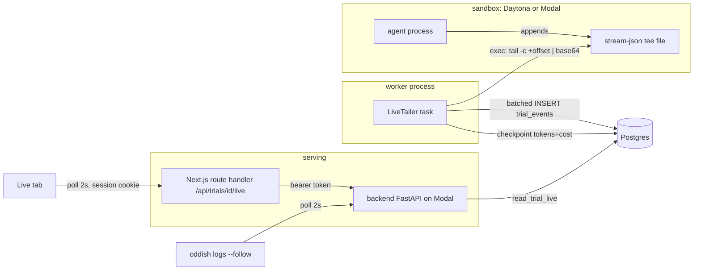
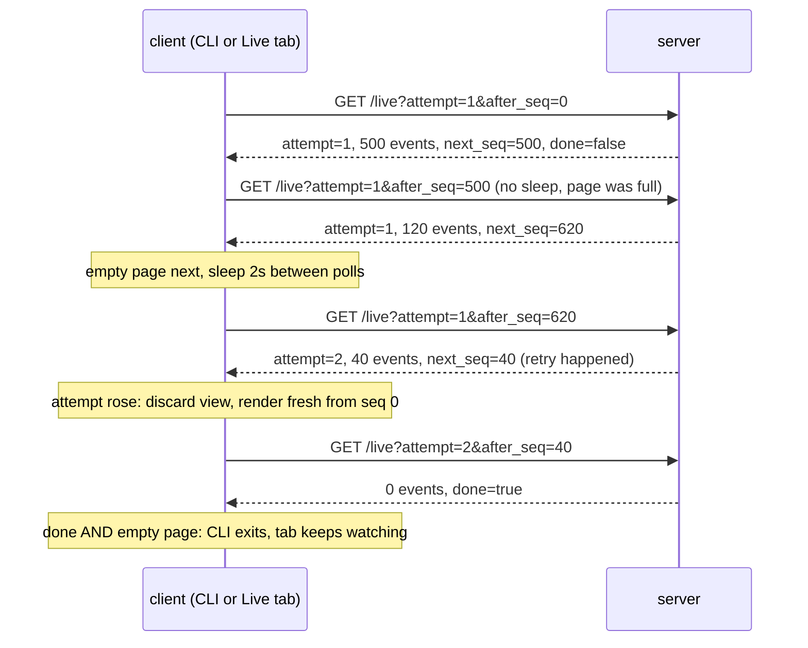

# Live streaming architecture, from first principles

Study notes for the harbor live-streaming MVP (PR #612). Uncommitted, personal.
Every claim below is anchored to executable code; comments are not evidence.
Spec: [docs/superpowers/specs/harbor-live-streaming-mvp.md](docs/superpowers/specs/harbor-live-streaming-mvp.md).

## 1. The problem, stated precisely

Before this feature, a trial was a black box between "started" and "finished".
The agent (Claude Code) runs inside a remote sandbox. Its transcript reaches S3
only after the trial ends. An operator watching a 40-minute trial sees a stage
label and nothing else, and the money the trial is burning is invisible until
settlement.

The goal: while a trial runs, show its transcript and its cost, in the CLI and
in the dashboard, a few seconds behind real time.

Three constraints shape every decision that follows. Understand these and the
whole design becomes forced moves.

1. **The producer cannot be instrumented.** The agent is arbitrary third-party
   code inside a Daytona or Modal sandbox. You cannot add a callback to it. The
   only channel into the sandbox is `exec`: run a shell command, get stdout
   back. There is no inbound network path to the sandbox, so it cannot push.
2. **The serving stack is serverless.** The API is FastAPI served by Modal
   behind a Next.js proxy. Containers are recycled, proxies buffer, idle
   connections are reaped. A long-lived connection (SSE, WebSocket) makes the
   flakiest component load-bearing.
3. **Trials retry.** The queue can restart a trial in place: same `trial_id`,
   new attempt, transcript starts over. Any consumer state keyed only on
   `trial_id` is wrong.

## 2. Topology

The repo is three packages. `oddish/` is the open-source core (CLI, server,
worker, all domain logic). `backend/` is the hosted cloud layer; it does not
reimplement logic, it imports it: see
[backend/api/routers/trials.py:23](backend/api/routers/trials.py#L23),
`from oddish.core.trial_live import read_trial_live`. `frontend/` is the
Next.js dashboard. A third year usually knows monorepos; the point worth
learning is the direction of the import arrow: hosted layer depends on core,
never the reverse, so the core stays deployable without the cloud.



Two different poll paths on purpose. The CLI holds an API key and talks to the
backend directly. The browser holds a Clerk session cookie; section 11 explains
why it cannot talk to the backend directly.

## 3. Producer side: tailing a process you cannot instrument

Given constraint 1, the only design left is pull: periodically exec a read
command inside the sandbox. The whole producer is one command, built at
[live_tail.py:230](oddish/src/oddish/workers/harbor/live_tail.py#L230):

```
set -o pipefail; tail -c +{offset+1} '{CLAUDE_LOG_PATH}' 2>/dev/null | head -c {MAX_CHUNK_BYTES} | base64 | tr -d '\n'
```

Derive each piece rather than memorizing it.

**Why `-c` (bytes) and not `-n` (lines)?** A byte offset is a resumable cursor:
the reader stores one integer and the next read continues exactly where the
last one ended, whether or not the writer was mid-line. Lines are not a stable
unit; the file may end in half a line at any instant. Note `+{offset+1}`
because `tail -c +N` is 1-indexed.

**Why `head -c`?** Bounded memory per tick. Without a cap, a chatty agent makes
one exec return hundreds of megabytes through the exec transport.

**Why `base64`?** The exec channel returns stdout as text. The chunk boundary
can split a multi-byte UTF-8 character, and raw control bytes can be mangled in
transit. Base64 reduces the payload to 7-bit ASCII, so the bytes that arrive
are exactly the bytes read. The decode validates this:
[live_tail.py:245](oddish/src/oddish/workers/harbor/live_tail.py#L245) uses
`base64.b64decode(encoded, validate=True)` so a truncated transport surfaces as
an error instead of silent corruption.

**Why `set -o pipefail`?** A shell pipeline's exit status is the last command's
status by default. `base64` succeeds even when `tail` fails, so without
pipefail a dead file reads as an empty success forever. This flag is the
difference between "detects breakage" and "silently shows nothing".

The tick is pull-based, so a failed tick costs nothing: skip it, next tick
re-reads from the same offset. No state is lost because the file is the state.

## 4. Framing: byte streams do not have message boundaries

The chunk that arrives ends wherever `head -c` cut it: mid-line, mid-character.
Same situation as reading from a TCP socket. `recv` gives you bytes; messages
are your problem. The solution is the standard one, a carry buffer:

[live_tail.py:248](oddish/src/oddish/workers/harbor/live_tail.py#L248):

```python
lines, self.carry = split_lines(self.carry + raw)
self.offset += len(raw)
```

Prepend the leftover from last time, split on newlines, keep the trailing
partial line as the new leftover.

Question: why is `offset` advanced by `len(raw)`, the full chunk, rather than
by the length of the complete lines consumed? Answer it before reading on.
Because the two cursors track different things. `offset` tracks what has been
read from the file, and the partial line has been read; it lives in `carry`
now. Re-reading it next tick would duplicate bytes. The file cursor and the
framing buffer together are the reader's full state.

## 5. Accounting: at-least-once reads, effectively-once numbers

Claude Code's stream-json emits an `assistant` event per model turn, each
carrying `message.id` and `message.usage`, and usage is cumulative per id:
later events for the same id supersede earlier ones. If replayed or duplicated
lines are ever fed in twice, what must the fold do to stay correct?

Store, not sum. [live_tail.py:124](oddish/src/oddish/workers/harbor/live_tail.py#L124):

```python
self.usage_by_id[msg_id] = usage
```

A dict write is idempotent; feeding the same line twice changes nothing.
Summing events would multiply-count on any duplicate. This is the general
pattern for at-least-once pipelines, which is what this is (a tick can be
retried, a chunk boundary can replay a line after a crash): make the write a
function of a producer-supplied identity, then duplicates collapse.

The same trick appears one layer down at the storage write,
[live_tail.py:284](oddish/src/oddish/workers/harbor/live_tail.py#L284):

```python
stmt = pg_insert(TrialEventModel).values(rows).on_conflict_do_nothing()
```

`pg_insert ... ON CONFLICT DO NOTHING` is Postgres upsert syntax: if a row with
the same primary key `(trial_id, attempt, seq)` exists, skip it silently. An
insert batch that is retried after a partial failure re-inserts the survivors
as no-ops. At-least-once delivery plus idempotent writes gives you the only
"exactly once" that exists in practice.

## 6. Money must be monotone

The tailer prices the folded usage and checkpoints it onto the `trials` row.
Two rules, both at [live_tail.py:293](oddish/src/oddish/workers/harbor/live_tail.py#L293):

```python
if cost is None:
    cost = self._last_cost
elif self._last_cost is not None:
    cost = max(cost, self._last_cost)
```

An unpriceable tick (unknown model, missing price) reuses the last value, and a
priceable one can only raise it. Why insist on monotonicity for an estimate?
Because the estimate is load-bearing. Quota admission reserves in-flight spend
with [quotas.py:185](oddish/src/oddish/core/quotas.py#L185):

```python
func.greatest(func.coalesce(TrialModel.cost_usd, 0),
              float(settings.pending_trial_reservation_usd))
```

Every running trial reserves at least a floor, and live cost can only tighten
that reservation, never loosen it. If the estimate could dip, a user at their
quota edge would oscillate between blocked and admitted. There is a second
consumer: if the worker is hard-killed, the last checkpoint persists and
becomes the billing floor for the dead trial. A monotone high-water mark is
safe to crash on; a fluctuating gauge is not. The write is also guarded by
`WHERE finished_at IS NULL`
([live_tail.py:319](oddish/src/oddish/workers/harbor/live_tail.py#L319)) so a
live estimate can never overwrite a settled, authoritative figure.

## 7. Fencing: the `replaced` flag

Harbor can restart the agent within one worker job. The registry then starts a
new tailer for the same trial, and the code does this,
[live_tail.py:355](oddish/src/oddish/workers/harbor/live_tail.py#L355):

```python
old_tailer.replaced = True
```

The old task is not merely cancelled. Cancellation is asynchronous; the old
coroutine may be parked inside an `await` holding a batch it is about to write.
So every write path re-checks the flag before acting:
[live_tail.py:256](oddish/src/oddish/workers/harbor/live_tail.py#L256),
[:278](oddish/src/oddish/workers/harbor/live_tail.py#L278),
[:305](oddish/src/oddish/workers/harbor/live_tail.py#L305).

This is a fencing token in miniature, the same idea used to make distributed
locks safe: revoking access is not enough, the storage side must be able to
reject writes from the revoked holder, because the revoked holder may not know
yet. Here both tasks live in one process, so a boolean suffices; across
processes you would need the token in the database predicate.

## 8. Storage: a hot table is not an archive

`trial_events` holds transcripts of running trials only. On terminal outcome
the worker purges the trial's rows, and a 24-hour TTL sweeper catches trials
whose worker died before purging. The permanent record is S3, exactly as before
this feature.

Why not serve live reads from S3? S3 objects are immutable blobs; the tee is
appended to continuously, and the transcript only lands there after the trial
ends. Why not keep events in Postgres forever? Because then the table is an
archive with unbounded growth on the hot path of every insert, and Postgres is
being used for the one thing it is needed for here: cheap indexed reads of
recent rows by `(trial_id, attempt, seq)`. Separate the queue from the archive.

Bounded-ness is enforced at write time too. After `MAX_TRIAL_EVENTS` the tailer
stops inserting transcript rows and writes one final marker event saying the
transcript is capped ([live_tail.py:261](oddish/src/oddish/workers/harbor/live_tail.py#L261)),
while cost checkpoints continue. A silent cap would read as "the agent went
quiet", which is a lie; caps must be visible to the consumer.

## 9. Delivery: one cursor contract, any transport

Why polling and not SSE or WebSockets? Constraint 2. A push channel through
Modal plus a Next.js proxy makes long-lived connections the fragile component,
and at a 2-second cadence a human cannot distinguish poll from push. The
deeper point: the endpoint's contract is cursor in, events plus cursor out,
which is transport-agnostic. If push is ever justified, the same contract is
flushed eagerly and no client changes shape.

The endpoint is ~50 lines, read it whole:
[oddish/src/oddish/core/trial_live.py](oddish/src/oddish/core/trial_live.py).

Derive the cursor. A single `seq` would be enough if trials never restarted,
but constraint 3 says a retry resets the transcript: new attempt, `seq` starts
at 0 beside the old rows (the PK is `(trial_id, attempt, seq)`). So the real
cursor is the pair `(attempt, seq)`, and the server handles staleness in one
line, [trial_live.py:45](oddish/src/oddish/core/trial_live.py#L45):

```python
effective_after_seq = after_seq if attempt in (None, trial.attempts) else 0
```

If the client's attempt is stale, its `after_seq` is meaningless on the new
attempt, so the server ignores it and serves the current attempt from the
beginning, in the same response that reveals the new attempt number.

Question: the server always serves the current attempt, so why must the client
send its attempt at all? Because without it the server cannot detect that the
client is stale. A stale client's `after_seq` of 4000 applied to a fresh
attempt would skip that attempt's first 4000 events. The parameter exists so
the reset can happen server-side in one round trip.

Two more properties of the response, both from
[trial_live.py:34](oddish/src/oddish/core/trial_live.py#L34) and
[:25](oddish/src/oddish/core/trial_live.py#L25):

```python
"done": trial.finished_at is not None,
"next_seq": events[-1].seq if events else after_seq,
```

**`done` is a snapshot, not a fact.** It reads the row now. The queue can clear
`finished_at` moments later for an auto-retry, and harbor's END hook sets
`finished_at` before the outcome writer decides RETRYING and clears it. Any
client that treats one `done: true` as permanent has a time-of-check to
time-of-use bug.

**`done` is computed independently of pagination**, so one response can carry a
full page and `done: true`. The termination rule is therefore: after `done`,
keep paging until an empty page. Stopping earlier races the terminal purge and
loses the tail.



## 10. Two clients, one contract, different termination

Both clients are deliberately thin; every hard decision lives in the contract.

The CLI loop is [logs.py:64](oddish/src/oddish/cli/logs.py#L64). The pieces to
verify against section 9: attempt change resets `after_seq = 0` and restarts
the transcript ([logs.py:77](oddish/src/oddish/cli/logs.py#L77)); pages with
events are drained back to back and the 2s sleep happens only on an empty page
([logs.py:100](oddish/src/oddish/cli/logs.py#L100)); exit condition is `done`
and an empty page ([logs.py:97](oddish/src/oddish/cli/logs.py#L97)). In follow
mode transient errors (network, 500/502/503/504) sleep and retry with the same
cursor ([logs.py:66](oddish/src/oddish/cli/logs.py#L66)); the cursor is only
advanced after a successful page, so a failed fetch cannot skip events.

The dashboard panel is
[live-transcript-panel.tsx](frontend/src/components/live-transcript-panel.tsx).
Same cursor logic: replace instead of append when attempt rises
([live-transcript-panel.tsx:125](frontend/src/components/live-transcript-panel.tsx#L125)),
immediate re-poll when a page carried events, 2s otherwise
([:139](frontend/src/components/live-transcript-panel.tsx#L139)).

The one place the clients diverge is termination, and the divergence is the
transient-`done` window from section 9. The CLI exits at done plus empty page:
a terminal command must terminate, and rerunning it attaches to the new
attempt. The panel never stops while mounted; it mirrors `done` from each
response ([:138](frontend/src/components/live-transcript-panel.tsx#L138)), so a
transient `done` shows "Ended" for a few seconds and then recovers. A panel
that stopped would freeze on "Ended" with no way back except a remount, which
is a worse failure than a CLI that exits a poll early.

Two React details a third year may not have met. First, the panel is mounted
with `key={trial.id}`
([trial-detail-panel.tsx:1141](frontend/src/components/trial-detail-panel.tsx#L1141)).
The drawer navigates between trials by swapping props on the same mounted
component; a changed `key` forces React to unmount and remount, which is the
cheapest correct way to reset all of the panel's refs and state per trial.
Without it the old trial's `(attempt, after_seq)` cursor is applied to the new
trial, silently skipping events. Second, every state write in the poll loop is
guarded by a `cancelled` flag set in the effect cleanup, because the fetch
promise resolves after unmount otherwise and writes into a dead component.

## 11. The hop a browser needs

The CLI sends an API key straight to the backend. The browser cannot: it holds
a Clerk session cookie, the backend wants a bearer token, and the backend URL
and its credentials do not belong in browser-visible code. So the frontend owns
a route handler,
[frontend/src/app/api/trials/[trial_id]/live/route.ts](frontend/src/app/api/trials/%5Btrial_id%5D/live/route.ts),
that authenticates the cookie, mints a token, forwards the query string
wholesale, and proxies the response with `cache: "no-store"` so Next's data
cache cannot serve a stale page into a 2-second poll.

The rule this encodes: in this codebase nothing is proxied implicitly. Every
backend GET the browser needs requires its own `route.ts`. This is exactly how
the first version of the Live tab shipped dead on arrival: component, types,
and rendering were all correct, but no route existed, so every poll got a Next
404. Lint and typecheck cannot catch an absent file; only tracing the actual
request path did.

## 12. Method notes

Two habits from this design worth stealing.

The spec's section 10 is a failure-mode table: enumerate concrete failures
(sandbox dies, chunk splits a character, worker hard-killed, trial retried,
transcript explodes) and name the invariant that absorbs each. Designing the
table first makes the invariants explicit; the code then just has to keep them.

Delivery was sliced S1 through S5, each independently shippable, riskiest
first: S1 (tailer, exec cadence, parsing) retired most of the unknowns while
shipping value on its own (live cost, tighter reservations), before any
consumer existed. Compare with building the UI first and discovering the exec
transport mangles UTF-8 last.

## Where to read next

- Contract and failure table: spec sections 8 and 10.
- The tests as executable spec:
  [oddish/tests/test_cli_logs.py](oddish/tests/test_cli_logs.py) asserts the
  exact fetch-call sequences for drain, attempt reset, and ride-out;
  [oddish/tests/test_live_tail.py](oddish/tests/test_live_tail.py) covers the
  fold, framing across split UTF-8, and checkpoint monotonicity.
- Verified endpoint facts and frontend traps:
  [HANDOFF-live-streaming-frontend.md](HANDOFF-live-streaming-frontend.md).
