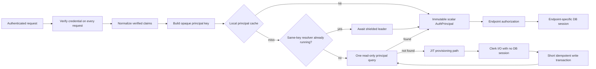
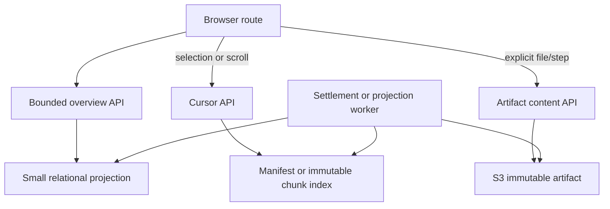
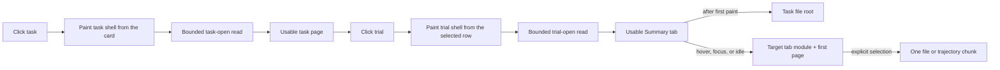

# Auth Request Path and Heavy-Read Performance Migration

Status: proposed

Baseline: `staging` at `7549ca42`

Evidence captured: 2026-08-10 PDT (2026-08-11 UTC)

## Decision

Oddish should treat authentication and the dashboard's large read surfaces as two
versions of the same architectural problem: request handlers are doing too much
unbounded or mutable work before they can return a useful first response.

The migration has four rules:

1. Authentication resolves one immutable, scalar authorization principal. A
   normal existing-user request performs no external I/O and no database write.
2. Initial page APIs return bounded control-plane data. Large immutable payloads
   are fetched by cursor or by explicit user selection.
3. Derived data is produced outside read requests and stored as a projection or
   durable artifact. A read may report `pending`; it must not run an LLM or scan
   an organization's history synchronously.
4. Every change is an independently measurable and revertible PR. Applied
   migrations are immutable; corrections are new forward revisions.

This is deliberately not a new generic repository, cache framework, or service
layer. The shared code should be limited to boundaries that own real invariants:
Server-Timing propagation, scalar authentication, in-flight miss coalescing,
cursor encoding, and durable job idempotency. Each endpoint should retain an
explicit query and response contract.

## What the HARs establish

The captures are in `/Users/kyle/Desktop/benchmark` and are intentionally not
committed to the repository.

| Capture | Relevant result |
| --- | --- |
| `baseline-staging-generallymuchfaster.har` | `/api/tasks/browse` returned 24 items in 8.73 s, then 5.38 s for the same 55 KB decoded body. A second page took 8.41 s. |
| `click-around-randomly-prod.har` | Production navigation produced request bursts of up to six business APIs. |
| `personal-tasks-prod-no-fixes.har` | The only capture with detailed upstream Server-Timing. It contains the auth fan-out, 24 s file trees, a 6.2 s trajectory, a 13 s task detail, and a 7.6 s tags request. |
| `after-pr1-merged-staging-test-1.har` | Browse measured 6.26 s and returned the same byte-identical 55 KB decoded body. Its task-file capture was metadata-only but still contained about 3,400 rows. |
| `staging-nuked.har` | Newest analyzed capture. At capture time, both `/api/tasks/browse` requests returned 500 in 2.35 s and 1.78 s. The capture cannot benchmark browse; it does not establish the current staging status. |
| `baseline-staging-2026-08-10.har` | Fresh authenticated, cache-disabled Chrome capture. Four successful browse requests returned 200 in 6.47–18.05 s (13.68 s median) for the same 24-item, 55,392-byte decoded body. Tags took 0.74–28.77 s, facets took 13.27–24.69 s, recursive files took 17.34 s for 6.81 MB, and a 67-step trajectory took 0.97 s for 693 KB. |

Sizes in this document are decoded HAR `content.size`, not compressed transfer
bytes. The slow requests spend their time waiting for the server, not receiving
bytes. The evidence does not support a browser, rendering, or network-transfer
diagnosis for the multi-second auth and database stalls.

The fresh baseline confirms that current staging browse no longer returns 500.
It also sharpens the attribution: the instrumented experiment proxies reported
`auth_total` of 0.3–0.5 ms while cost-totals still took 5.20–8.16 s end to end.
Authentication is a proven historical cross-cutting amplifier, but it is not
the sole cause of current slowness. Endpoint-specific query and payload work can
remain slow with warm authentication.

### The captured auth fan-out

Three instrumented experiment APIs began within 2 ms. They were part of a wider
five-API fan-out beginning within 4 ms, and all three instrumented requests took
a cold backend auth path:

| Route | Total | `auth_db` | `auth_total` | Backend total | Auth share of backend |
| --- | ---: | ---: | ---: | ---: | ---: |
| task shells | 5,609.5 ms | 3,344.7 ms | 3,345.0 ms | 5,232.8 ms | 63.9% |
| slim tasks | 1,107.3 ms | 331.4 ms | 331.8 ms | 816.7 ms | 40.6% |
| cost totals | 10,121.9 ms | 3,184.2 ms | 3,197.0 ms | 9,527.0 ms | 33.6% |

The three calls accumulated 6,860.3 ms in `auth_db`. The two long calls prove
that a successful auth miss can exceed three seconds. They do not prove that a
single SQL point lookup took three seconds.

The backend is configured to instrument asyncpg and httpx. Use the following
trace IDs to verify the corresponding child spans in Logfire and, when present,
separate pool wait, SQL, Clerk I/O, and commit:

- task shells: `cf83e4236fb95300f1f4728716283d22`
- slim tasks: `855c29cf303df4ca271758e073d8f099`
- cost totals: `d68083b5c2134f4bee8a3b5162a8b67c`

These should be inspected before attributing a percentage of the 3.2 seconds to
any one internal phase.

### Other boundedness failures

| Surface | Captured behavior | Architectural failure |
| --- | --- | --- |
| Task files | Production: 3,730 paths, 2,343 bodies, 7.1 MB decoded, 24.5 s. Fresh staging: 3,384 paths, 6.81 MB decoded, 17.34 s on a recursive full-body path. The earlier staging overview capture returned roughly 3,400 metadata rows in 1.7–2.5 s. | Recursive metadata remains unbounded, and the full-body path remains extremely large. Archive-backed recursive listing ignores `limit` and `cursor`. |
| Trajectory | One production trial returned 62 steps and 773 KB decoded in 6.2 s. Fresh staging returned 67 steps and 693 KB in 0.97 s, with a cached 5.7 KB summary in 0.66 s; all 67 step rows were mounted. An older missing summary synchronously called Claude and took 18.4 s. | An immutable large artifact is returned whole; a missing derived summary can run LLM work inside a GET; every step becomes a DOM accordion item. |
| Tags | The fresh 4,953-byte decoded response varied from 0.74 s to 28.77 s. | A definitions request recomputes organization-wide usage counts by unnesting task and version arrays. |
| Task detail | Two similarly shaped 40-trial responses took 1.1 s and 13.0 s. | The initial click eagerly loads all versions' trials, jobs, rollups, experiments, and tags. Auth/pool contention amplifies the unbounded query. |
| Browse | Fresh staging returned 200 four times in 6.47–18.05 s (13.68 s median) for 24 items and 55,392 decoded bytes. One earlier navigation was client-aborted after 30 s and is excluded from the successful latency set. | Correctness is restored, but page selection remains entangled with organization-wide activity work and card enrichment. The generic proxy drops upstream Server-Timing, so the current split between auth, pool wait, and endpoint query work is not observable in the HAR. |

### The captured task and trial opening waterfall

The fresh capture contains the exact side-by-side task-definition and trial
drawer shown in the product. A cold task navigation first waited 1.45 s for the
task RSC response. That response contained 1.59 MB decoded and transferred
288 KB because the server component awaited the full task-detail bundle before
returning the usable page.

Opening a failed trial then started the following work within its first 310 ms:

| Visible or supporting work | Time | Decoded bytes | Why it ran |
| --- | ---: | ---: | --- |
| Full trial detail | 1.64 s | 2,590 | Refresh the trial row before showing the QA report. |
| Version trials | 0.47 s | 7,073 | Build the task overview's trial-QA aggregation. |
| Full task detail | 1.40 s | 1,586,282 | Re-fetch all task versions and trials for checks, totals, and the task pane. |
| Task-definition files | 2.39 s | 743,889 | Populate the left file tree. |
| Analysis log | 0.56 s | 34 | Fetched on every summary open even when the log is collapsed and the analysis is terminal. |
| Trial-file listing | 1.92 s | 4,300 | Search recursively for a legacy `verifier/ctrf.json` summary. This was not a Files-tab click. |

The completed-trial sample had the same request shape. Its full task detail was
only 39 KB but still took 1.63 s; its task-definition request returned 3,384
files, 6.81 MB decoded, and took 17.34 s. This proves two independent problems:
the task-detail latency is not explained by payload size alone, while the file
tree has a deterministic unbounded payload problem.

The first completed-trial open also downloaded 12 JavaScript chunks totaling
1.25 MB decoded and 382 KB transferred. The active tab was Summary, but the
component tree exposes Files, Trajectory, and Artifacts dynamic subtrees at the
same time. This makes inactive-tab code compete with the first useful paint.

The local task page passes `loadFilesLazily`, which is intended to add
`inline=0&presign=0`. The deployed requests in the fresh HAR did not contain
those flags. That deployment or call-path mismatch must be closed with a
network-shape assertion. Even when the flags are present, the current option is
only lazy **content** loading: it still requests every file path recursively.
It is not a lazy or paginated tree.

## Why `auth_db` is slow

The diagnosis has three confidence levels:

| Confidence | Finding |
| --- | --- |
| Proven by the HAR and current control flow | The three concurrent APIs all missed the process-local cache; two successful `auth_db` intervals exceeded 3.1 seconds; misses are not coalesced; `auth_db` covers more than SQL. |
| Confirmed in code as work inside or competing with that interval | Unused select-in relationship queries, commit-on-success, possible Clerk profile/membership HTTP while the session is open, auth-path writes, and per-container startup role DDL. |
| Not attributable without the existing traces | How much of either 3.2-second interval was checkout/pool wait, SQL execution, Clerk HTTP, row-lock/commit contention, or another backend phase. |

### The timer is broader than its name

On a Clerk cache miss, `backend/auth/__init__.py` starts `auth_db` before opening
`get_session()` and stops it only after `get_or_create_user_from_clerk()` and the
session context complete. That interval can contain:

- local or remote connection-pool checkout;
- the explicit user and organization queries;
- implicit SQLAlchemy relationship queries;
- Clerk profile or membership HTTP;
- provisioning and identity writes;
- flush and commit;
- connection return.

`oddish/src/oddish/db/connection.py::get_session` commits every successful
session, including this nominally read-oriented dependency. The captured
`auth_total` is almost equal to `auth_db`, so the observed calls are successful
misses, not the separate 500 ms disconnect-retry branch.

The first observability PR should keep the public `auth_db` aggregate for
continuity but add spans/metrics for checkout, query, external I/O, flush, and
commit. It should not guess at those components from the HAR.

### One normal miss crosses too many boundaries

The existing-user path calls `_refresh_user_github_identity`. That helper may
create a new httpx client and call Clerk with a 10-second timeout. The no-org
recovery path may also call Clerk's membership API. Both run while the auth
session is open.

This creates a capacity multiplier: one slow identity-provider request can pin
one of the API container's scarce database connections even though it is not
using the database. It also makes an external profile system part of the
availability path for unrelated reads such as task shells and cost totals.

### Auth ORM models fan out implicitly

Four relationships default to `lazy="selectin"`:

- `OrganizationModel.users`
- `OrganizationModel.api_keys`
- `UserModel.organization`
- `UserModel.api_keys`

Repository-wide inspection found no production read of these relationship
attributes; callers use direct queries. Loading a user or organization can
therefore hydrate unused collections and trigger secondary selects. This is the
same mapper-level failure mode fixed for task/trial models in PR #1127.

An old, unmerged branch reported Logfire dropping a cold auth miss from about ten
queries to about two after changing eager auth relationships. That older model
had six such relationships, including two API-key relationships already removed
from staging, so the count is directional corroboration rather than an expected
current result. Do not cherry-pick the commit: it also bundled an unreviewed TTL
increase.

### Concurrent misses are not coalesced

The authorization cache is process-local, bounded to 1,000 entries, and has a
60-second wall-clock TTL. It has no per-principal pending map. Requests for the
same user and organization that arrive together can all observe a miss and run
the complete resolver/provisioning path.

Modal may run many containers, so local caches are fragmented. In-process
singleflight will remove same-container amplification but cannot eliminate a
simultaneous miss in two containers. That is acceptable initially: the cold
resolver should first become one cheap indexed read. A networked cache is not a
substitute for fixing an expensive resolver.

### Cache hits and misses return different auth shapes

`AuthContext` contains both scalar fields and session-bound ORM objects.
`CachedAuthData` duplicates only a scalar subset. A miss returns ORM objects; a
hit does not. Endpoint behavior therefore depends on cache state:

- `GET /org` can return 404 when `auth.org` is absent on a hit;
- organization settings can silently use deployment defaults;
- invite handling can fail because the cached context lacks the Clerk org ID;
- permission and task-submission code maintain scalar/ORM fallback branches.

This is both a correctness bug and unnecessary indirection. There should be one
auth result type, and it should have the same shape on hits and misses.

### Cold containers can add pool contention

The API engine is configured for two pooled connections plus one overflow
connection, matching a maximum of three concurrent inputs per container. During
lifespan startup, every container also schedules role-default work against the
same engine. That work checks out a connection and issues `SELECT current_user`
and `ALTER ROLE`.

Three first requests plus this background task create four local consumers for
three connection slots. Repeating DDL from every cold container can also contend
globally. The HAR cannot establish that these captures hit cold startup, so this
is a concrete design defect and likely amplifier, not a measured root-cause
percentage.

Increasing the local pool is not the first fix. It can merely move contention to
the shared transaction pool while preserving excessive queries and external I/O.

## Target authentication architecture



### One scalar principal

Replace `AuthContext` plus `CachedAuthData` with one frozen scalar type. The
exact fields should be the result of a consumer audit, not a copy of the ORM
models. A representative shape is:

```python
@dataclass(frozen=True, slots=True)
class AuthPrincipal:
    method: AuthMethod
    org_id: str
    org_slug: str | None
    actor_user_id: str | None
    role: UserRole | None
    scope: APIKeyScope = APIKeyScope.FULL
    api_key_id: str | None = None
    api_key_creator_role: UserRole | None = None
```

An endpoint that needs organization settings, a Clerk organization ID, user
profile data, or an email address performs an explicit narrow read. Those values
are not authorization state merely because an endpoint happens to need them.
Public endpoints should use `None` or a distinct unauthenticated sentinel rather
than weakening the authenticated principal with an optional organization.

Required invariants:

- cache hits and misses return field-identical principals;
- no principal contains an ORM entity or session reference;
- JWT signature, issuer, expiry, and configured audience validation run on every
  request; making audience configuration mandatory is a separate security rollout;
- raw API keys and raw bearer tokens never become cache keys or metric labels;
- role, organization, API-key status, and soft-delete predicates are explicit in
  the resolver query;
- authorization helpers consume only `AuthPrincipal`.

Before key construction, normalize the Clerk v1 top-level organization claims
and v2 nested `o.id`/role claims into one canonical verified-claims shape. The
backend currently reads only the v1 fields even though the frontend already
understands both formats; a valid v2 token can therefore fall into the expensive
and ambiguous no-org recovery path. The opaque cache key must include issuer,
subject, canonical organization ID, and canonical role so a newly issued token
with a changed role cannot reuse the old role's local entry.

### Read-only steady-state resolution

Clerk auth should use one explicit scalar select joining the live user membership
to the live organization by the verified subject and organization claim. The
normalized, signed Clerk role is authoritative for that request, matching the
effective behavior of today's login-time role synchronization without writing it
back during auth. Add and test `organizationMembership.updated` webhook handling
to keep the database role projection current for non-request consumers and to
invalidate cached principals. Record a token/DB role mismatch for rollout
visibility; do not repair it inside the request.

API-key auth should use one scalar select that checks hash, `scope`, `expires_at`,
`is_active`, `deleted_at`, and active organization state. Use the key's
denormalized `created_by_role`; do not inner-join the creator, because current
policy permits a key to remain valid after its creator row is missing or
soft-deleted.

For an existing principal, resolution must perform:

- one SQL statement;
- zero external HTTP calls after credential verification (a cold JWKS fetch is
  part of verification, not principal resolution);
- zero row mutations;
- zero commit-requiring work;
- zero relationship hydration.

Use an explicit read-session boundary that closes or rolls back on success. Do
not make the handler share the auth session: short independent auth and endpoint
transactions avoid holding a connection through handler setup or unrelated I/O.

### Provision only after authoritative not-found

JIT provisioning remains valid product behavior, but it is not the normal
resolver:

1. Run the read-only resolver.
2. On true not-found, close the read session.
3. Fetch required Clerk profile or membership data with no DB connection held.
4. Open a short write transaction and idempotently upsert organization, user,
   and membership data.
5. Close the write transaction and run the scalar resolver again.

Concurrent provisioning must converge on a live uniqueness constraint, not an
application-only check. Instrument the frequency and reason for missing-org
tokens before changing their behavior. Fail closed for invalid organization
claims; retain a separate personal-organization flow only if real traffic shows
that it is required.

GitHub identity reconciliation belongs to Clerk webhooks plus a repair/backfill
job. Webhook handlers must obey the same fetch-then-short-write boundary; moving
Clerk I/O to a webhook is not sufficient if that handler still holds a database
session during the call. API-key `last_used_at` is telemetry and should be
sampled, batched, or written asynchronously; it must not turn every cold
authorization read into a contended write.

### Coalesce in-process misses

The cache should store `AuthPrincipal` directly. Its one owned operation is
`get_or_resolve(key)`, combining TTL lookup with a per-key in-flight task:

- the first caller creates an independently owned resolver task;
- every caller, including the creator, awaits `asyncio.shield(leader)`;
- different keys resolve concurrently;
- the resolver task removes its own pending entry on completion, with an identity
  check so an older completion cannot delete a newer task for the same key;
- exceptions and authorization failures are never cached;
- follower cancellation cannot cancel the leader;
- cache expiry uses a monotonic clock;
- principal entries and pending entries are independently bounded; capacity
  pressure backpressures new distinct keys and never evicts an active task.

Avoid a global resolver lock. The map needs only a short mutation lock; database
and network work must run outside it.

### Invalidate before increasing TTL

Centralize invalidation at the mutations that change authorization:

- Clerk user, organization, and membership webhooks;
- role and membership changes;
- member removal or organization deletion;
- API-key revoke, rotate, or delete;
- any settings mutation that is intentionally included in the principal.

Emit `hit`, `miss`, `coalesced`, `expired`, and `invalidated` metrics without PII.
With process-local caches, a mutation can immediately clear only the container
that handles it. Keep the 60-second TTL unless invalidation is delivered to every
container through a broadcast/version mechanism or a shared cache. A longer TTL
must not silently lengthen the cross-container revocation window.

A shared L2 is conditional. Add it only if post-fix telemetry shows material
cross-container misses, or if the product requires a shorter cross-container
revocation window than local TTLs can provide. It must use versioned scalar
payloads, short TTLs, explicit global invalidation, and an opaque key. Cache
failure falls back to the authoritative database; malformed or stale cache data
must never grant access.

### Enforce membership uniqueness before concurrent provisioning

The likely Clerk lookup key is a live `(clerk_user_id, org_id)` membership. The
old global Clerk-user uniqueness was removed without adding per-organization
uniqueness. A live org-scoped constraint is required for correctness before JIT
provisioning can safely run concurrently; it is not merely a performance index.
First audit duplicates:

```sql
SELECT clerk_user_id, org_id, count(*), array_agg(id)
FROM users
WHERE deleted_at IS NULL
  AND clerk_user_id IS NOT NULL
GROUP BY clerk_user_id, org_id
HAVING count(*) > 1;
```

After resolving any duplicates, add a new backend Alembic revision using an
autocommit block for the live partial unique index:

```sql
CREATE UNIQUE INDEX CONCURRENTLY uq_users_live_clerk_org
ON users (clerk_user_id, org_id)
WHERE deleted_at IS NULL
  AND clerk_user_id IS NOT NULL;
```

The existing non-partial `uq_users_org_email` also prevents a replacement row
when a soft-deleted membership still owns `(org_id, email)`. The same forward
migration must choose and test one coherent restore policy:

- look up the canonical `(clerk_user_id, org_id)` with `include_deleted=True`
  and restore that row when it is the same membership; and
- after an email-collision audit, replace the non-partial email constraint with
  a live partial unique index so an unrelated tombstone does not block a new
  membership.

Rows with `is_active = false` and `deleted_at IS NULL` also need an explicit
audit/backfill policy. They remain uniqueness-owning rows, are rejected by the
resolver, and should be reactivated or rejected deliberately rather than causing
an insert race.

After correctness constraints exist, run `EXPLAIN (ANALYZE, BUFFERS)` for the
final scalar resolver. Add any further performance index only if the existing
indexes do not support that plan. Inspect actual database indexes first to avoid
duplicating one under a different migration name.

## Incremental auth PR plan

Each PR below must be deployable and useful without the next PR.

| PR | Change | Dependency | Incremental benefit | Validation and rollback |
| --- | --- | --- | --- | --- |
| A0 | Add migration immutability CI for both Alembic trees. Reject modification/deletion of revisions already on protected `staging`; test the candidate on one database in protected-Oddish, protected-backend, candidate-Oddish, candidate-backend order. | None | Prevents another dropped/stamped revision and exercises the real cross-tree dependency. | CI fixture deletes and mutates a base revision and must fail. Revert CI only. |
| A1 | Forward/join upstream `Server-Timing` through the generic frontend proxy and hot bespoke proxies, including non-2xx and streamed responses. | None | Exposes timing already emitted by the backend without changing backend behavior. | Frontend header contract tests. Frontend-only rollback. |
| A2 | Split backend auth spans/metrics into credential verification, cache result, checkout, SQL, external I/O, flush/commit, and provisioning outcome. | None | Makes later performance changes attributable without coupling them to proxy behavior. | Cold/warm/20-way baseline and trace-span assertions. Backend-only rollback. |
| A3 | Remove the four unused auth ORM relationships and add a mapper/query-count guard like the task/trial regression test. Retain the test FK shim unless a separate change deliberately replaces its production-schema parity role. | None | Removes hidden collection queries on cold auth loads. Older six-relationship evidence predicts the direction, not the current count. | Assert mapper shape and measure current SQL count. If a real consumer appears, add an explicit query there. No migration. |
| A4 | Move `apply_role_defaults` from every API container's lifespan into an explicit singleton deploy task that uses the runtime DSN and an advisory lock, or provision it through the DBA. Do not assume the Alembic role is the runtime role. | None | Frees a cold-start connection slot and stops repeated role DDL without configuring the wrong principal. | Verify the runtime role once; confirm API startup issues no `ALTER ROLE`. Revert the deploy hook if ordering fails. |
| A5 | Normalize Clerk v1/v2 claims; introduce frozen scalar `AuthPrincipal`; migrate permissions and ORM-dependent endpoints to explicit reads. Change the existing TTL cache to store that principal directly, delete `CachedAuthData`, and include canonical role in the opaque key. | A3 | Cache hits and misses become identical; valid v2 tokens avoid ambiguous fallback; `/org`, settings, and invite cache-state bugs disappear. | Contract-test v1/v2 claims and endpoints before/after cache population. No migration. Keep the public auth dependency signature stable for rollback. |
| A6 | Add a forward backend migration for live `(clerk_user_id, org_id)` uniqueness and a coherent soft-deleted membership/email restore policy. | A0 | Makes concurrent JIT provisioning deterministic. | Duplicate/inactive/tombstone audit; concurrent upsert test; full ordered forward-upgrade test. Roll back application use before considering a constraint downgrade. |
| A7 | Add the one-query read-only Clerk resolver. Use the normalized signed role for the request; handle membership-updated webhooks for the DB projection. On not-found, run external provisioning with no DB session, then re-resolve. Remove GitHub/profile HTTP from the found path and open webhook transactions. | A5, A6 | Predictable cold principal resolution: one query, no post-verification external HTTP, no write. Slow Clerk cannot pin a DB connection for existing users. | Query-count/no-write and v1/v2 role tests; assert no HTTP overlaps a checked-out auth connection. Shadow-compare successes, but never fall back after a V2 denial. |
| A8 | Make API-key resolution one scalar read that checks scope, expiry, key/org active state, and soft deletion without requiring a live creator row. Move `last_used_at` to sampled/batched telemetry. | A5 | Removes round trips, a commit, and same-key row-write contention without changing orphaned-key policy. | One-select/zero-write, expiry/revoke/soft-delete/orphaned-creator tests, and telemetry-loss acceptance. Revert telemetry independently. |
| A9 | Change cache expiry to a monotonic clock and add task-owned per-key singleflight around the principal resolver. | A7, A8 | A same-container burst performs one resolver instead of one per route. | N same-key calls = one resolver; distinct keys stay parallel; exception, identity-safe cleanup, capacity, and cancellation tests. Disable singleflight or revert. |
| A10 | Add mutation/webhook invalidation through the central cache interface and emit invalidation/coalescing metrics. Keep the local TTL at 60 seconds. | A9 | Gives same-container revocation and quantifies remaining cross-container staleness without pretending local invalidation is global. | Mutation matrix proves local invalidation and records container scope. Invalidation remains useful if callers fall back to TTL. |
| A11 | Add a versioned shared L2 or broadcast/version mechanism only if telemetry shows material cross-container misses or a stricter revocation requirement. | A10 plus evidence | Reduces cross-container cold reads or delivers global invalidation; only then can a longer TTL be considered. | Shadow read, then read-through flag. Disabling it returns to DB resolution and the 60-second local TTL. |

Do not combine A3 with a TTL increase, A5 with a shared cache, or A7 with an
unproven performance index. Those bundles make a regression difficult to attribute and
repeat the all-at-once shape that made the browse migration hard to recover.

## Heavy-read architecture

The non-auth hotspots should converge on a small control plane and a separately
addressable payload plane:



Every initial page contract should state its maximum rows, maximum embedded
payload, cursor order, and freshness model. A response may contain `pending` or
eventually consistent counters; it may not silently become unbounded.

### File trees

Current staging's captured overview pane fetches file contents on selection but
still sends every path. File-only/public-share views intentionally retain a
`stream=1` full-body path, so content-on-selection is not yet a global invariant.
The storage implementation also accepts `limit` and `cursor` without honoring
them in recursive archive and object-store branches.

Use the existing `.oddish-manifest.json` as the authoritative listing source
where available. Do not create a second manifest with overlapping ownership.

| PR | Increment | Benefit |
| --- | --- | --- |
| F1 | Switch the frontend tree to non-recursive directory navigation and request only one directory page at a time. Keep file bodies selection-only. | Immediately bounds the first request without a schema change; a 3,400-row tree becomes tens of entries. |
| F2 | Add a cursor response contract for file metadata and enforce `limit` in every storage branch. Add conformance tests that run the same cursor cases against archive, expanded-manifest, and object-store implementations. | Makes boundedness a backend invariant rather than a frontend convention. |
| F3 | Make the existing manifest the indexed source for new task versions; enqueue an asynchronous backfill for legacy archives. Version/chunk that manifest only if benchmarks show whole-manifest reads are material. | Avoids recursive S3 enumeration and archive inspection while preserving one source of truth. |

Keep the old recursive response during the frontend cutover only as an explicit
compatibility boundary with removal criteria. Do not add candidate-path probing
or multiple silent fallbacks inside the new endpoint.

Acceptance gates: initial tree response under 100 KB, bounded by the requested
limit, stable cursor behavior under inserts, and no file body in the new
overview/cursor response. A full stream or archive download must be an explicit
separate action.

### Trajectories and summaries

The canonical ATIF trajectory should remain an immutable artifact. The dashboard
does not need to download or render it all at once.

| PR | Increment | Benefit |
| --- | --- | --- |
| T1 | Add a `TRAJECTORY_SUMMARY` worker-job kind and handler. Enqueue an idempotent job at trial settlement; a missing-summary GET enqueues once and returns typed `pending` rather than calling Claude. | Removes the captured 18.4-second LLM call from page navigation and gives retries, ownership, and queue cost an explicit home. |
| T2 | Virtualize the existing step accordion and keep only a small overscan window mounted. | Bounds DOM work for 500-action runs even before the API changes. |
| T3 | Produce a trajectory step index/chunks at settlement and add a stable cursor API. Fetch the next page on scroll/expansion while retaining the original full artifact for download. | Bounds transfer, parsing, and memory; a 500-step trial no longer requires a multi-megabyte first response. |

The summary job must use `(trial_id, trajectory artifact hash)` as its idempotency
input and retain the existing summary-generation service as the handler's domain
logic. A newer artifact invalidates the prior derived summary explicitly. Do not
use a process-local lock as the only duplicate-prevention mechanism. Adding the
job kind requires a new forward migration and an update to the stable worker-kind
documentation when implemented.

Acceptance gates: summary reads return ready/pending within 200 ms excluding
network variance, initial trajectory data is at most 50 steps and 250 KB, and no
more than roughly 100 step rows are mounted at once.

### Tags

Tag definitions and usage analytics have different freshness and cost. Give them
different contracts.

| PR | Increment | Benefit |
| --- | --- | --- |
| G1 | Add a definition-only org-scoped endpoint and move filters/editors to it. It selects tag identity, name, color, and definition metadata only. | Removes organization-wide task/version unnesting from routine navigation; the current 5 KB response should become a cheap indexed read. |
| G2 | Maintain usage counts as an eventually consistent projection owned by tag-assignment/tag-projection work. Keep counts on the management surface, with an `as_of` value. | Restores useful counts without rescanning every tagged row per request. |

Do not make the cheap definition endpoint call the legacy count endpoint as a
fallback. During rollout the management page may continue to use the old route;
filters should not.

### Task and trial interaction critical path

The product should optimize for the visible sequence, not for completing every
possible drawer request at once:



A click must never wait for history, a recursive tree, an analysis log, an
inactive tab, or an LLM. Those are secondary consumers of an already usable
surface.

#### Component-by-component diagnosis

| Visible component | Current work | Biggest problem | Target contract |
| --- | --- | --- | --- |
| Task route, header, KPIs, and version selector | The server component awaits `/tasks/{id}/detail` and embeds it in RSC. That core query select-in loads every trial across every version, then fetches queue information, worker jobs, QA costs, experiments, and tags and folds full trial responses in Python. | The route is blocked by an all-history bundle. The captured response was 1.59 MB decoded and took 1.45 s before the page could become useful. | `TaskOpenResponse`: task shell, selected/default version, exact aggregate counters, and at most 20 compact trial refs. At most 50 KB; no trial `result`, full `analysis`, jobs, or historical versions. |
| Task overview in the left pane | `TaskFilesPanel` reads `/detail`; `TaskOverviewPanel` also fetches `/tasks/{id}/trials?version=N` and folds full analysis objects in the browser. | It duplicates trial data already present in `/detail`, requires all version trials to form a small QA digest, and repeats the request after cache/remount boundaries. | `TaskOverviewResponse`: verdict, source-audit findings, classification counts, capped finding refs, and at most 20 compact trial-QA rows for one version. Full rows/history remain cursor-addressable. |
| Task-definition tree | One recursive `/tasks/{id}/files` request builds the whole client tree. `loadFilesLazily` omits bodies only when its flags reach the request; it does not lazy-load paths. | The fresh deployment returned 744 KB–6.81 MB and 2.39–17.34 s. The local comment that trees are shallow is disproved by 3,384 paths. | Root directory page only: `recursive=false`, no bodies, no presigned URLs, stable cursor, at most 100 entries and 50 KB. Expanding a directory fetches that directory only. |
| Selected task file | Selection fetches through the task-file proxy or a presigned URL. The backend emits immutable-version ETags, but the frontend proxy reserializes the response and does not preserve the upstream ETag/304 contract. | Repeat selections can redo auth, DB authorization, archive reads, and transfer despite immutable `(task, version, path)` content. | One selected preview capped at 100 KB, ETag and `Cache-Control` preserved end to end, with a separate explicit full-file action. Warm repeat should be a browser 304/cache hit. |
| Trial frame and header | The parent already has a trial row, but `TrialAnalysisCard` treats it as untrusted and shows a skeleton until `GET /trials/{id}` succeeds. | A 0.61–1.64 s refresh gates useful summary content even when a safe snapshot is already on screen. A task-to-trial mode change can also add a fixed 150 ms transition. | Paint the selected row immediately, label it as a snapshot internally, and revalidate in the background. Only fields absent from the snapshot retain skeletons. No artificial mode delay. |
| Trial Summary | The full-trial endpoint always queries queue info, recent jobs, QA cost, and pre-trial audit. The card also fetches `analysis-log` on every open and `useVerifierSummary` may recursively list trial files to locate legacy CTRF. | Terminal trials pay for live-queue data and collapsed logs. The captured summary issued a 306–562 ms log request plus an 879–1,922 ms recursive file listing unrelated to the visible report. | `TrialOpenResponse`: terminal header/timing/cost/result summary, analysis report, embedded verifier summary, and tab availability/counts. Logs load only while analysis is active or when expanded. No S3 scan to render a badge. |
| Trial Files | `TaskFilesPanel` recursively lists trial files, requests presigned URLs for the set, auto-selects a file, and then fetches its body. | First content waits for S3 enumeration/signing; Files and Artifacts use different listing URLs and cannot reliably share the result. | Read a versioned terminal-trial manifest, show one root page, and prefetch only the selected/hovered file. Running trials use a revisioned short-TTL manifest. |
| Trajectory | The tab fetches the complete ATIF JSON and summary together and renders every step as an accordion item. | The fresh 67-step payload was already 693 KB; 500 actions scale transfer, JSON parsing, derived calculations, refs, and DOM together. A missing summary can still run Claude inside GET. | Persist summary at settlement, return a first page of at most 50 steps/250 KB, fetch later chunks by cursor, and virtualize to fewer than 100 mounted step rows. |
| Artifacts | `ArtifactsViewer` recursively lists every trial file, filters artifact paths in the browser, expands every directory, selects the first artifact, and immediately fetches it. | It repeats file enumeration, mounts the entire artifact tree, and downloads content before the user chooses it. | Use the same immutable trial manifest as Files, filtered/indexed by artifact kind and prefix. One root page first; one selected artifact body on demand. |
| Drawer JavaScript and inactive tabs | The Summary open exposed dynamic children for Files, Trajectory, and Artifacts. The captured first completed-trial open fetched 12 chunks totaling 1.25 MB decoded. | Code and renderer dependencies for invisible tabs compete with the summary's first paint. Large syntax/Markdown renderers arrive before a file is selected. | Mount/import only the active tab. Prefetch its module and first bounded page on pointer hover, focus, or post-paint idle. Load a renderer only after the selected file type requires it. |

#### Bounded read contracts

Keep the contracts view-specific. Do not replace the current giant `/detail`
bundle with a new giant drawer bundle.

- `TaskOpenResponse` owns the task page's header and initial cards. It contains
  scalar task/version state, SQL aggregates, and a capped preview; it never
  contains all versions or full trial payloads.
- `TaskOverviewResponse` owns the left Overview pane for exactly one task
  version. Exact counts are separate from capped display rows. Every capped
  collection carries `has_more` or a cursor.
- `TrialOpenResponse` owns the trial header and Summary tab. For a terminal
  trial it requires no queue-position or worker-job query. For an active trial,
  live scheduling state is a separate short-poll resource.
- `FileManifestPage` is shared by task Files, trial Files, and Artifacts. It
  contains path, kind, size, content hash, and child/cursor metadata, never file
  bodies or a presigned URL for every row.
- `TrajectoryPage` returns summary metadata and a bounded step page. The full
  immutable ATIF document remains available as an explicit download.

Immutable resources are keyed by task-version content hash or trial artifact
hash and carry ETag/long private caching. Mutable running-trial resources carry
a revision and short TTL. Frontend proxies must stream or pass through these
headers rather than parse and reserialize immutable bodies.

#### Incremental interaction PR plan

Each PR produces a user-visible or database-time improvement without requiring
the rest of the migration. A1/A2 should land early for attribution, but none of
these interaction improvements should wait for the entire auth rewrite.

| PR | Change | Direct incremental benefit | Validation and rollback |
| --- | --- | --- | --- |
| I1 | Make Summary the only critical React subtree: render the selected trial snapshot immediately, remove the fixed task-to-trial delay, fetch a terminal analysis log only when expanded, defer the legacy verifier scan, and conditionally mount inactive tab modules. | The drawer and existing QA report paint without waiting 0.61–1.64 s for trial refresh; removes two noncritical requests and inactive-tab code from first paint. | Playwright asserts the report snapshot appears before the trial fetch completes and that Summary open emits no terminal log, recursive verifier listing, trajectory, or artifact request. Frontend-only revert. |
| I2 | Add and cut the task route to `TaskOpenResponse`; replace mapper hydration with explicit scalar/aggregate SQL and stream/render the page without awaiting `/detail`. Seed the shell from the browse item when present. | Biggest task-click reduction: removes the captured 1.59 MB RSC, all-version trial hydration, all-trial job lookup, and Python full-row folding from navigation. | Query-count and payload-shape tests; task header p95 and byte gate. Keep `/detail` for old clients during cutover; frontend can switch back independently. |
| I3 | Add `TaskOverviewResponse` for one version and cut `TaskOverviewPanel` to it. Return exact aggregate counts plus capped compact trial/finding refs; add cursors for the rest. | Removes duplicate `/detail` + full `/trials` fetches and browser folding of full analysis JSON while preserving every visible overview feature. | Compare verdict/counts/findings with the old path on sampled tasks. Endpoint flag allows read rollback. |
| I4 | Add cursor endpoints for versions and task trial history, and remove remaining history arrays from task open. Fetch queue/jobs only for visible active rows. | Task click cost stays flat as a task accumulates versions and trials; historical navigation remains complete. | Deep-history fixture, stable-cursor tests, and maximum-row assertions. Code-only rollback. |
| I5 | Make the task-definition tree truly hierarchical: enforce `limit`/`cursor` in every storage branch, use the existing manifest, request one directory at a time, and preserve ETag/304/cache headers through Next. Add a regression assertion for `inline=0&presign=0`. | Removes the captured 744 KB–6.81 MB left-pane request and makes root files visible independently of total tree size. Repeated file clicks become cache hits. | Cross-storage cursor conformance; HAR root under 50 KB and no body/presign fields. Frontend can fall back to the old recursive route during cutover. |
| I6 | Add `TrialOpenResponse` backed by a narrow terminal fast path; seed its SWR key from the selected row and move active queue/job state to its own resource. Store/serve verifier summary metadata directly instead of client S3 discovery. | Full freshness arrives in one bounded read; terminal opens stop querying irrelevant jobs/queues and stop listing files for a badge. | Terminal query-count/no-S3 test, active-trial contract test, p95 gate. Preserve existing full-trial endpoint until consumers migrate. |
| I7 | Produce one versioned trial file manifest at settlement and share its SWR resource between Files and Artifacts. Page by directory/kind, fetch one selected body, and lazy-load its renderer. | Files and Artifacts open without S3 enumeration or duplicate lists; first content is one small metadata page plus one explicit file. | Manifest hash/idempotency tests, running-to-terminal revision test, and Files→Artifacts request-count E2E. Disable manifest reads to roll back. |
| I8 | Move trajectory summary generation to settlement work, add cursor/chunk reads, and virtualize the step list. Prefetch only summary + first page on tab intent. | Makes large trajectories fast on first open and prevents 500-action transfer/DOM growth; removes synchronous LLM latency from GET. | 500-step fixture, chunk reconstruction and summary idempotency tests, payload/DOM gates. Keep full artifact download and old endpoint during cutover. |

If I2 or I3 misses its database SLO after the response is bounded, keep the API
contract and replace its implementation with a shadowed durable projection.
Do not expose projection ownership to the client or add synchronous write hooks
to every lifecycle path in the same PR. Backfill, reconcile, compare drift, and
cut the reader in separate forward-only steps.

The highest expected uplifts are I2 (task click), I5 (left task definition),
I1/I6 (trial Summary), I7 (Files and Artifacts), and I8 (Trajectory). A3, A7,
and A9 reduce cold/burst tails across all of them, but auth work cannot substitute
for bounding these endpoint-specific reads.

### Task browse and the restored migration

The history matters:

- PR #1090 removed duplicate experiment-page resource fetches and made file
  bodies selection-driven in overview-first authenticated panes. File-only and
  public-share views still stream bodies. It was a frontend request-shape
  improvement.
- PR #1102 moved task browse to a client SWR request and cached it between
  visits. It exposed the slow backend browse request instead of hiding it in
  document TTFB.
- PR #1152 added `task_version_browse_summaries`, lifecycle refresh hooks,
  page-before-enrichment, and a 24-trial preview cap in one large change.
- PR #1156 reverted all of #1152, including deleting the migration. Its recorded
  history does not state a more specific reason for reverting the feature.
- PR #1157 restored only `task_browse_summary_001.py` after deployment failed
  because the staging database had already stamped it.

The restored migration is now immutable. Its summary table has no current model,
reader, or writer and is stale after the migration's one-time backfill. Its
`idx_trials_task_browse_preview` index is not inert: PostgreSQL maintains it on
writes and may choose it without an application reference. Verify planner usage
and write cost before changing or dropping it in a new forward revision. If the
table is reused, run a full rebaseline/reconcile before shadow comparison and a
read cutover. Do not edit, delete, or repurpose the applied revision.

Rebuild browse in smaller increments:

1. Preserve the restored 200 response and use
   `baseline-staging-2026-08-10.har` as the post-fix measurement gate. The
   archived 500-only capture remains unusable as a latency comparison.
2. Cap per-card preview trials for the already-paged visible tasks, using a
   deterministic order and `has_more`, while retaining separate exact counters.
   Current staging already pages task identities before card enrichment; this
   new increment bounds the remaining visible-card fan-out.
3. Add a durable, asynchronously reconciled activity/summary projection in
   shadow. Compare it against the authoritative query and report drift.
4. Cut only the browse ordering/enrichment reader to the verified projection.
   Keep the authoritative rebuild as a repair path, not a per-request fallback.

Any local recent-activity work resumed after this analysis must rechain its new
migration after `task_browse_summary_001`; it must not retain an older
`down_revision`.

## Migration safety

The dropped browse migration exposed a gap: upgrading an empty database can pass
even if a revision already stamped in staging was removed from the candidate
tree. The repository needs both forms of validation:

1. **Revision immutability:** compared with protected `staging`, an existing
   revision file may not be deleted or modified. Only new revision files are
   accepted.
2. **Forward upgrade:** use one database and deployment order. Apply protected
   Oddish, then protected backend migrations; apply candidate Oddish, then
   candidate backend migrations. Backend revisions assume the core schema, so
   running the upgrade trees against independent databases is not representative.
3. **Head integrity:** independently preserve each tree's single-head/graph check
   and validate every `down_revision` is present.
4. **Expand/contract:** additive schema first; shadow write/backfill/reconcile;
   verified read cutover; removal only in a later deploy after rollback no longer
   needs the old representation.

Never repair a deployed migration by changing its body. A forward no-op or
corrective revision is preferable to making source history disagree with
`alembic_version` in a live database.

## Measurement contract

Instrumentation is cumulative. A1 forwards the backend timing contract on every
proxied response, including errors. A2 adds phase metrics and spans; A9 adds
singleflight waiter/coalescing metrics. The final contract includes:

- credential verification;
- auth cache result and, after A9, coalesced waiter count;
- DB checkout, query count/duration, flush/commit duration;
- Clerk external-call duration;
- provisioning outcome;
- handler DB time and total backend time;
- trace ID joined through Next.js.

Use cold, warm, and burst scenarios. At minimum, measure one request, three
experiment-page requests starting together, 20 same-principal requests, and 20
distinct-principal requests. Report p50, p95, p99, query count, and response
bytes; do not compare only one waterfall.

Structural release gates for auth:

- warm local principal: zero DB statements;
- existing cold Clerk principal after credential verification: one select, zero
  writes, zero external HTTP;
- existing cold API key: one select, zero synchronous writes;
- 20 same-key requests in one process: one resolver execution;
- no auth transaction spans a Clerk HTTP call;
- cache-hit and cache-miss endpoint authorization is identical;
- no per-container role-default DDL.

Initial latency goals for staging are warm principal-cache lookup p95 below 10 ms
excluding credential verification, and cold existing-principal resolution p95
below 150 ms after verification. Measure warm and cold-JWKS credential validation
separately in A2, then set the total warm-auth SLO from that baseline; one captured
request already spent 12.7 ms in JWT verification, so a sub-10 ms total gate would
be false precision. No principal-resolution request should exceed one second
outside a declared database incident. These are rollout gates to validate against
deployment geography and pool behavior, not assumptions that replace measurement.

Instrument the interaction path with browser marks for click-to-shell,
click-to-usable-primary-content, and click-to-secondary-content. Join those marks
to backend trace IDs and Server-Timing. A fast handler that waits behind another
drawer request is still a failed interaction; a fast shell whose content never
arrives is also a failure.

Structural and latency release gates for task/trial interactions:

| Interaction | UI/network gate | Backend/data gate |
| --- | --- | --- |
| Click task | Real task shell or header feedback within 100 ms; warm usable task header p95 below 500 ms and cold existing-principal p95 below 1 s. | `TaskOpenResponse` at most 50 KB and three handler SQL statements; handler p95 below 150 ms excluding auth. No all-trial ORM hydration. |
| Open task overview | Overview usable p95 below 500 ms; no second full-task request. | At most 100 KB; exact counters plus at most 20 display rows. No full `result`, job history, or uncapped analysis array. |
| Open trial Summary | Snapshot frame/report within 100 ms; fresh data p95 below 500 ms. One critical backend request at most. | `TrialOpenResponse` at most 75 KB and two handler SQL statements for a terminal trial; no queue/job query, analysis-log read, or S3 request. |
| Show task-definition root | Root visible p95 below 500 ms and independent of total descendants. | At most 100 entries/50 KB; no file body or row-wide presign. Handler/storage p95 below 200 ms. |
| Select a text file | Cached repeat is a browser hit/304; warm first byte p95 below 300 ms. | Preview capped at 100 KB; immutable ETag survives backend and frontend proxies. |
| Open Files or Artifacts | Root/first page p95 below 500 ms; switching between the tabs does not repeat the same manifest fetch. | At most 100 entries/50 KB per page; one selected body only; no live S3 enumeration for a settled trial. |
| Open Trajectory | Summary plus first step page p95 below 500 ms. | At most 50 steps/250 KB initially and fewer than 100 mounted step rows; no synchronous LLM. |

After primary content paints, start no more than two secondary data requests at
once. Direct deep links may prioritize their addressed tab, but they must not
also preload every sibling tab. Run these gates with cold browser assets, warm
browser assets, warm principal, cold existing principal, and a 20-way same-user
burst; report p50/p95 rather than the best sample.

## Test and rollout requirements

Auth resolver, cache, and singleflight tests must run in a fast non-secret
backend CI job. The existing dashboard E2E workflow can skip when Clerk secrets
are absent, so it cannot be the only regression barrier.

Required tests:

- exact SQL-count tests for existing Clerk and API-key principals;
- cache hit/miss parity for `/org`, org settings, invites, and permissions;
- same-key coalescing, distinct-key parallelism, leader exception cleanup, and
  follower cancellation;
- concurrent JIT provisioning uniqueness;
- member/role/API-key invalidation;
- no external HTTP while the auth DB connection is held;
- Server-Timing forwarding on success, backend error, and stream responses;
- task navigation does not request or embed the legacy full `/detail` bundle;
- task and trial open response byte caps and handler SQL-count guards;
- Summary open performs no terminal analysis-log, recursive verifier-file,
  trajectory, artifact, or inactive Files request;
- task-definition root request is non-recursive, metadata-only, cursor-bounded,
  and preserves ETag/304 on selected files;
- Files and Artifacts share one settled-trial manifest revision and fetch only
  one explicitly selected body;
- cursor conformance across every file-storage implementation;
- trajectory summary idempotency and stale-artifact invalidation;
- a 500-step trajectory stays below the initial payload and mounted-row gates.

Roll out the new resolver in staging behind an explicit selector. Shadow-compare
only successful identity projections and record mismatches without PII. Never
fall back from a V2 authorization denial to V1, because that turns a rollout flag
into a permission bypass. After parity and load gates pass, make V2 authoritative
and remove the old resolver in the next cleanup PR.

## Code map

| Concern | Current owner |
| --- | --- |
| Clerk dependency and `auth_db` timer | [`backend/auth/__init__.py`](../../backend/auth/__init__.py) |
| Local auth cache and API-key verification | [`backend/auth/verification.py`](../../backend/auth/verification.py) |
| Clerk provisioning and GitHub refresh | [`backend/auth/provisioning.py`](../../backend/auth/provisioning.py) |
| Dual-shape auth types | [`backend/auth/types.py`](../../backend/auth/types.py) |
| Auth ORM relationships | [`backend/models.py`](../../backend/models.py) |
| Session commit and role defaults | [`oddish/src/oddish/db/connection.py`](../../oddish/src/oddish/db/connection.py) |
| API pool sizing | [`backend/endpoints.py`](../../backend/endpoints.py) |
| API lifespan role task | [`backend/api/app.py`](../../backend/api/app.py) |
| Generic frontend response proxy | [`frontend/src/lib/backend-response.ts`](../../frontend/src/lib/backend-response.ts) |
| Server-Timing join helper | [`frontend/src/lib/server-timing.ts`](../../frontend/src/lib/server-timing.ts) |
| Blocking task route fetch | [`frontend/src/app/(app)/tasks/[task_id]/page.tsx`](../../frontend/src/app/(app)/tasks/[task_id]/page.tsx) |
| Task page SWR and drawer ownership | [`frontend/src/app/(app)/tasks/[task_id]/task-detail-client.tsx`](../../frontend/src/app/(app)/tasks/[task_id]/task-detail-client.tsx) |
| Task overview trial aggregation | [`frontend/src/components/task-overview-panel.tsx`](../../frontend/src/components/task-overview-panel.tsx) |
| Task/trial file tree and selected preview | [`frontend/src/components/task-files-panel.tsx`](../../frontend/src/components/task-files-panel.tsx) |
| Trial tabs, summary refresh, and analysis-log fetch | [`frontend/src/components/trial-detail-panel.tsx`](../../frontend/src/components/trial-detail-panel.tsx) |
| Shared trial fetch | [`frontend/src/lib/use-trial.ts`](../../frontend/src/lib/use-trial.ts) |
| Legacy verifier artifact discovery | [`frontend/src/components/use-verifier-summary.ts`](../../frontend/src/components/use-verifier-summary.ts) |
| Artifact listing and eager first selection | [`frontend/src/components/artifacts-viewer.tsx`](../../frontend/src/components/artifacts-viewer.tsx) |
| Recursive file storage | [`oddish/src/oddish/db/storage.py`](../../oddish/src/oddish/db/storage.py) |
| Trajectory endpoint | [`backend/api/routers/trials.py`](../../backend/api/routers/trials.py) |
| Summary generation | [`backend/api/services/summarize_trajectory.py`](../../backend/api/services/summarize_trajectory.py) |
| Trajectory renderer | [`frontend/src/components/trajectory-viewer.tsx`](../../frontend/src/components/trajectory-viewer.tsx) |
| Tag usage scan | [`backend/api/routers/tags.py`](../../backend/api/routers/tags.py) |
| Eager task detail | [`oddish/src/oddish/core/endpoints/task_detail.py`](../../oddish/src/oddish/core/endpoints/task_detail.py) |
| Restored browse migration | [`oddish/alembic/versions/task_browse_summary_001.py`](../../oddish/alembic/versions/task_browse_summary_001.py) |

## Completion criteria

This migration is complete when authentication has one scalar result and one
read-only steady-state query, request bursts coalesce locally, authorization
mutations invalidate deliberately, a task or trial click paints immediately
from its bounded shell, and no page's first response scales with the total
number of files, trajectory steps, tag assignments, task trials, versions, or
organization tasks. Summary, Files, Trajectory, Artifacts, task Overview, and
the task-definition tree must each meet their own byte, query, and p95 gates.

At that point a shared auth cache, further manifest chunking, or additional read
projections should be evidence-driven follow-ups—not prerequisites for a usable
application.
