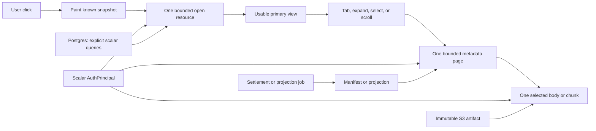
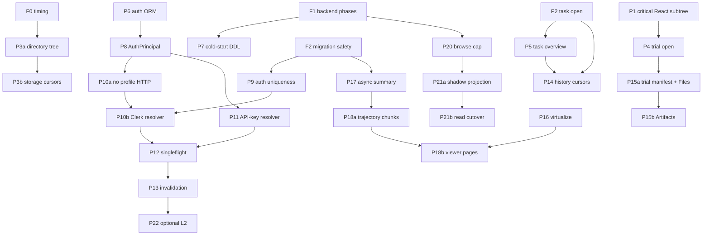

# Task and Trial Performance Rewrite — Implementation Plan

Status: proposed

Target branch: `staging` at `7549ca42`

Evidence: `baseline-staging-2026-08-10.har` and
[`auth-request-path.md`](./auth-request-path.md)

## Decision

These problems do coincide in one architecture, but they should **not** become
one large pull request.

The common failure is that a click starts broad work before the browser has the
small amount of data needed to paint:

- authentication can provision, write, call Clerk, and load ORM collections;
- task open hydrates every version and trial before returning the route;
- task Overview fetches and folds another full trial collection;
- task Files, trial Files, and Artifacts recursively enumerate trees;
- Summary refreshes data the parent already owns and starts hidden work;
- Trajectory transfers and mounts the complete artifact;
- browse and tags scan organization-wide data for small responses.

The rewrite is one **bounded-resource architecture** delivered as vertical,
independently deployable PRs. Each PR leaves the application better even if no
later PR lands. New read contracts live beside old ones during cutover, and no
request silently falls back to the expensive path.

This is the expected uplift order from the captured user flow:

1. Remove the blocking full task-detail bundle from task navigation.
2. Replace the recursive task-definition request with a bounded directory page.
3. Paint the selected trial immediately and replace its broad refresh with a
   bounded terminal-trial read.
4. Remove duplicated task Overview/history work.
5. Make Files, Artifacts, and Trajectory bounded by user intent.
6. Make cold authentication one read and coalesce bursts. This improves every
   route's cold tail, but it does not replace endpoint-specific work: the fresh
   HAR contained multi-second endpoints with approximately 0.4 ms warm auth.
7. Bound browse/tag work and add projections only where bounded queries still
   miss the database SLO.

## What success looks like

The browser gets useful control-plane data first. Large immutable payloads are
separate resources fetched only after intent. The frontend does not compensate
for a broad backend response by hiding it behind skeletons.

## Architectural invariants

1. **Every initial resource is bounded.** It declares maximum rows, response
   bytes, ordering, cursor semantics, and freshness.
2. **One visible region has one data owner.** A child renders the parent's
   snapshot or owns one canonical SWR key; it does not refetch the same entity
   under a second key.
3. **Render is derived from inputs.** Do not mirror fetched props into state or
   use an Effect to delay content that can render now. Effects synchronize real
   external systems only.
4. **Only the active tab mounts.** Summary, Files, Trajectory, and Artifacts do
   not fetch or import one another. Intent may prefetch exactly the addressed
   tab after primary paint.
5. **Exact counts and display rows are separate queries.** A count may be exact
   while its visible preview is capped and cursor-addressable.
6. **Steady-state auth is scalar and read-only.** An existing Clerk user or API
   key causes one bounded read, no external HTTP, and no synchronous write.
7. **Immutable content has stable identity.** Task-version files and settled
   trial artifacts use a content/artifact revision, ETag, and private immutable
   caching. Running-trial state uses a separate revision and short TTL.
8. **Derived work never runs in a GET.** Manifests, trajectory summaries, and
   expensive projections are created by idempotent jobs or reconcilers. Reads
   return `pending` when the product is not ready.
9. **Projections are implementation details.** The API contract stays stable if
   its authoritative query is later replaced by a reconciled projection.
10. **Migrations move forward.** Applied revisions are immutable. Schema,
    shadow population, reader cutover, and cleanup are separate deployments.

## Resource contracts

These are view contracts, not new generic repositories or a universal response
wrapper.

| Resource | Owns | Hard exclusions | Initial cap |
| --- | --- | --- | --- |
| `AuthPrincipal` | `user_id`, `org_id`, canonical role, auth kind, safe identity scalars | ORM objects, raw tokens, profile refresh data | One frozen scalar object |
| `TaskOpenResponse` | Task header, selected/default version, above-fold totals, capped trial refs | Full `result`, full analysis arrays, jobs, all versions, all trials | 50 KB; at most 20 refs; at most 3 handler SQL statements |
| `TaskOverviewResponse` | One version's verdict, source audit, exact QA counts, capped finding/trial refs | All-history trial bodies and client-side folding of full analysis JSON | 100 KB; at most 20 display rows |
| `TaskHistoryPage` | Versions or trial rows in deterministic order | Nested histories and uncapped jobs | At most 50 rows plus cursor |
| `TrialOpenResponse` | Trial header, timing/cost, terminal result summary, QA report, verifier summary, tab availability | Terminal queue lookup, worker-job history, collapsed log, S3 discovery | 75 KB; at most 2 handler SQL statements for terminal trials |
| `TrialLiveState` | Queue/running state that can actually change | Terminal result and immutable artifacts | One active trial; short poll/TTL |
| `FileManifestPage` | Path, kind, size, content hash, child marker, revision, cursor | Bodies and one presigned URL per row | At most 100 rows and 50 KB |
| `FileContent` | One selected preview or explicit full download | Sibling files | Preview at most 100 KB; stable ETag |
| `TrajectorySummary` | Stored schema-v5 summary and artifact revision | LLM generation | 50 KB; `ready` or typed `pending` |
| `TrajectoryPage` | Stable ordered step chunk | Complete ATIF by default | At most 50 steps and 250 KB |
| `TagDefinitions` | Tag identity, name, color, definition metadata | Usage-count scan | 25 KB target |
| `TaskBrowsePage` | Paged task cards, exact/cached counters, capped previews | All matching task enrichment and uncapped preview trials | Existing page size; bounded work per card |

Suggested endpoints may use `/open`, `/overview`, `/manifest`, and `/steps`, but
the invariant matters more than the spelling. When implemented, update
`AGENTS.md` for every API/storage/deployment contract change.

## Frontend ownership and request graph

| Visible region | Primary owner | Start condition | Allowed follow-up |
| --- | --- | --- | --- |
| Task route/header | Route-level `TaskOpenResponse` | Navigation | Overview plus task-file root after header paint |
| Task Overview | `TaskOverviewPanel` | Overview is visible | Next findings/history page after explicit expand/scroll |
| Task definition | `TaskFilesPanel` task-version manifest key | Tree is visible | One directory on expand; one body on selection |
| Trial frame/Summary | Selected-row snapshot, then `TrialOpenResponse` | Trial selection | Live state only for active trials; log only on expand |
| Trial Files | Settled-trial manifest key | Files tab intent/activation | One directory page and one selected body |
| Artifacts | The same settled-trial manifest revision with `kind=artifact` | Artifacts tab intent/activation | One selected artifact body |
| Trajectory | Summary plus first step-page key | Trajectory tab intent/activation | Next page near viewport boundary |

After primary content paints, no more than two secondary data requests may be in
flight. A direct link to a non-Summary tab prioritizes that tab; it does not also
load its siblings.

## PR sizing and isolation rules

- The application-code budget is **500 changed lines or fewer** per PR across
  `frontend/src`, `backend`, and `oddish/src`. Tests, migrations, fixtures, and
  docs are required but excluded from that budget. Deletions are reported
  separately instead of being used to hide a broad rewrite.
- `350–480` in the estimates below is a warning band. If the implementation
  crosses 500 application lines, split the backend contract from an immediately
  following frontend cutover; do not drop the tests or compatibility boundary.
- A PR may depend on merged predecessors, never on an unmerged successor.
- Every new endpoint is org-scoped and ships beside the old endpoint. The
  frontend switches to exactly one reader; it does not race V1 and V2 or catch
  errors and issue the expensive request.
- Every PR has its own latency/query/request-shape assertion and rollback.
- Feature flags belong at reader boundaries only. Remove them after the soak;
  do not build a general flag or repository abstraction for this migration.
- Schema PRs are additive. A code rollback may leave an unused additive table,
  column, or index until a later forward cleanup revision.

## Foundation PRs

These do not count as user-impact priority. Land them first or alongside P1 so
every later before/after comparison is attributable.

| PR | Status | Scope | App LOC | Gate and rollback |
| --- | --- | --- | ---: | --- |
| F0 — timing propagation | Complete | Forward/join upstream `Server-Timing` and trace context through the generic Next proxy and the hot task/trial/tag proxies, including errors and streams. | 80–160 | 4 header contract tests passing. Frontend-only revert. |
| F1 — backend phase metrics | Proposed | Separate credential verification, cache, pool checkout, SQL, external HTTP, commit, and handler DB/total spans. Add response byte/query-count observations without payload data. | 120–220 | Cold/warm/20-way traces have all phases. Backend-only revert. |
| F2 — migration immutability CI | Proposed | Reject deletion/modification of protected Oddish or backend revisions. Upgrade one database in protected Oddish → protected backend → candidate Oddish → candidate backend order. | 0 | Mutation/deletion fixtures must fail. CI-only revert. |

## Recommended staged PRs

### Wave 1 — make task and trial clicks immediately useful

#### P1 — One critical React subtree

**Outcome:** task/trial selection paints known data immediately and Summary is
the only mounted drawer tab.

- Stop the task route from blocking its first shell on the legacy full-detail
  response; reuse the browse/SWR snapshot when available.
- Render the selected trial row immediately while one background revalidation
  fills only missing fields.
- Remove the fixed 150 ms task-to-trial transition.
- Mount/import only the active tab. Do not fetch a terminal analysis log until
  its disclosure is expanded. Do not scan trial files for legacy verifier data
  during Summary open.
- Keep one canonical resource key; no Effect should copy a fetched snapshot
  into a second state owner.

Dependencies: none. Estimated app LOC: 250–400.

Gate: shell/report visible within 100 ms; Summary open emits no terminal log,
recursive verifier, Files, Artifacts, or Trajectory request. Rollback is
frontend-only.

#### P2 — Bounded task-open vertical slice

**Outcome:** a task click no longer hydrates all history or returns the captured
1.59 MB RSC bundle.

- Add `TaskOpenResponse` and one org-scoped explicit scalar/aggregate query.
- Page/select task identity before any enrichment.
- Return only header fields, selected/default version, aggregate totals, and at
  most 20 compact trial refs.
- Cut the task route to this resource. Keep `/detail` unchanged for remaining
  consumers during the soak.

Dependencies: P1 recommended, not required for backend safety. Estimated app
LOC: 350–480.

Gate: at most 50 KB, three handler SQL statements, no mapper hydration of
`TaskModel.trials`, handler p95 below 150 ms excluding auth. Roll back the
frontend reader; leave the additive endpoint.

#### P3a — Directory-first task tree and immutable file caching

**Outcome:** the left task-definition pane no longer requests 3,384 paths or
6.81 MB before showing its root.

- Make the tree request one non-recursive directory page with
  `inline=false`, `presign=false`, `limit`, and a stable cursor.
- Expand one directory at a time and fetch one selected preview.
- Pass ETag, `Cache-Control`, 304, range, and content headers through Next
  without JSON reserialization.
- Retain the explicit full archive/stream action for file-only and public-share
  views; do not silently route the overview pane through it.

Dependencies: F0 for measurable cache headers. Estimated app LOC: 250–400.

Gate: the captured tree request is non-recursive and metadata-only, visible p95
is below 500 ms, and a repeated selection is a browser hit/304. The frontend can
switch back to the old recursive route during the compatibility window.

#### P3b — Enforce the file-page contract in every storage branch

**Outcome:** boundedness is a backend guarantee, including flat directories and
archive-backed tasks, rather than a convention in the new UI.

- Define one cursor response and enforce `limit`/cursor in archive,
  existing-manifest, and object-storage implementations. The current recursive
  archive branch may not ignore them.
- Run the same ordering, continuation, wrong-revision, and end-of-list contract
  tests against every implementation.
- Use the existing `.oddish-manifest.json` as task-version listing ownership;
  enqueue an explicit legacy backfill only where the manifest is absent.

Dependencies: P3a. Estimated app LOC: 280–430.

Gate: every page is at most 100 rows/50 KB with stable, complete cursors and no
body/presign fields. Code-only backend rollback leaves P3a's directory-first
behavior intact.

#### P4 — Bounded trial-open vertical slice

**Outcome:** terminal Summary freshness is one small database read, not queue,
job, log, and S3 work.

- Add `TrialOpenResponse` using explicit trial/task columns.
- For a terminal trial, omit queue position and worker-job queries. Read active
  scheduling state from a separate `TrialLiveState` resource only while active.
- Serve the stored `_verifier` summary directly. Legacy artifact discovery is
  an explicit repair/backfill path, not a Summary request fallback.
- Seed the new key from the selected-row snapshot and revalidate without
  replacing renderable data with a skeleton.

Dependencies: P1. Estimated app LOC: 300–450.

Gate: terminal response at most 75 KB/two SQL statements, fresh p95 below
500 ms, and no queue/job/log/S3 operation. Roll back the frontend reader and
retain the endpoint.

#### P5 — Bounded task Overview

**Outcome:** the left Overview stops downloading full version trials and
folding complete analysis objects in the browser.

- Add `TaskOverviewResponse` for exactly one task version.
- Return exact aggregate counts independently from at most 20 compact
  trial/finding refs, each capped collection carrying a cursor or `has_more`.
- Cut `TaskOverviewPanel` to this one resource and remove its duplicate
  `/trials?version=` ownership.

Dependencies: P2 for shared task/version identity only. Estimated app LOC:
350–480.

Gate: at most 100 KB/20 rows, no full result/job/analysis history, sampled old
and new counts/verdicts agree. Roll back at the reader boundary.

### Wave 2 — remove cross-cutting database stalls

#### P6 — Remove auth ORM collection fan-out

**Outcome:** a cold principal lookup no longer triggers unused organization/user
collection reads.

- Remove the four mapper-level `lazy="selectin"` relationships on
  organization/user API-key and membership collections.
- Add a mapper/query-count guard modeled on the existing task/trial lazy-loading
  regression test.
- Keep the backend test FK shim unless test-schema parity is deliberately
  replaced; do not bundle a TTL change.

Dependencies: none. Estimated app LOC: 30–100.

Gate: current cold Clerk and API-key query counts decrease or stay explicitly
bounded. Code-only revert.

#### P7 — Remove role DDL from API-container startup

**Outcome:** a cold container does not make four consumers compete for a
three-connection pool or repeat `ALTER ROLE` across containers.

- Move runtime-role defaults to a singleton deploy/ops step using the runtime
  DSN and an advisory lock, or provision them through the DBA.
- API and standalone server startup must not issue role DDL.

Dependencies: F1. Estimated app LOC: 80–180.

Gate: cold-start traces show no API `ALTER ROLE` and no checkout wait caused by
the role task. Re-enable the deploy hook/startup path only if runtime-role
verification fails.

#### P8 — Scalar `AuthPrincipal` and cache-shape parity

**Outcome:** cache hits and misses authorize identically and endpoints no longer
depend on detached ORM objects.

- Normalize Clerk v1/v2 claims into one frozen scalar `AuthPrincipal`.
- Change the existing 60-second cache to store that principal directly.
- Move the small set of ORM-dependent consumers (`/org`, settings, invites,
  submission fallbacks) to explicit narrow endpoint reads.
- Do not increase TTL or introduce a shared cache.

Dependencies: P6. Estimated app LOC: 300–450.

Gate: cache-hit/miss parity for permissions, org, settings, and invite behavior.
Rollback keeps the public dependency signature stable.

#### P9 — Membership uniqueness and restore policy

**Outcome:** concurrent JIT provisioning has one canonical live membership.

- Add a forward backend migration for live `(clerk_user_id, org_id)` uniqueness.
- Audit duplicates, inactive rows, and tombstones. Restore the same canonical
  membership deliberately and replace the conflicting non-partial email rule
  only after the collision audit.
- Chain from the current backend head; do not modify an applied revision.

Dependencies: F2. Estimated app LOC: 50–150 plus migration/audit code.

Gate: production-like audit, concurrent provision test, and full ordered
forward-upgrade test. Roll back application use before any future constraint
change; an additive uniqueness constraint may remain.

#### P10a — Remove profile HTTP from steady-state login

**Outcome:** Clerk/GitHub enrichment cannot pin an auth transaction or add a
10-second HTTP timeout to an existing user's request.

- Move GitHub/profile refresh out of `get_or_create_user_in_org`'s found path.
- Let Clerk user/membership webhooks own normal profile changes and provide an
  explicit idempotent backfill/repair command for missed historical data.
- Assert that no external HTTP span overlaps a checked-out auth connection.

Dependencies: P8. Estimated app LOC: 180–320.

Gate: existing-user login performs no profile HTTP while preserving webhook and
backfill convergence. Re-enable the old refresh call only as a code rollback,
never as a per-request fallback.

#### P10b — One-query read-only Clerk resolver

**Outcome:** an existing signed-in user performs one scalar SELECT, no write,
and no Clerk/profile HTTP.

- Resolve active user plus organization scalars in one explicit org-scoped
  query.
- Only authoritative not-found enters provisioning. Run external Clerk work
  without a checked-out DB session, commit provisioning, then re-resolve.
- Shadow-compare successful V1/V2 resolutions, but never fall back after a V2
  denial.

Dependencies: P8, P9, and P10a. Estimated app LOC: 280–420.

Gate: one select, zero writes, zero external HTTP for an existing principal;
no transaction spans external I/O; cold resolver p95 below 150 ms after token
verification. Disable the V2 reader to roll back.

#### P11 — API-key scalar resolver

**Outcome:** API-key auth stops doing multiple ORM reads and a synchronous
`last_used_at` write.

- Resolve key, scope, expiry, active org, and soft-delete state in one scalar
  query without requiring a live creator row.
- Move usage touch to sampled/batched telemetry outside the request transaction.

Dependencies: P8. Estimated app LOC: 220–380.

Gate: one select/zero writes with expiry, revoke, tombstone, scope, and orphaned
creator tests. Revert the resolver; sampled telemetry is independently safe to
leave or disable.

#### P12 — Per-principal singleflight

**Outcome:** a same-container route burst performs one cold resolver, not one
per concurrent API request.

- Use task-owned per-key work keyed by Clerk user/org or a hashed API-key
  identity.
- Followers await the leader with cancellation shielding; cleanup is
  identity-safe in `finally`; errors are never cached; distinct keys stay
  parallel; pending work is capacity-bounded.
- Use a monotonic expiry clock. Keep the local TTL at 60 seconds.

Dependencies: P10b and P11. Estimated app LOC: 180–300.

Gate: 20 same-key requests cause one resolver; distinct keys remain parallel;
leader exception and follower cancellation allow a clean retry. Disable the
singleflight wrapper to roll back.

#### P13 — Explicit local invalidation

**Outcome:** mutations and webhooks invalidate the local scalar cache
deliberately instead of waiting silently for TTL.

- Centralize invalidation for membership/role/org settings, member removal,
  user updates, API-key revoke, and other authorization mutations.
- Emit hit, miss, coalesced-waiter, and invalidation metrics with container
  scope made explicit.

Dependencies: P12. Estimated app LOC: 180–320.

Gate: a mutation matrix proves local invalidation. Rollback returns to the
60-second TTL; no correctness path may assume broadcast invalidation exists.

#### P14 — Cursor versions and trial history

**Outcome:** task-open cost stays flat as tasks accumulate versions and trials.

- Add stable cursor pages for versions and historical trials.
- Remove remaining history arrays from the open contracts.
- Fetch queue/job state only for visible active rows.

Dependencies: P2 and P5. Estimated app LOC: 250–400.

Gate: a deep-history fixture cannot increase P2/P5 bytes or query count; cursors
are deterministic and complete. Code-only reader rollback.

### Wave 3 — make secondary trial content scale to large runs

#### P15a — Settled-trial manifest and Files cutover

**Outcome:** Files opens from one revisioned metadata source without recursive
S3 enumeration.

- At settlement, persist one idempotent trial manifest keyed by trial artifact
  revision/hash. Include path, kind, size, content hash, and directory index.
- Add a bounded page filtered by directory/prefix/kind.
- Cut Files to the canonical manifest SWR identity and fetch one selected body.
  Running trials use a revisioned short-TTL view until settlement.
- Do not create a second task manifest: task-version paths continue to use the
  existing `.oddish-manifest.json` ownership from P3b.

Dependencies: P4. Estimated app LOC: 400–500.

Gate: first page is at most 100 rows/50 KB with one selected body, and manifest
generation is idempotent. Disable manifest reads to use the existing listing
during the soak.

#### P15b — Artifacts cutover to the same manifest

**Outcome:** Artifacts stops enumerating the trial separately and switching
Files → Artifacts reuses the same artifact revision.

- Query the P15a page with `kind=artifact`/prefix filtering rather than fetching
  all paths and filtering in the browser.
- Keep the same canonical manifest revision in SWR, mount one directory page,
  and fetch content only after an explicit selection.

Dependencies: P15a. Estimated app LOC: 150–280.

Gate: Files → Artifacts does not repeat the base manifest request; the artifact
page is at most 100 rows/50 KB and fetches at most one body. Frontend-only
rollback leaves the Files improvement intact.

#### P16 — Virtualize the existing trajectory immediately

**Outcome:** 500-action trajectories stop mounting hundreds of accordion trees
even before transfer is chunked.

- Virtualize the stable step list with a small overscan window.
- Keep expanded-step state keyed by stable step ID, not list index.
- Move whole-trajectory derived calculations out of repeated row renders.

Dependencies: none. Estimated app LOC: 150–280.

Gate: fewer than 100 step rows mounted for a 500-step fixture and identical
expanded-step behavior. Frontend-only revert.

#### P17 — Asynchronous trajectory summary

**Outcome:** a missing summary GET never spends 18 seconds running Claude.

- Add a durable idempotent summary job keyed by
  `(trial_id, trajectory_artifact_hash)` and enqueue it at settlement.
- Reuse the existing summary service inside the worker handler.
- Backfill existing terminal trials through an explicit sweep/repair command.
  A missing/stale summary GET returns typed `pending`; it neither enqueues nor
  performs synchronous LLM work.
- Update the documented worker-job kind when implemented.

Dependencies: F2. Estimated app LOC: 300–450 plus migration.

Gate: ready/pending read below 200 ms backend time, job idempotency and stale
artifact invalidation tests. The old stored summary remains readable on rollback.

#### P18a — Trajectory step chunks and cursor API

**Outcome:** the backend can serve bounded trajectory pages without replacing
the canonical ATIF artifact.

- Build a deterministic step index/chunks at settlement without replacing the
  canonical immutable ATIF artifact.
- Add stable cursor reads while retaining explicit full artifact download.

Dependencies: P17. Estimated app LOC: 300–450.

Gate: every page is at most 50 steps/250 KB, full cursor reconstruction equals
the source artifact, and first-page backend p95 is below 200 ms. The existing
viewer remains compatible during rollback.

#### P18b — Trajectory first-page frontend cutover

**Outcome:** a 500-action trial no longer transfers or parses full ATIF on tab
open.

- Cut the virtualized viewer to summary plus the P18a first page.
- Load the next chunk near the virtual viewport boundary and preserve expanded
  state by stable step ID.
- Keep the explicit full-artifact download.

Dependencies: P16 and P18a. Estimated app LOC: 200–350.

Gate: initial browser data is at most 50 steps/250 KB, fewer than 100 rows are
mounted, and usable first page p95 is below 500 ms. Disable the page reader to
fall back to the full artifact while retaining virtualization.

### Wave 4 — make entry surfaces cheap and constant-work

#### P19 — Cheap tag definitions

**Outcome:** routine filters stop waiting for a 1–28.77 second usage-count scan.

- Add an org-scoped definition-only endpoint for identity, name, color, and
  definition metadata.
- Cut filters and editors that do not display counts to it.
- Leave usage analytics on the management route until a later projected count
  is justified; never call the count route as a fallback.

Dependencies: none. Estimated app LOC: 180–300.

Gate: indexed definition read, at most 25 KB, no task/version array unnest.
Frontend reader rollback.

#### P20 — Cap browse-card enrichment

**Outcome:** the current successful browse page stops loading all current-version
preview trials for every visible card.

- Keep the existing page-before-enrichment ordering.
- Select a deterministic maximum preview per visible card with `has_more` while
  retaining separate exact counters.
- Add a query/row cap that cannot grow with a task's full trial history.

Dependencies: F1. Estimated app LOC: 250–400.

Gate: 24-card work is bounded by `page_size × preview_limit`; card values match
the authoritative path; browse no longer regresses to 500. Code-only rollback.

#### P21 — Shadow browse activity projection

**Outcome:** organization-wide activity ordering can leave the request path if
the bounded authoritative query still misses its SLO.

This is intentionally two PRs:

1. **P21a — schema, writer/reconciler, and shadow comparison**
   (350–480 app LOC plus a new forward Oddish migration). Rebaseline any stale
   rows in `task_version_browse_summaries`; do not assume the restored table is
   current. Produce drift and freshness metrics while the authoritative reader
   remains live.
2. **P21b — read cutover only** (150–250 app LOC). Switch ordering/enrichment
   behind one reader selector after drift is zero and p95 is better. Keep the
   authoritative rebuild as a repair command, not a per-request fallback.

Dependencies: P20 plus evidence that its bounded query misses the gate.

Gate: reconciler idempotency, zero sampled drift, freshness SLO, and browse p95
below 500 ms backend time excluding auth. Reader-selector rollback is immediate;
additive schema remains.

### Conditional tail work

#### P22 — Shared auth L2 or broadcast versioning, only with evidence

Add a shared scalar cache/invalidation mechanism only if P10b–P13 telemetry shows
material cross-container misses or the product requires tighter global
revocation. Keys must be versioned; values contain no ORM object, raw token, or
PII beyond the existing scalar authorization identity. Cache failure falls back
to the one-query resolver, never to allow.

Dependencies: P13 and measured need. Estimated app LOC: 300–450.

Gate: shadow-read parity and cross-container burst improvement. One flag disables
L2 and returns to the 60-second local cache. Do not increase TTL in this PR.

#### P23 — Compatibility cleanup

After at least one stable release and HAR/query-count gates, remove unused
legacy `/detail`, recursive overview, duplicate trial fetch, and reader flags.
Remove schema only through later forward revisions after rollback no longer
needs it. Update `AGENTS.md` with the final stable contracts.

Dependencies: all relevant consumers migrated and observed. Estimated app LOC:
at most 250 changed lines plus deletions.

Gate: repository-wide route/contract search finds no consumer; public-share and
CLI paths retain their explicit full-download behavior. Rollback is the prior
release, not an in-request fallback.

## Dependency map

Independent nodes can be developed concurrently, but merge and measure one at a
time on staging so each uplift is attributable.

## Placement in the existing codebase

Keep the existing package boundary while introducing the new contracts:

| Responsibility | Existing owner to extend |
| --- | --- |
| Host-neutral task/trial open queries and schemas | `oddish/src/oddish/core/endpoints/` and `oddish/src/oddish/schemas.py` |
| File listing/cursor behavior and task manifests | `oddish/src/oddish/db/storage.py` plus the existing task-file core endpoints |
| Host-neutral settlement jobs and idempotency | `oddish/src/oddish/workers/` and the existing `worker_jobs` registry |
| Hosted org-scoped route adapters | `backend/api/routers/tasks.py` and `backend/api/routers/trials.py` |
| Clerk/API-key principal resolution and invalidation | `backend/auth/`, `backend/models.py`, and hosted mutation/webhook routers |
| Next response/header pass-through | `frontend/src/lib/backend-response.ts`, `frontend/src/lib/server-timing.ts`, and focused `frontend/src/app/api/` routes |
| Task route and resource ownership | `frontend/src/app/(app)/tasks/[task_id]/page.tsx` and `task-detail-client.tsx` |
| Task Overview and definition tree | `frontend/src/components/task-overview-panel.tsx` and `task-files-panel.tsx` |
| Trial Summary and tab ownership | `frontend/src/components/trial-detail-panel.tsx`, `use-verifier-summary.ts`, and `use-trial.ts` |
| Trial Files and Artifacts | `frontend/src/components/task-files-panel.tsx` and `artifacts-viewer.tsx` |
| Trajectory summary/API/view | `backend/api/routers/trials.py`, the current summary service, and `frontend/src/components/trajectory-viewer.tsx` |
| Browse and tags | `oddish/src/oddish/core/endpoints/tasks_query.py` and `backend/api/routers/tags.py` |

`oddish` must remain self-hostable and must not import `backend`. If P17 turns
trajectory summary generation into a built-in worker job, move or wrap the
host-neutral summary primitive under `oddish` and let `backend` register hosted
capabilities; do not make the core handler import the current backend service.
Clerk, multi-tenant auth, Modal wiring, and hosted webhooks remain in `backend`.

Do not add a generic `ReadModelRepository`, universal cache adapter, or wrapper
component hierarchy. The reusable units are only the invariants shared by real
consumers: cursor encoding, transparent response headers, scalar principals,
singleflight, job idempotency, and stable artifact revision identity.

## Database implementation rules

- Use explicit column selects for open resources. Do not fix broad ORM loading
  by adding a different eager-loader combination.
- Apply org and soft-delete predicates in every authoritative query, including
  raw SQL paths.
- Page identities before enrichment. Cap enrichment with a lateral/windowed
  query or a second bounded query, never an N+1 loop.
- Use keyset cursors with a stable unique tiebreaker. Encode the ordering fields
  and reject a cursor for the wrong resource/revision.
- Add an index only after `EXPLAIN (ANALYZE, BUFFERS)` on the final query and an
  audit of existing production indexes.
- Transactional lifecycle code may enqueue an idempotent worker job in the same
  transaction. It should not synchronously build large manifests or run an LLM.
- Every projection owns a reconcile/rebuild path, `as_of`/revision metadata,
  drift comparison, and a reader selector. Do not put synchronous refresh hooks
  across every mutation path in the same PR as read cutover.
- The restored `task_browse_summary_001` migration is immutable. Its table is
  application-unused and stale after its one-time backfill; its trial preview
  index is live and may be planner-used. Measure before reusing or changing it.
- New local recent-activity migrations must chain after
  `task_browse_summary_001`, not an older head.

## Caching and invalidation

| Data | Identity | Policy |
| --- | --- | --- |
| Local auth principal | Opaque credential identity plus canonical org/role | 60-second monotonic TTL; explicit local invalidation; singleflight |
| Task open/overview | Task ID, selected version, task/update revision | Revalidate; short private TTL or SWR based on mutability |
| Task file page/content | Task-version content revision, directory/path, cursor | Long private immutable cache; ETag/304 |
| Terminal trial open | Trial ID plus settlement/update revision | Revalidate once, then long private cache when revision is terminal |
| Running trial live state | Trial ID plus attempt/revision | Short TTL/poll only while visible |
| Trial manifest/content | Trial artifact revision, prefix/kind/path, cursor | Long private immutable cache; ETag/304 |
| Trajectory summary/page | Trajectory artifact hash plus summary schema/cursor | Long private immutable cache; `pending` is short-lived |

Next route handlers must preserve upstream caching and timing headers. Parsing
and reserializing immutable responses should be the exception, not the default.

## Measurement and release gates

Measure browser click-to-shell, click-to-primary-content, and
click-to-secondary-content alongside `Server-Timing`, trace ID, SQL count,
response bytes, request count, and mounted rows.

| Interaction | Release gate |
| --- | --- |
| Click task | Shell/header feedback under 100 ms; warm usable header p95 under 500 ms; cold existing-principal p95 under 1 s |
| `TaskOpenResponse` | At most 50 KB, 3 handler SQL statements, handler p95 under 150 ms excluding auth |
| Task Overview | Usable p95 under 500 ms; at most 100 KB/20 display rows; no second full-task request |
| Task file root | Visible p95 under 500 ms; at most 100 rows/50 KB; independent of descendant count |
| Selected file | Warm first byte p95 under 300 ms; cached repeat is a hit/304; preview at most 100 KB |
| Trial Summary | Snapshot under 100 ms; fresh p95 under 500 ms; one critical backend request |
| `TrialOpenResponse` terminal path | At most 75 KB/2 SQL statements; no queue, jobs, log, or S3 |
| Files or Artifacts | First page p95 under 500 ms; shared revision; at most 100 rows/50 KB and one body |
| Trajectory | Summary and first page p95 under 500 ms; at most 50 steps/250 KB and fewer than 100 mounted rows |
| Auth existing Clerk/API key | One select, zero writes, zero external HTTP; same-key burst has one resolver |
| Tags | Definition endpoint indexed and under 25 KB; no usage-count scan |
| Browse | 200 response; bounded card rows; target backend p95 under 500 ms after any proven projection cutover |

Run each gate with cold and warm browser assets, warm and cold existing
principals, a 20-way same-user burst, a deep-history task, a 3,000-file task,
and a 500-step trajectory. Report p50/p95/p99, not the best run.

Required regression barriers:

- frontend network-shape tests for task navigation and every trial tab;
- backend query-count and response-byte tests for every open contract;
- cursor conformance across every storage implementation;
- immutable cache-header/304 tests through backend and Next;
- auth cache-hit/miss parity, resolver no-write, and singleflight cancellation;
- settlement job idempotency and stale-revision invalidation;
- production-like ordered migration upgrade and protected-revision immutability;
- one reproducible HAR after each wave, compared with
  `baseline-staging-2026-08-10.har`.

## Completion criteria

The rewrite is complete when:

- task and trial selection paint a real snapshot immediately;
- first responses do not scale with total versions, trials, files, artifacts,
  trajectory steps, tag assignments, or organization tasks;
- Summary, Files, Trajectory, and Artifacts have separate intent-driven owners;
- settled immutable content is manifest-addressed and cacheable end to end;
- existing-user and API-key auth are one read/no write, with burst coalescing;
- no GET calls Clerk, recursively enumerates S3, runs an LLM, or performs a
  hidden full-history fallback;
- browse remains correct and any projection has reconciliation, drift evidence,
  and an independent read cutover;
- every legacy compatibility path has an explicit owner and removal date.

That is one coherent rewrite at the architecture level, delivered as small
vertical PRs whose benefits accumulate instead of a coupled migration that must
all succeed at once.
