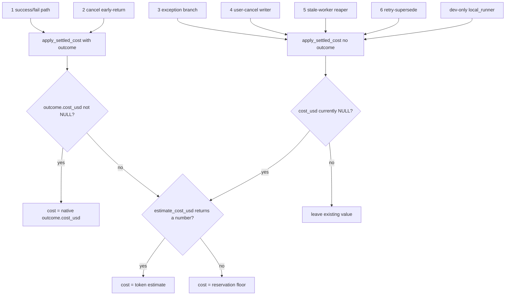

# S1 — Cost Completeness

## The invariant

**A settled billable trial must never have `NULL` cost_usd.**

"Settled" means the trial reached a terminal state and had `finished_at` set;
"billable" means it consumed a slot that did real work (RUNNING / QUEUED /
RETRYING — never a never-started PENDING row).

Why it matters: later slices compute a user's daily spend with
`SUM(cost_usd)` over their settled trials. SQL `SUM` **skips `NULL` rows**. So a
settled billable trial left at `NULL` is *invisible spend* — it draws down the
budget in reality but contributes `0` to the sum, and a start-then-cancel loop
could bypass the cap entirely. S1 closes that gap by guaranteeing every settled
billable terminal writes a real dollar value.

## `apply_settled_cost` — the one chokepoint

Every terminal writer routes cost through `apply_settled_cost(trial, outcome=None)`
in `oddish/src/oddish/trial_cost.py`. It has **two modes**:

**Outcome present** (`outcome is not None`). We have Harbor's authoritative
result. Copy the token counts (`input`, `cache`, `cache_write`, `output`,
`total_steps`) onto the trial, then set `cost_usd` to the first of:

1. `outcome.cost_usd` — the provider's native dollar figure, if non-`NULL`;
2. else `estimate_cost_usd(...)` derived from the token counts and the model's
   price sheet, if it returns a number;
3. else the **reservation floor**.

This branch **overwrites** whatever `cost_usd` held before — so a late real
outcome cleanly replaces an earlier floor (one value, never summed twice).

**Outcome absent** (`outcome is None`). We have no fresh result — the worker
died, an exception fired, or a reaper is settling the row. Floor **only if
`cost_usd` is currently `None`** (`_estimate_or_floor(trial)` off the tokens
already on the row, else the constant). If a real value is already there, leave
it untouched — never clobber known spend with a guess.

The **reservation floor** is `settings.pending_trial_reservation_usd`, a
deploy-time `Decimal` config (`config.py`, default `0.50`, env
`ODDISH_PENDING_TRIAL_RESERVATION_USD`). `_estimate_or_floor` returns
`float(...)` of it as the last resort.

## The six terminal writers

| # | Site | Scenario | Call |
|---|------|----------|------|
| 1 | `trial_handler.py:590` success/fail path | Normal settle: SUCCESS, no-reward SUCCESS, or any FAILED with a Harbor outcome | `apply_settled_cost(trial, outcome)` |
| 2 | `trial_handler.py:563` cancel early-return | Trial was user-cancelled while running, but a late outcome still arrived — persist its partial cost before returning | `apply_settled_cost(trial, outcome)` |
| 3 | `trial_handler.py:648` exception branch | Worker raised, no outcome at all — floor if still NULL | `apply_settled_cost(trial)` |
| 4 | `queue.py:240` user-cancel writer | Killed-worker cancel: the API flips the row to FAILED itself; `_store_trial_results` never runs, so this writer floors billable slots synchronously (skips PENDING) | `apply_settled_cost(trial)` |
| 5 | `cleanup.py:397` stale-worker reaper, FAILED branch | Heartbeat stalled and attempts exhausted — reaper settles the orphan and floors | `apply_settled_cost(trial)` |
| 6 | `trials.py:158` retry-supersede | User retries a stuck trial; the old row is snapped to a terminal FAILED and floored so its spend isn't lost | `apply_settled_cost(old_trial)` |

Plus a **dev-only** seventh: `local_runner.py:331,343` (in-process probe runs)
floors on both its SUCCESS and FAILED terminals, but not on `dry_run`.

## Flow

## Suspicious parts

- **Broad `except Exception` in `_estimate_or_floor`.** Safe — deliberate. The
  estimator does `int(tokens)`, so a malformed token field (e.g. the string
  `"1000.0"`) would raise `ValueError` mid-settlement. Swallowing *any* estimator
  failure and falling through to the floor is exactly what keeps the invariant
  intact: a settlement path must never propagate an exception that would leave
  `cost_usd` NULL. Covered by `test_non_int_token_never_raises_and_falls_back_to_floor`.

- **QUEUED counts as billable, PENDING is skipped** (`BILLABLE_CANCEL_TRIAL_STATUSES`
  = QUEUED/RUNNING/RETRYING). Safe — intended (spec §10, §17-P0.2). A QUEUED row
  has claimed a slot and may have spun up a sandbox, so flooring it is correct. A
  PENDING row never started work, so charging it would bill pure queue churn. The
  billable check reads the *original* status at `queue.py:225`, before line 229
  overwrites it to FAILED — so the gate is evaluated correctly.

- **A cancelled PENDING row gets `finished_at` set but keeps `cost_usd` NULL.**
  Safe — this is the intended shape, not a leak. The daily SUM skips the NULL
  row, which is correct: a never-started trial did `$0` of billable work, so its
  contribution *should* be zero. The invariant is scoped to *billable* trials;
  PENDING is explicitly excluded.

- **Flooring nop/oracle baselines.** Safe (accepted coarseness). These
  deterministic baselines run on the canonical `nop_oracle` model, which has no
  price sheet entry, so `estimate_cost_usd` returns `None` and they settle at the
  floor even though they burn no LLM tokens. That's a small phantom charge, but
  the floor is a deliberately coarse guardrail (spec Q5/D2: "a flat constant …
  the whole reservation is just a guardrail"), and S1's contract is only "never
  NULL for billable," not "exactly right." Not an S1 bug; a future tightening
  (per-model tier / explicit `0.0` carve-out) can refine it.

- **Dev-only `local_runner` path.** Safe. It floors on both real terminals and
  correctly leaves `dry_run` uncharged (`cost_usd` stays NULL — a dry run settled
  nothing). It never runs in the hosted worker, so it can't affect production
  quota accounting; it's covered for completeness only.

- **Any place cost could still settle NULL?** Swept all six writers plus the
  dev path. Every branch that sets `finished_at` on a billable trial routes
  through `apply_settled_cost`, which cannot return leaving a billable settled
  row at NULL: outcome-present always assigns, outcome-absent assigns whenever
  `cost_usd` was NULL. The only NULL survivors are non-billable (cancelled
  PENDING, dry-run), which is intended. **No real bug found — no code change.**
