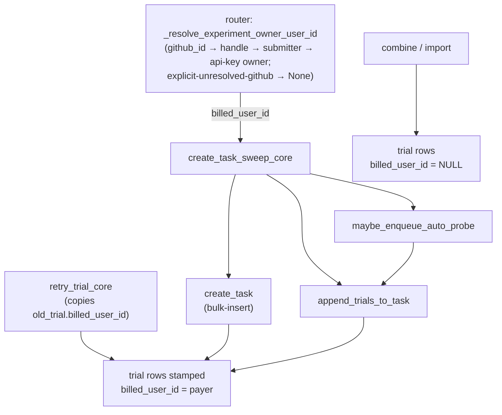

# S2 — Per-Trial Attribution

## The invariant

**Every Oddish-billed trial carries `billed_user_id`** — the payer whose daily
budget its cost draws down. `NULL` means the trial's cost draws down *nobody's*
quota (imported / combined rows, which are outside today's billing window).

Why it matters: a later slice enforces the per-user daily quota with

```sql
SELECT SUM(cost_usd) FROM trials
WHERE org_id = ? AND billed_user_id = ? AND finished_at >= ? AND deleted_at IS NULL
```

That sum keys on `billed_user_id`. A trial that is *actually* billable but was
inserted `NULL`-billed is silently uncounted spend: it draws down the real
budget but contributes `0` to the sum, so the payer can exceed their cap by the
accumulated cost of every NULL-billed trial. S2 closes that gap by stamping the
payer at **creation** in every path that mints a new billable trial.

## The "stamp at creation in four billable paths" contract

`billed_user_id` is set once, when the trial row is first written — never
back-patched. Four paths create billable trials, and all four thread the value
through:

1. **Sweep bulk-insert** (`create_task` → `_bulk_insert_trials`,
   `oddish/queue.py`) — the create-mode path. The payer rides in each trial row
   dict and is carried through the raw `INSERT ... unnest` SQL (see below).
2. **Append** (`append_trials_to_task`, `oddish/queue.py`) — new trials added to
   an existing task copy the same dict shape and pass `billed_user_id` through.
3. **Retry** (`retry_trial_core`, `oddish/core/endpoints/trials.py`) — a retry
   mints a fresh immutable trial that copies the superseded row's spec, including
   `billed_user_id=old_trial.billed_user_id`. A NULL-billed trial retries to
   NULL; a stamped one carries its payer forward.
4. **Auto-probe** (`maybe_enqueue_auto_probe`, `oddish/core/probe/auto_probe.py`)
   — the opt-in probe trial is a normal append, so it forwards `billed_user_id`
   into `append_trials_to_task`. Both call sites in `sweep.py` (append-mode *and*
   create-mode) pass the payer.

### Who is the payer? — resolution happens in the router, *before* core

The `billed_user_id` value is resolved once per submission by the backend router
(`backend/api/routers/tasks.py`), via `_resolve_experiment_owner_user_id`, and
passed **into** `create_task_sweep_core` — not resolved after the insert. This is
"owner precedence":

1. explicit GitHub identity (immutable `github_id` beats mutable handle) →
   the exactly-one active org member carrying it, via `_resolve_connected_user`;
2. an **explicit but unresolved** GitHub identity → `None` (leave owner unset —
   it matches the legacy github-tag Mine filter, and there is no org member to
   bill);
3. else the submitter (`auth.user_id`);
4. else the API-key owner (`api_key.created_by_user_id`).

The single-sweep route resolves once and **reuses** that same value both for
`billed_user_id` and for `_stamp_experiment_owner`, so the payer and the
dashboard-Mine owner can never drift. The batch route resolves per item through a
`resolve_billed_user_id` callback into `create_task_sweep_batch_core`, running
inside each item's savepoint — same algorithm, no second implementation.

### What is left NULL — by omission, on purpose

- **Combine** copies a curated field tuple (`_COMBINE_TRIAL_RESULT_FIELDS` in
  `oddish/core/endpoints/deletion.py`); `billed_user_id` is *not* in it, so
  combined result-trials land NULL.
- **Import** builds `TrialModel(...)` explicitly and never sets the column, so it
  defaults to NULL.

Both are correct: they materialize *already-paid-for* trials, not new spend, so
they must not draw down anyone's live quota.

## The raw `INSERT ... unnest` SQL — two positional contracts

`_TRIAL_BULK_INSERT_SQL` (`oddish/queue.py`) inserts N trials with one
statement whose shape is constant regardless of N (`unnest` over per-column
arrays, cheap under Supavisor transaction pooling with `statement_cache_size=0`).
Threading a new column through it means keeping **two** independent positional
contracts intact:

1. **INSERT-column ↔ SELECT-expression** — the *k*-th name in the `INSERT
   (...)` column list is filled by the *k*-th expression in `SELECT ...`. Here
   `billed_user_id` is the 7th INSERT column and `t.billed_user_id` is the 7th
   SELECT expression. The SELECT references columns of `t` **by name**, so its
   ordering just has to line up with the INSERT list.
2. **unnest-argument ↔ ORDINALITY-alias** — `unnest(CAST(:a …), CAST(:b …), …)
   WITH ORDINALITY AS t(a, b, …, ord)` binds the *k*-th array argument to the
   *k*-th alias name **positionally**. `:billed_user_id` is the *last* array
   argument (17th) and `billed_user_id` is the *last* data alias before `ord` —
   so it was appended to the tail of both lists rather than interleaved after
   `org_id`, which is fine as long as the two tails match.

Arity matters because Postgres binds these by position, not by name. If the
argument list and the alias list ever differ in length or order, every column
past the divergence silently shifts by one — you would write the payer id into
`agent`, or bind `harbor_config` text to a boolean cast, and the failure would be
a type error or (worse) silently-wrong data, not a missing-column error. The
`billed_user_id` value flows: router → `create_task_sweep_core` →
`create_task` / `append_trials_to_task` → row dict → `_bulk_insert_trials`
params (`[t.get("billed_user_id") for t in trials]`) → SQL.

## Flow



## Suspicious parts

**Create-mode auto-probe leak — FIXED (commit `9c155887`).** The create-mode
call to `maybe_enqueue_auto_probe` in `sweep.py` originally forwarded `org_id`
but *not* `billed_user_id` (the earlier `replace_all` matched the append-mode
call's indentation but missed the create-mode one). Since `run_probe` on a fresh
sweep is the common case, this inserted the probe trial NULL-billed, and its real
provider cost was invisible to the daily-spend SUM — a user could exceed their
quota by accumulated probe cost. Fixed: the create-mode call now passes
`billed_user_id`, and `test_auto_probe_forwards_billed_user_id_to_append` locks
the payer being threaded into the insert. Both auto-probe call sites are now
covered. **No new bug remains here.**

**`billed_user_id` is a denormalized column, NOT a ForeignKey.** It is a plain
`String(64)` with `foreign_keys == set()` and no DB constraint. This is
deliberate: `users` lives in the `backend/` package, and a cross-package FK from
`oddish/` would break OSS installs that ship the CLI+server without the hosted
layer. The cost is that a `billed_user_id` can, in principle, point at a
non-existent / deactivated user id; the quota reader must tolerate that (a stale
id simply sums against a user who no longer enforces). This is an accepted MVP
tradeoff, not a bug.

**Migration `down_revision = "a1b2c3d4e5f6"` targets a DUPLICATE revision id —
PRE-EXISTING repo cycle, a real blocker for `alembic upgrade`.** Two migration
files in `oddish/alembic/versions/` **both** declare `revision =
"a1b2c3d4e5f6"`: `a1b2c3d4e5f6_add_trial_cache_write_tokens.py` and
`a1b2c3d4e5f6_add_run_analysis_to_tasks.py`. Alembic requires revision ids to be
unique, so this collision makes the revision graph ambiguous and will fail
`alembic upgrade` / `alembic heads` independently of S2. Both colliding files
predate S2 and were not touched by its commits — **this is a pre-existing repo
defect, not introduced by S2**, and `billed_user_001` merely inherits it by
naming that id as its parent. Per the repo owner the `a1b2c3d4e5f6` target is
intentional and left as-is here; **flagged as a merge-time blocker that must be
resolved (dedupe the revision id and confirm a single head) before this
migration — or any migration on this branch — can run.**

**Any billable path still NULL-billable?** Swept: create (bulk-insert), append,
retry, and auto-probe (both modes) all thread the payer. Combine and import are
NULL by design (already-paid rows). The batch route resolves per item via the
`_resolve_billed` callback with the identical algorithm as the single route. No
billable creation path currently leaves `billed_user_id` NULL by accident.

Note: the MVP resolves the payer from the client-supplied GitHub handle, so a
caller could in principle attribute spend to another org member by spoofing a
handle. This is an **accepted MVP limitation**, tracked separately — not a defect
of this slice.
