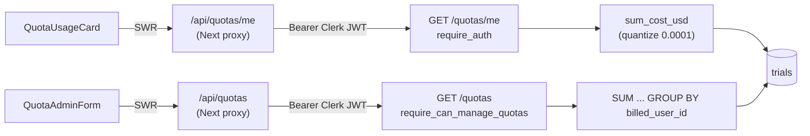

# S3 — Usage Visibility

## What this slice does

S3 makes a user's **daily spend** visible — nothing more. It reads the
`billed_user_id` + `cost_usd` columns that S1 and S2 guaranteed, sums them per
user per day, and surfaces the number two ways: a self-service card ("$X of $Y
used today") and an admin table of every member's spend. There is **no
enforcement** here — no run is blocked, no cap is compared. S5 is the slice that
turns this read into a gate.

## The read: `sum_cost_usd`

The one query lives in `oddish/src/oddish/core/quotas.py`:

```sql
SELECT COALESCE(SUM(cost_usd), 0) FROM trials
WHERE org_id = :org_id
  AND billed_user_id = :user_id
  AND finished_at >= :period_start   -- start_of_today_utc()
  AND deleted_at IS NULL
```

This is **settled spend today, keyed on settlement day**. Read the four
predicates as four deliberate exclusions:

- `finished_at >= period_start` — only trials that reached a terminal state
  *and* settled at or after today's UTC midnight count. **In-flight trials
  (`finished_at IS NULL`) are excluded** — SQL `>=` is false against `NULL`. So
  spend lands in the day's total the moment it settles, not when it started. A
  run that spanned midnight counts on the day it *finished*.
- `billed_user_id = :user_id` — only trials attributed to this payer (the S2
  invariant). **NULL-billed rows** (imported / combined — already-paid trials)
  never match and are excluded.
- `deleted_at IS NULL` — **soft-deleted** trials drop out of the total.
- `COALESCE(..., 0)` — a user with no settled trials today sums to `0`, not
  `NULL`.

`start_of_today_utc()` is calendar UTC midnight — it takes `now` and zeroes
hour/minute/second/microsecond. The window is a fixed calendar day, not a
rolling 24h.

### Why quantize to `0.0001`

`cost_usd` is a SQL **`Float`** column, so a `SUM` accumulates IEEE-754 rounding
error: `0.1 + 0.2` is `0.30000000000000004`, not `0.3`. `to_money_decimal`
wraps the raw sum in `Decimal(str(...))` and `.quantize(Decimal("0.0001"))`
(`MONEY_QUANTUM`), collapsing that noise to a deterministic 4-decimal value.
This matters for two consumers: the **display** (so the dashboard doesn't show a
17-digit tail) and, more importantly, **S5's cap comparison** — a `used >= limit`
check must be evaluated against a stable, reproducible number, not float slop.

## The effective limit

In S3 the effective daily limit is **just the deploy-time default**,
`settings.default_daily_quota_usd` (`Decimal("100.00")`, `config.py`). Every
endpoint returns `float(settings.default_daily_quota_usd)` for every member —
there are no per-user overrides yet. S4 introduces the override column and
changes this to `COALESCE(user's row, default)`; S3 is the flat-default
baseline.

## Auth: `require_can_manage_quotas`

The admin endpoint is guarded by `require_can_manage_quotas`
(`backend/auth/permissions.py` + `backend/auth/__init__.py`). Two things make it
different from the existing `require_admin`:

1. **It rejects FULL API keys.** `require_admin` lets a FULL-scope API key
   through via `require_scope`. `require_can_manage_quotas` returns `403`
   ("User auth required to manage quotas") the moment `auth.method` is
   `API_KEY`, *before* checking the role. Quota management is **user-auth-only**
   — a key can never enumerate members' spend.
2. **It is self-service for every org, not @abundant-gated.** `can_manage_quotas`
   returns `True` for any org `ADMIN`. This is unlike `require_api_key_creator`,
   which is locked to admins with an `@abundant.ai` email in the Abundant org.
   Any org's own admin can view that org's quota table.

The member endpoint (`/quotas/me`) needs only `require_auth` — it reads your own
spend, so any authenticated caller (including an API key, scoped to its own
`user_id`) qualifies.

## The two endpoints

Both live in `backend/api/routers/orgs.py`.

- **`GET /quotas/me`** (`require_auth`) — caller-scoped. Calls `sum_cost_usd`
  with `auth.org_id` + `auth.user_id`, returns `QuotaUsageResponse`
  (`user_id`, `limit_usd`, `used_usd`, `period="daily"`). If the caller has no
  `user_id` (e.g. a bare API key with no user), `used_today` stays `0`.
- **`GET /quotas`** (`require_can_manage_quotas`) — org-wide admin view. It does
  **one grouped query, not N+1**: it lists members once, then runs a single
  `SUM(cost_usd) ... GROUP BY billed_user_id` over the org's settled trials
  (same four predicates as `sum_cost_usd`, minus the single-user filter, plus
  `billed_user_id IS NOT NULL`). The results become a `{user_id: used}` dict,
  and each member row looks itself up with `.get(id, 0)`. Members with no spend
  correctly show `$0`. Returns `QuotaListResponse` (a list of `QuotaMemberItem`).

## The schemas

`backend/api/schemas.py`:

- `QuotaUsageResponse` — one member's `used_usd` vs `limit_usd` (the `/me`
  payload).
- `QuotaMemberItem` — one admin-table row: identity (`user_id`, `email`, `name`,
  `github_username`, `role`) plus `limit_usd` / `used_usd` / `period`.
- `QuotaListResponse` — `{ members: [QuotaMemberItem] }`.

All money fields are plain `float` on the wire; the `Decimal` quantization is a
server-side computation detail, not part of the contract.

## The frontend

Two Next.js **proxy routes** forward the Clerk token to the backend and relay
the JSON verbatim:

- `frontend/src/app/api/quotas/me/route.ts` → backend `GET /quotas/me`
- `frontend/src/app/api/quotas/route.ts` → backend `GET /quotas`

Each grabs the Clerk session token (`getClerkToken`), sets it as
`Authorization: Bearer` + `X-Clerk-Authorization` (`getAuthHeaders`), fetches
the backend with `cache: "no-store"`, and passes upstream status/body through
(so a backend `403` surfaces to the browser as `403`).

Two components consume them via SWR:

- **`quota-usage-card.tsx`** — the member widget. Fetches `/api/quotas/me`,
  renders "$used of $limit used today" with a progress bar; when
  `used >= limit` it flips the bar to destructive and shows a "reached today's
  limit" note. (The note is copy only — S3 does not actually block anything.)
- **`quota-admin-form.tsx`** — the **read-only** admin table. Fetches
  `/api/quotas`, sorts members by label, renders used/limit per row, and shows
  "Admins only." on a `403`. Its own comment flags that S4 will make `limit_usd`
  editable and add a `PUT /api/quotas/{id}` Save flow; the table shape is
  deliberately kept additive so that upgrade is a diff, not a rewrite.

## Read path



## Suspicious parts

S3 was reviewed by two independent bug-hunt teams (codex + claude) with **zero
confirmed bugs**. This section is documentation for a human, not a fix list —
S3 is frozen and a later slice is being built on these files concurrently, so no
code was touched. Residual things a reviewer should be aware of:

- **`start_of_today_utc()` is server-clock UTC, not the user's local day.** A
  user in UTC-7 sees their "daily" total reset at 5pm local. This is an accepted
  MVP choice (one global calendar day keyed on settlement), consistent with how
  S5 will compare against it — but it is a product decision worth stating
  explicitly, not a bug.

- **Day is keyed on `finished_at`, so a long run that crosses midnight counts
  entirely on its finish day.** Its whole cost lands in the finish-day bucket
  even though the work spanned two days. Intended (spend is counted at
  settlement, matching S1's "settled cost" model), but it means a single
  expensive overnight run can spike one day's total. Not a defect.

- **`limit_usd` is the flat default for everyone.** By design in S3 (overrides
  arrive in S4). Worth flagging only so a reader doesn't mistake the constant
  for a missing per-user lookup.

- **`cost_usd` being a `Float` column is the root reason quantization exists.**
  The quantize makes the *displayed / compared* value deterministic, but the
  underlying per-trial values are still floats, so the pre-quantize sum can
  differ in the last bits across query plans. Quantizing to `0.0001` is the
  intended mitigation and is applied on **both** read paths (`sum_cost_usd` and
  the grouped admin query), so the two stay consistent. A future hardening could
  make `cost_usd` a `Numeric`/`Decimal` column and drop the quantize entirely;
  out of scope for S3.

- **`billed_user_id` is a denormalized `String`, not a FK** (an S2 property S3
  inherits). A `billed_user_id` could in principle point at a
  removed/deactivated user; `sum_cost_usd` would still sum against that id, and
  the admin table — which only lists *live* members — would silently omit that
  spend from any row (it lands in no member's `.get(id, 0)`). For S3's
  read-only display this is harmless; a reviewer building enforcement on top
  should know the grouped total and the per-member rows can disagree if a payer
  has left the org. Accepted MVP tradeoff, tracked with S2.

- **No real bug found — no code change.** Every predicate in both read paths
  matches the S1/S2 invariants (settled, billable, non-deleted, attributed), the
  admin path avoids N+1 with a single grouped query, and the auth split
  (user-only admin for `/quotas`, self-scope for `/quotas/me`) is enforced
  before any DB work.
