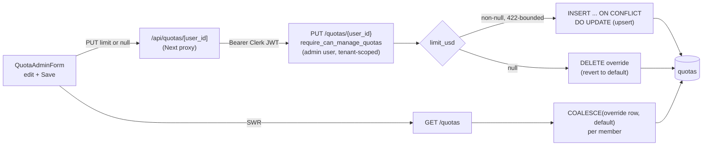

# S4 — Quota Overrides

## What this slice does

S4 lets an admin **override** the flat per-user daily limit that S3 baked in.
S3 returned `DEFAULT_DAILY_QUOTA_USD` (`settings.default_daily_quota_usd`,
`Decimal("100.00")`) for every member. S4 adds a `quotas` table whose rows exist
**only to override** that default, and a `PUT /quotas/{user_id}` for admins to
set or clear an override. There is still **no enforcement** — S5 turns the
effective limit into a gate. S4 only changes *which number* the read paths
report.

## Override-only semantics (the core design choice)

A `quotas` row is a **pure override**: its `limit_usd` replaces the read-time
default for one `(org_id, user_id)`. A **missing row is not "no quota"** — it
means the member is enforced at the default. So there is deliberately **no
seeding, no `ensure_quota`, no coverage gate**: nothing ever has to backfill a
row for every member, and no invariant says "every member must have a row."

This is **default-at-read**, and it designs those problems away. Because both
read paths fall back to the default in code (`COALESCE(override, default)`), a
member with no row is already correct — they read at `$10`. Adding a member,
running the migration on an empty table, or a preview DB with zero rows all
"just work." The table is a sparse set of *exceptions*; the common case stores
nothing.

## The table (`QuotaModel` / `add_quotas_table_001`)

`backend/models.py` — the `quotas` table lives in the **backend** tree because
it FKs `organizations` and `users` (both backend-owned):

- `UNIQUE(org_id, user_id)` (`uq_quotas_org_user`) — one override per membership.
  The same human in two orgs carries two independent budgets. This unique index
  is also the conflict target for the upsert.
- `limit_usd NUMERIC(12,4)` — exact decimal money, scale 4, precision 12.
- `period_kind VARCHAR(16)` + `CHECK (period_kind IN ('daily'))` — a
  CHECK-constrained varchar (mirrors the `trials.origin` pattern), **not** a
  native PG enum, so the migration stays cleanly reversible. Only `'daily'`
  today; the column is the extension point for future periods.
- Both FKs are `ON DELETE CASCADE` — deleting an org or user drops its override
  rows automatically (no dangling exceptions).

The migration (`add_quotas_table_001`, chained off backend head
`g1h2i3j4k5l6`) is a raw `CREATE TABLE IF NOT EXISTS` + two indexes, **no data
seeding**, reversible `DROP`. Columns mirror `QuotaModel` including the
`TimestampedMixin` `created_at`/`updated_at`/`deleted_at`.

## `PUT /quotas/{user_id}` — set or clear

`set_member_quota` in `backend/api/routers/orgs.py`. Body is `QuotaUpdateRequest
{ limit_usd: Decimal | None }`.

- **Non-null → upsert.** `INSERT ... ON CONFLICT (org_id, user_id) DO UPDATE`
  (`pg_insert(...).on_conflict_do_update`): first set writes a fresh row, a
  re-set updates `limit_usd` (+ bumps `updated_at`) in place. Idempotent — no
  read-modify-write race, one round trip.
- **Null → delete.** `DELETE FROM quotas WHERE org_id=? AND user_id=?` removes
  the override so the member **reverts to the default**. Deleting a
  member-with-no-row is a harmless no-op.
- The response echoes the resulting **effective** limit: the new `limit_usd` on a
  set, or `settings.default_daily_quota_usd` on a clear — built by the same
  `_quota_member_item` helper the GET list uses, so PUT and GET can't drift in
  shape.

### Auth and tenancy

Guarded by `require_can_manage_quotas` (`backend/auth/`): it **rejects FULL API
keys** (`403 "User auth required to manage quotas"` the moment `auth.method ==
API_KEY`, before any role check) and **rejects non-admins** (`403 "Admin role
required"`). It is **not** `@abundant`-gated — any org's own admin qualifies.
The endpoint is **tenant-scoped**: it looks the member up by
`id == user_id AND org_id == auth.org_id`, so a cross-org target is a **404**,
never a silent edit of another tenant's row. **Self-edit is allowed** — an admin
may set their own override (the lookup includes themselves).

### Why the `limit_usd` Field bound (the fixed bug)

`QuotaUpdateRequest.limit_usd` carries a bounded `Field(gt=0,
le=Decimal("99999999.9999"), max_digits=12, decimal_places=4)`. Each clause
turns a would-be failure into a clean **422** *before* the value reaches the
column:

- `gt=0` — rejects **zero and negatives** (silently accepted before).
- `le=99999999.9999` + `max_digits=12` — rejects a value `>= 100_000_000` that
  would **overflow `NUMERIC(12,4)`** with no handler → an opaque **500**.
- `decimal_places=4` — rejects **excess scale**. Without it, PUT echoed the raw
  un-rounded value while the DB rounds to scale 4, so a later **GET disagreed**
  with the PUT response. Now only exact `<= 4`-decimal values reach the column,
  so **PUT == GET**.

## `GET /quotas` — COALESCE per member

`list_member_quotas` still does S3's single grouped spend query, and now **also**
loads every override row for the org (`SELECT user_id, limit_usd FROM quotas
WHERE org_id = ?`) into a `{user_id: limit}` dict. Each member row's limit is
`override_limit_by_user_id.get(member.id, default_limit_usd)` — i.e.
**`COALESCE(override row, default)`** resolved in Python, not per-member N+1.
`GET /quotas/me` still reports the flat default (per-user overrides are an
admin-list / PUT concern in the MVP; `/me` gains them in a later slice).

## Frontend

`quota-admin-form.tsx` upgrades S3's read-only admin table to **editable**: each
row has a per-draft `limit_usd` `<Input>` and a **Save** button disabled until
the draft is dirty. Save PUTs `{limit_usd: "<value>"}`, or `{limit_usd: null}`
when the input is left **empty** (clear → revert to default), then `mutate()`s
SWR. Client-side it rejects negative / non-numeric before sending; server 422
messages, `403 → "Admins only."`, `404 → "Member not found."` surface per row.
The proxy `app/api/quotas/[user_id]/route.ts` forwards the Clerk token
(`Authorization: Bearer` + `X-Clerk-Authorization`, `cache: "no-store"`) and
passes the backend status/body straight through.

## Flow

## Suspicious parts

S4 was reviewed by two independent bug-hunt teams (codex + claude). The **claude
team found and FIXED** the `limit_usd` correctness bug (commit `7f6beb71`):
before the `Field` bound, `limit_usd` was an unbounded `Decimal`, so a value
`>= 100_000_000` overflowed `NUMERIC(12,4)` into an opaque 500, zero/negatives
were silently accepted, and an excess-scale input was echoed un-rounded by PUT
while the DB rounded — making PUT and GET disagree. The single Pydantic `Field`
constraint (`gt=0`, `le`, `max_digits`, `decimal_places`) now rejects all four
with a clean 422; **fixed and covered** (4 parametrized cases + 16 override
tests green). This section is for a human — S4 is frozen, S5 is being built
concurrently on other files, so **no code was touched**. Residual notes:

- **`limit_usd` on the wire is a `float`, not the exact `Decimal`.** The column
  and validation are exact `NUMERIC(12,4)`, but `_quota_member_item` casts to
  `float(...)` for the response, and the FE reads `member.limit_usd` as a JS
  number and formats `.toFixed(2)`. At MVP magnitudes (`<= 99_999_999.9999`) a
  float carries the value fine, but a client that round-trips the *displayed*
  `.toFixed(2)` back through PUT can quietly re-round a value that had more than
  2 decimals. Accepted for the MVP (the contract is float, same as S3's money
  fields); worth knowing when S5 compares `used >= limit`.

- **`/quotas/me` still reports the flat default, ignoring the override row.**
  Only the admin list + PUT resolve `COALESCE(override, default)`; a member
  viewing their own `/me` card sees `$10` even if an admin set them to `$25`.
  This is the documented MVP scope (overrides are admin-surface only), but it
  means the member-facing "used of $limit" can disagree with the admin table
  until `/me` is upgraded. Not a defect of this slice — flagged so S5's gate,
  which must read the *effective* limit, doesn't inherit `/me`'s flat-default
  read by accident.

- **`period_kind` is write-frozen to `'daily'`.** The upsert always writes
  `"daily"`, the CHECK allows only `'daily'`, and no code reads the column back.
  It is inert scaffolding for future periods — correct today, but a reviewer
  should not assume it is a live dimension.

- **No confirmed residual bug.** The upsert is idempotent and races-free, the
  delete-on-null is a safe no-op when absent, the tenant scope makes cross-org a
  404, the auth split (admin-user-only, no API keys) is enforced before any DB
  work, and the overflow/rounding class of bug is closed at the schema. The
  read/write effective-limit resolution matches (`COALESCE(override, default)`
  on both), so PUT and GET agree.
