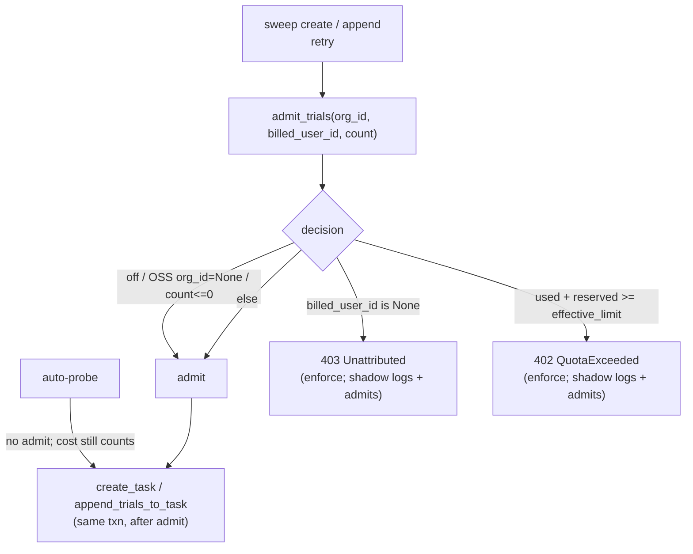

# S5 — Admission Enforcement

## What this slice does

S5 is the gate. S1–S3 guaranteed the *inputs* (every settled billable trial has
a real `cost_usd`, every new billable trial carries `billed_user_id`, and
rolling-window spend is summable); S4 made the *limit* per-user overridable. S5 finally
**compares spend against the limit at submit time and can block the run** with a
`402`. It ships **off** and rolls out `off → shadow → enforce` behind one flag.

## `admit_trials` — the whole gate in one function

`oddish/core/quota_admission.py`. `admit_trials(session, org_id, billed_user_id,
count)` is the core; `admit_submission_trials(...)` is a thin wrapper that just
passes `count=len(submission.trials)`. The function either returns (admit) or
raises an `HTTPException` subclass (block). The decision, in order:

1. **No-op guards (one line).** If `settings.quota_mode == OFF`, or `org_id is
   None` (an **OSS / self-hosted install** has no org and never enforces), or
   `count <= 0`, return immediately. Nothing is read from the DB.
2. **Unattributed.** If `billed_user_id is None` the trial's cost draws down
   *nobody's* budget (the S2 "NULL means uncounted spend" case). Under
   **enforce** this raises `Unattributed` (**403** — "link your GitHub");
   under **shadow** it logs `quota.would_block reason=unattributed` and admits.
3. **Budget check.** Otherwise compute three exact `Decimal` values and compare:
   - `effective_limit = get_effective_limit(...)` — the S4 limit (see below).
   - `used = sum_cost_usd(...)` — the payer's spend settled in the trailing
     24h (`SUM(cost_usd)` over `finished_at >= quota_window_start()`), the S3
     read.
   - `reserved = (inflight_count(...) + count) * pending_trial_reservation_usd`
     — a **pessimistic hold** for work that hasn't settled a cost yet. It counts
     both the trials already in flight (`PENDING/QUEUED/RUNNING/RETRYING`, not
     superseded, not deleted) **and** the `count` about to be created, each at a
     flat `$0.50` reservation. This is what stops a user from launching 1000
     concurrent trials that each individually look under-budget.
   - **Block when `used + reserved >= effective_limit`.** The comparison is
     `>=`, so a submission that lands *exactly on* the cap is **rejected**
     (tested: `test_admit_blocks_at_exactly_the_cap` /
     `..._allows_just_under_the_cap`). All three operands are `Decimal`, so the
     decision is **deterministic at the boundary** — no float rounding can flip
     an at-cap run one way on one host and the other way on another. Under
     **enforce** this raises `QuotaExceeded` (**402**, carrying `used_usd` /
     `limit_usd`); under **shadow** it logs `quota.would_block reason=over_budget`
     and admits.

### `get_effective_limit` — S4's COALESCE, in one query

`oddish/core/quotas.py`. Raw SQL against the **backend-owned** `quotas` table:
`SELECT limit_usd FROM quotas WHERE org_id=? AND user_id=? AND deleted_at IS
NULL`. A non-null result is the admin override; **`None` (no row) falls back to
`settings.default_daily_quota_usd`**. This is S4's "default-at-read" —
`COALESCE(override, default)` — resolved for the enforcement path. Raw `text()`
(not the ORM `QuotaModel`) so `oddish/` doesn't take a hard dependency on the
backend model; a missing table / OSS install simply never reaches here (guard 1
short-circuits on `org_id is None`).

## The four billable seams

Every path that mints a *new* billable trial is an S2 attribution seam. Three
call admit **before** the insert; auto-probe (#4) is the deliberate exception:

1. **Sweep create** (`sweep.py`, create mode) — `admit_submission_trials(...)`
   right before `create_task(...)`.
2. **Sweep append** (`sweep.py`, append mode) — `admit_submission_trials(...)`
   right before `append_trials_to_task(...)`.
3. **Retry** (`endpoints/trials.py`) — `admit_trials(..., count=1)`, but **only
   `if old_trial.billed_user_id is not None`**. A NULL-billed trial (imported /
   combined) retries without a gate, mirroring S2: it was never billable, so it
   never enforces.
4. **Auto-probe** (`probe/auto_probe.py`) — the one seam that does **not** admit.
   An auto-probe always enqueues so every task version gets its diagnostic probe,
   never gated on budget. Its cost still counts toward the payer's budget
   (`sum_cost_usd` has no `is_probe` filter), so a later sweep/retry is admitted
   against the higher total. **User-initiated** probes ride the normal sweep path
   (#1/#2) and *are* gated like any other trial.

### Why a 402 rolls back cleanly

In the sweep path, `admit_*` runs **inside the same DB transaction, before the
inserts**. So when it raises `QuotaExceeded`, the exception propagates out of the
request handler with **no trial rows written** — the transaction is never
committed, so there is nothing to undo. The check is a true admission gate, not
a compensating delete. (This is also why the check must come before
`create_task` / `append_trials_to_task`, not after.)

### Batch joint-overshoot — handled for free

The batch route runs each item in its own `begin_nested()` savepoint and calls
`admit_trials` per item. Because item *k*'s trial inserts are already **in the
transaction** (flushed, uncommitted) when item *k+1* runs, `inflight_count`
picks them up — so N items that are each individually under-budget but jointly
over-budget are caught: the first item that tips `used + reserved` over the cap
is the one that 402s, and only *its* savepoint rolls back. No separate
whole-batch pre-sum is needed.

## Rollout: `off → shadow → enforce`

One setting, `settings.quota_mode` (`QuotaMode` enum in `config.py`):

- **`off`** (shipped default) — guard 1 short-circuits; zero behavior change,
  zero DB reads. This is what makes S5 safe to merge dark.
- **`shadow`** — runs the *full* computation but **never raises**: an
  unattributed or over-budget submission emits a `quota.would_block` warning
  (with `reason`, `used`, `limit`) and admits. This validates the gate against
  real traffic — you can watch what *would* have been blocked before flipping.
- **`enforce`** — the would-block cases raise `403` / `402`.

### Fail-safe startup guard

`backend/api/app.py` `_assert_quota_schema_or_force_off()`, called from
`lifespan`. When mode is not `off`, it runs one combined `EXISTS` query checking
that **both** `trials.billed_user_id` and the partial index
`idx_trials_org_billed_user_finished` exist. If they don't, it **forces
`quota_mode = off`** with a loud error, rather than enforcing against a
`SUM(cost_usd)` that would silently read `0` for everyone (a fail-**open** where
nobody is ever billed). Two deliberate degradations: if the DB is simply
unavailable at startup the check is **skipped** (honoring the repo's
no-startup-DB-handshake design — a transient pooler blip must not crash the app),
and any hard failure never propagates. It fails *safe* (off), never *crashes*.

## Flow

## Suspicious parts

S5 was reviewed by two independent teams (codex + claude). The **codex bug-hunt
(cross-checked by claude) found and FIXED** the startup-guard bug in commit
`0d6003b8`: an earlier Edit had slid `_assert_quota_schema_or_force_off` in
*between* the `@asynccontextmanager` decorator and `lifespan`, so the decorator
wrapped the helper and `lifespan` became an undecorated async generator. That
would have broken prod startup, and the test suite missed it because ASGI's
`ASGITransport` skips the lifespan protocol. Fixed: the decorator now sits on
`lifespan`, the helper is a plain `async def`, and the guard query was collapsed
to one combined `EXISTS`. This section is for a human — **S5 is frozen; no code
was touched.** Residual notes:

- **`reserved` is a flat per-trial hold, not a real cost estimate.** Every
  in-flight or about-to-create trial reserves the same
  `pending_trial_reservation_usd` ($0.50) regardless of model/agent. A cheap
  trial over-reserves and an expensive one under-reserves; the hold is released
  implicitly when the trial settles a real `cost_usd` and drops out of
  `inflight_count`. This is an intentional MVP approximation (a coarse
  admission throttle, not an accountant), but a user running many
  expensive-model trials can still exceed the cap between admit and settle,
  since only $0.50 each was held. Accepted for the MVP.

- **The check is read-then-decide with no lock.** `admit_trials` reads `used`
  and `inflight_count` and decides, but two concurrent submissions from the same
  payer both read the *pre-insert* state, so they can both pass and jointly
  overshoot (a classic TOCTOU on the SUM). Within a single transaction the batch
  path is fine (inserts are visible to later items), but two *separate*
  concurrent requests are not serialized against each other — there's no
  `SELECT ... FOR UPDATE` on a per-user row and no advisory lock. At MVP
  volumes the $0.50 reservation cushions this; a hard cap would need a
  serialization point. Flagged, not a defect of this slice.

- **`used` inherits S2's denormalized-id and `/me`-flat-default caveats.**
  `billed_user_id` is a plain string, not an FK (S2), so a stale id sums against
  a user who no longer enforces; and `sum_cost_usd` + `get_effective_limit` here
  read the *effective* override correctly, but the member-facing `/quotas/me`
  card (S4) still shows the flat default — so a user can be enforced at their
  override while their own card claims a different limit until `/me` is upgraded.
  Both are documented upstream-slice scope, carried forward here unchanged.

- **No confirmed residual bug.** The gate runs before the inserts in-txn (so a
  block leaves no rows), the `>=` boundary is exact `Decimal`, the OSS/off/NULL
  short-circuits are covered (8 admission tests green), auto-probe's
  skip-on-QuotaExceeded can't sink a real sweep, and the startup guard fails safe
  to `off` on a missing schema rather than fail-open or crash.
