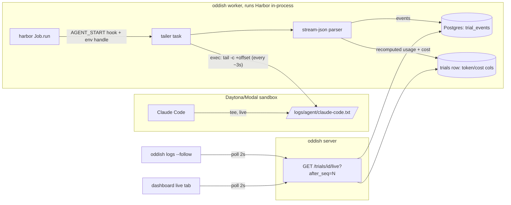
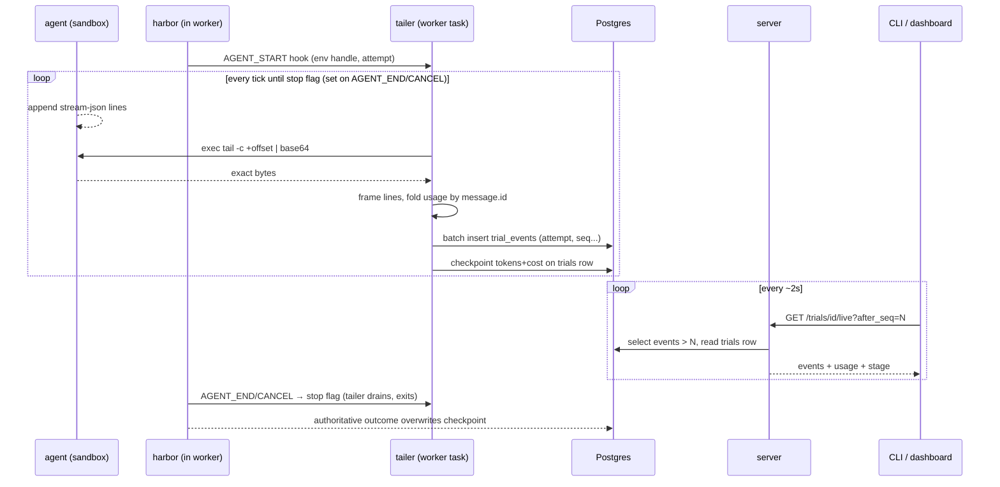

# Harbor Live Streaming MVP — live transcripts + live cost

**Goals:** while a trial is running, (1) show the agent's transcript as it happens,
(2) show a running dollar cost that updates as the agent burns tokens.

**Non-goals (MVP):** push transport (SSE/WebSocket), streaming for non-Claude-Code
agents beyond a graceful fallback, provider-authoritative billing ledgers, forking
Harbor's environment exec layer.

---

## 1. The problem, and the one fact that makes it tractable

Harbor runs the agent *inside* a sandbox (Daytona or Modal), and on those two
providers Harbor's `exec` deliberately buffers all output until the command exits —
the Modal wrapper literally redirects to files and `cat`s them after `wait`
(`harbor/environments/modal.py`, `_build_wrapped_exec_command`). Harbor does have a
native streaming API (`Trial.add_log_callback`), but only the docker and ec2
environments feed it, and `Job` — the API oddish drives — doesn't expose it at all.
So "just subscribe to Harbor's stream" is not available to us in the cloud without
fork surgery.

The saving fact: **the agent writes its own transcript to a file inside the sandbox,
live**. Claude Code runs as

```
claude --verbose --output-format=stream-json --print ... | tee /logs/agent/claude-code.txt
```

(`harbor/agents/installed/claude_code.py:1455`), so `/logs/agent/claude-code.txt`
grows line-by-line during the run, and each line is a JSON event — including
per-API-call token usage. And Harbor's lifecycle hooks hand oddish a **live handle
to the running environment** (`TrialHookEvent.environment`, `harbor/trial/hooks.py:45`),
which oddish already uses mid-trial to push probe assets
(`oddish/src/oddish/workers/queue/trial_handler.py:822`).

Put those together and the design is: **don't intercept the stream — tail the file.**

## 2. A 60-second primer: every log pipeline answers four questions

Any "ship logs from A to B" system, from `tail -f | nc` to Kafka, has to answer:

1. **Capture** — how do bytes leave the producer? (push vs pull; we pull)
2. **Framing** — where are the record boundaries? Bytes arrive in arbitrary chunks;
   a JSON event may be split across two reads. You must buffer the partial tail.
3. **Transport & cursors** — how does a consumer say "give me what I haven't seen"?
   The answer is always a monotonic cursor (byte offset, sequence number).
4. **Idempotency** — deliveries repeat (retries, restarts). Design so processing the
   same data twice converges to the same state instead of double-counting.

Each design section below is one of these questions answered for our case. When a
choice looks arbitrary, map it back to which of the four it serves.

## 3. Architecture overview

One new moving part (a **tailer task** in the worker), one new table
(`trial_events`), one new endpoint, two consumers.



Key structural choice: the tailer lives **in the worker process**, not the server.
The worker already holds the environment handle, already owns the trial's DB row,
and dies with the trial — so tailer lifecycle management is free. The server stays
stateless.

## 4. Capture: the tailer task (question 1)

Registered from the existing hook dispatcher in
`oddish/src/oddish/workers/queue/trial_handler.py` (`_handle_harbor_event`):

- On `TrialEvent.AGENT_START`: spawn `asyncio.create_task(tail_agent_log(...))`
  using `hook_event.environment`. Two identity details: use the oddish trial id the
  dispatcher already binds by closure — `hook_event.trial_id` is Harbor's
  `trial_name`, a different namespace — and stamp the current `trial.attempts`
  (load-bearing, see §7).
- On `AGENT_END` / `CANCEL`: set a stop flag; the tailer wakes immediately, does
  one final drain, and exits. The drain is **best-effort by contract**: it races
  Harbor's continuation (verification, then env stop — and on Harbor-internal
  retries, a fresh AGENT_START replaces the tailer outright), and any bytes it
  misses are covered by the authoritative end-of-trial extraction. Never exec
  inside the hook body — hooks are awaited inline in the trial's control flow, so
  a drain there blocks Harbor's teardown. `END` is too late to drain at all:
  Harbor stops the environment *before* emitting it
  (`harbor/trial/trial.py:383-387`); treat END as bookkeeping only.

Each tick:

```python
out = await env.exec(f"tail -c +{offset + 1} {LOG_PATH} | head -c {MAX_CHUNK} | base64 -w0")
raw = base64.b64decode(out.stdout or "")
```

Why base64: `ExecResult.stdout` is a decoded `str` on every provider, and `head -c`
can bisect a multibyte UTF-8 character — re-encoding a lossily-decoded chunk gives
the wrong byte count and the cursor drifts. Base64 makes the transport ASCII-proof
and hands us the exact bytes. The offset then advances **only by the byte length of
the complete lines actually consumed** (§5 returns the partial tail to the carry
buffer) — never by raw chunk length. A failed tick moves nothing; the next one
re-reads the same range. Note the tailer's own exec is unaffected by Modal's
buffer-until-exit wrapper (§1): that defers output of the *wrapped* command until it
exits, and `tail | head | base64` exits immediately.

Why **pull** instead of push: the sandbox can't reach our DB (and shouldn't), Harbor
won't stream on these providers, and pull makes backpressure trivial — if we fall
behind, the next tick reads a bigger chunk (capped by `MAX_CHUNK`, say 256 KiB; the
remainder arrives next tick).

Cadence is a measured decision, not an assumption. On Daytona (the default
provider) every exec is a multi-round-trip operation with an internal ~1s polling
floor (`harbor/environments/daytona/environment.py:1626-1638`), and a busy queue
runs ~48 concurrent trials — a 3s cadence would mean ~16 provider execs/sec.
Default to 5s, make it a setting, and treat "measured exec latency at target
cadence under load" as an S1 exit criterion. One mitigating fact: each worker
container runs exactly one trial, so there is no in-container amplification.

The byte `offset` is our capture cursor (question 3, producer side). MVP keeps it in
worker memory only: if the worker crashes, the queue retries the trial from scratch
(fresh attempt, fresh log file), so there is no partially-tailed-but-still-running
trial to resume. That's a real simplification you get from aligning tailer lifetime
with trial lifetime — notice how much machinery (persisted offsets, resume
protocols) that one alignment deletes.

## 5. Framing and parsing (question 2)

`tail -c` gives bytes, not lines. The last line of any chunk may be incomplete, so
the tailer keeps a carry buffer:

```python
buf += chunk
*lines, buf = buf.split("\n")
```

Only complete lines are parsed; the remainder waits for the next tick. Each complete
line is one Claude Code stream-json event. We keep three kinds and drop the rest:

| event | transcript use | cost use |
|---|---|---|
| `assistant` message | text + tool_use blocks | `message.usage` — keep *last* per `message.id` |
| `user` (tool results) | tool output preview (truncated) | — |
| `result` (final) | run summary | authoritative `total_cost_usd` |

One semantic trap the adapter must not fall into: stream-json `message.usage` is
**cumulative within a message id** — the same `message.id` appears on multiple
streamed events, each carrying updated running totals for that API call. Summing
over *events* multiply-counts. The correct fold, which Harbor's own parser uses
(`claude_code.py:718-768`), is: keep the last usage seen per `message.id`, then
count each id exactly once.

Parsing is wrapped in per-agent **adapters** with a one-method interface
(`parse(lines) -> list[TranscriptEvent], UsageTotals`). MVP ships the Claude Code
adapter; agents without one degrade to today's behavior (stage badges only). This is
the standard trick for "N formats, one pipeline": isolate format knowledge at the
edge, keep everything downstream format-agnostic.

## 6. Live cost: recompute, never accumulate (question 4)

The tempting design is a running counter: `cost += price(delta_usage)`. Don't. Ticks
can repeat a read after a transient exec failure, the parser may reprocess a line
after a partial write, and any drift is invisible until it's large. Instead, every
tick recomputes totals **from all events seen so far** (they're already in memory or
cheap to keep as running sums keyed by event id):

```
usage[msg_id] = last message.usage seen for msg_id        # cumulative per id, see §5
prompt = Σ over ids of (input + cache_read + cache_creation)   # bundled, as harbor does
cost = estimate_cost_usd(model, input_tokens=prompt, output_tokens=Σ output,
                         cached_tokens=Σ cache_read, cache_write_tokens=Σ cache_creation)
```

pricing via the existing `oddish/src/oddish/model_pricing.py:164` (LiteLLM-backed).
Two signature facts that are easy to get wrong: arguments go by **keyword** (the
positional order is not what you'd guess), and `input_tokens` is the *bundled*
prompt total — the function subtracts the cache components back out itself
(`model_pricing.py:182-190`). Recompute-from-source is idempotent: seeing the same event
twice cannot change the answer. That single property is what lets the rest of the
pipeline be sloppy about at-least-once delivery.

The checkpoint writes go to the **existing** columns on the `trials` row
(`input_tokens`, `cache_tokens`, `cache_write_tokens`, `output_tokens`, `cost_usd`,
`total_steps`) every tick that changed them.

**Quota interaction — deliberate, and stated precisely.** (An earlier draft claimed
mid-run writes were invisible to enforcement; review proved that false.) Admission
sums two terms. The *settled* term (`sum_cost_usd_by_user`,
`_settled_cost_predicates`) gates on `finished_at IS NOT NULL`, so running trials
never enter it. The *inflight reservation* does read live cost: it reserves
`GREATEST(COALESCE(cost_usd, 0), pending_floor)` per running trial
(`oddish/src/oddish/core/quotas.py:102-124`). Live checkpoints therefore tighten
admission in real time — a trial that has burned $5 reserves $5 instead of the flat
floor. This is safe because `GREATEST` only ever *raises* the reservation, never
loosens it, and the reservation's own docstring ("each stands in at its accumulated
cost so far") shows it was built to absorb exactly this. The tailer must uphold the
monotonicity end: checkpointed `cost_usd` never regresses within an attempt — a
transiently unpriceable tick reuses the previous estimate rather than writing NULL
(which `COALESCE(cost_usd, 0)` would read as a drop back to the flat floor). At trial end, the
authoritative outcome extraction (`oddish/src/oddish/workers/harbor/outcome.py`)
overwrites the checkpoint. The live figure is a LiteLLM estimate while Claude
Code's final self-reported `total_cost_usd` is authoritative, so expect the UI
number to visibly snap at completion. Display surfaces that sum non-null `cost_usd`
(task detail, frontend trial aggregation) will start including running trials —
that is the feature, not a bug, but it's called out here so nobody "fixes" it.

Side effect worth naming: the last checkpoint is also a **billing floor for
cancelled/crashed trials** — even a hard-killed worker leaves the tokens it had
already checkpointed. This pairs with (but does not require) the graceful-cancel
salvage work discussed separately.

## 7. Storage: `trial_events`

```sql
create table trial_events (
    trial_id    uuid    not null references trials(id) on delete cascade,
    attempt     integer not null,
    seq         integer not null,
    kind        text    not null,          -- message | tool_use | tool_result | summary
    payload     jsonb   not null,          -- pre-rendered, truncated for display
    created_at  timestamptz not null default now(),
    primary key (trial_id, attempt, seq)
);
```

`attempt` is load-bearing, not decoration: worker auto-retries reuse the same trial
row **in place** — `_prepare_trial_run` clears result fields and increments
`trial.attempts` (`trial_handler.py:455-468`) — and `seq` restarts at 0 against a
fresh log file. Without `attempt` in the key, `ON CONFLICT DO NOTHING` would
silently drop every retried attempt's transcript: the worst kind of loss, because
the UI would keep showing the old attempt, frozen but plausible. The tailer stamps
the attempt it was spawned with; a superseding attempt's rows land beside, not on
top of, the old ones.

`seq` is a per-attempt dense counter assigned by the tailer — the consumer-facing
cursor (question 3). Inserts are batched per tick (one `INSERT ... ON CONFLICT DO
NOTHING`, which also makes replays harmless — idempotency again, this time at the
storage layer).

Volume control: payloads are truncated at write time (tool results to ~2 KiB, etc.)
and each trial is capped at ~5,000 events; past the cap the tailer keeps updating
cost but stops inserting transcript rows and writes one `summary` row saying so.
Silent truncation is banned — the UI must be able to show "transcript capped".

**Retention:** anchor deletion where every trial terminates, not where the happy
path ends. The S3 upload is conditional and best-effort
(`trial_handler.py:1203-1222` — skipped when Harbor dies before producing a job
dir, swallowed on failure, absent in S3-disabled mode), so "delete after upload"
would leak rows precisely for the trials that end badly. Instead: delete in the
worker's terminal `finally` cleanup, with a TTL sweeper (`finished_at` older than
~24h) as the backstop for hard-killed workers. The table still only ever holds
transcripts of running (plus recently-dead) trials; the permanent record remains
S3, exactly as today.

## 8. Delivery: polling endpoint (question 3, consumer side)

```
GET /trials/{trial_id}/live?attempt=A&after_seq=N
→ { "attempt": A', "events": [...], "next_seq": M,
    "usage": {tokens..., cost_usd}, "harbor_stage": "agent_running", "done": false }
```

Consumers loop: request, render, sleep 2s, repeat with `after_seq=next_seq`, until
`done`. The cursor is really the pair `(attempt, seq)`: when the response's
`attempt` is newer than the client's, the trial was retried — the client resets its
transcript view and re-polls from `after_seq=0` on the new attempt. Both the CLI (`oddish logs --follow`) and the dashboard's live tab are thin
clients of this one endpoint.

Why polling and not SSE: our stack (Modal-served FastAPI behind a Next.js proxy)
makes long-lived connections the riskiest component in an otherwise boring design,
and at a 2s interval polling is indistinguishable from push for a human reader. The
endpoint's contract (cursor in, events + cursor out) is deliberately
transport-agnostic: if SSE is ever justified, it's the same contract flushed
eagerly, and no client logic changes shape.

## 9. End-to-end sequence



## 10. Failure modes and the invariants that absorb them

| failure | what happens | absorbed by |
|---|---|---|
| exec tick fails (sandbox busy/dying) | skip tick, retry next | pull model — no state lost |
| tail tooling missing / sandbox dead | rc 127 or repeated failures | pipefail + disable after N consecutive failures, logged |
| harbor-internal retry (same trial, one job) | new AGENT_START while old tailer lives | start() replaces the registry entry, old task cancelled |
| worker hard-killed | tailer dies with trial; last checkpoint persists | new attempt starts at byte 0; events keyed by attempt |
| trial auto-retried in place | same `trial_id`, `seq` restarts at 0 | `attempt` in the PK — new rows land beside old ones |
| duplicate read / replayed lines | same events re-parsed | fold-by-message.id + `ON CONFLICT DO NOTHING` |
| chunk splits a JSON line or UTF-8 char | partial tail carried as bytes | base64 transport + framing buffer (§4, §5) |
| agent has no adapter | no transcript, no live cost | fallback = today's stage-only view |
| transcript explodes in size | inserts stop at cap, cost keeps updating | explicit cap + visible "capped" marker |
| trial finishes (any path) | rows deleted in terminal `finally`; TTL sweeper backstops | S3 remains the system of record |

The load-bearing invariants, stated once: *tailer lifetime == trial lifetime*;
*cost is a pure function of events seen, folded by message.id*; *`finished_at`
separates settled spend from live spend, and live spend only ever tightens the
inflight reservation*; *events are keyed by attempt*; *S3, not `trial_events`, is
the permanent record*.

## 11. Delivery slices

- **S1 — tailer + cost checkpoint (flag-gated).** Hook wiring, byte-safe tail loop,
  Claude Code adapter, checkpoint to `trials` columns. No new table. Exit criteria:
  adapter fixture tests covering the message.id fold (§5) and the pricing call
  (§6); measured exec latency at target cadence on a loaded queue (§4). Ships value
  alone: live cost via existing trial endpoints, tighter inflight reservations,
  billing floor for killed trials.
- **S2 — `trial_events` + ingest.** Migration (attempt-keyed PK), batched inserts,
  caps, `finally`-anchored retention + TTL sweeper.
- **S3 — `/trials/{id}/live` endpoint.** `(attempt, seq)` cursor contract above.
- **S4 — CLI `oddish logs --follow`.**
- **S5 — dashboard live tab.** Poll + render transcript, running cost ticker.

Each slice is independently shippable; S1 is where most of the risk (exec cadence,
parsing) gets retired, so it goes first.

## 12. Explicitly not built, and why

- **Harbor-native streaming** (Job → Trial `add_log_callback` pass-through + rewriting
  the Modal/Daytona exec wrappers to tee instead of buffer): strictly more invasive,
  ongoing fork-merge burden against upstream, and it delivers the same bytes we
  already get from the teed file.
- **SSE/WebSocket:** see §8 — same contract, more fragile plumbing, no reader-visible
  gain at 2s cadence.
- **Provider-side usage ledger (LLM proxy):** authoritative billing, but a different
  project entirely; nothing in this design blocks it later.

---

*Design review, 2026-07-06: two independent passes (Opus agent, Codex), findings
folded in above. The three blockers — cumulative-per-`message.id` usage semantics,
the `estimate_cost_usd` signature, and attempt-keyed event storage — are resolved
in §§5–7. The §6 quota paragraph was rewritten after the original "reservation is
disjoint from cost_usd" claim was proven false against `quotas.py`; writing live
cost into `trials.cost_usd` (and thereby tightening inflight reservations) is a
deliberate decision, not an oversight.*
