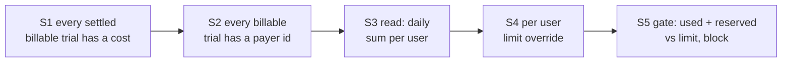
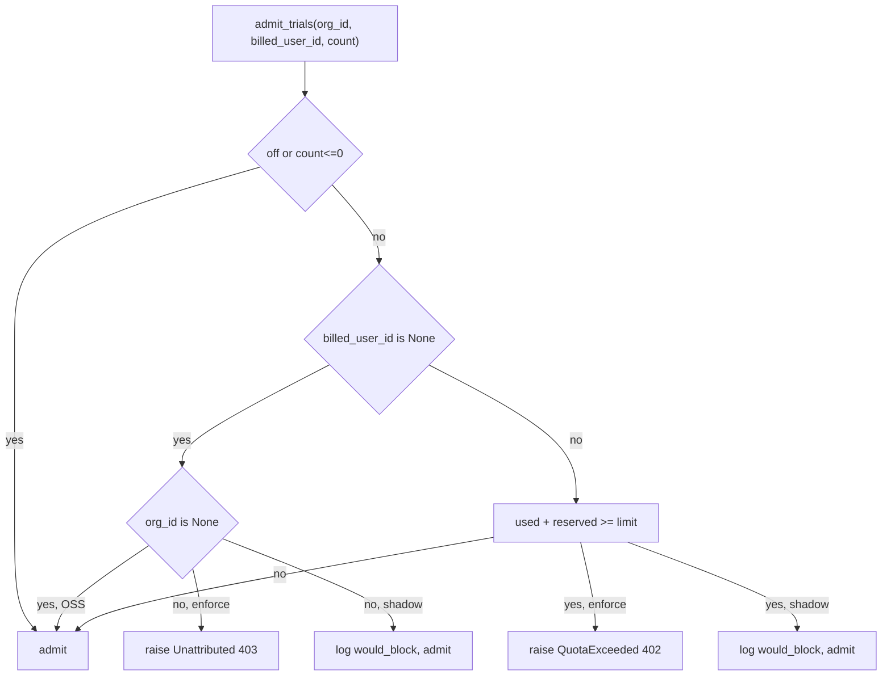

# User Quotas MVP, explained from first principles

Audience: a 3rd year CS student. You know data structures, SQL basics, HTTP, and a little Python and JavaScript. You have not necessarily seen SQLAlchemy, FastAPI, Pydantic, Alembic, Next.js, or React SWR. Those are explained where they appear.

Open this file in the worktree window (`/Users/charles/worktrees/oddish-user-quotas-mvp`) so the code links resolve. Every claim here is checked against executable code, not against comments. Comments are ignored as proof. Where something looks wrong, it is flagged inline and collected in [section 9](#9-suspicious-findings-consolidated).

Read the code as you go. The links are the point.

---

## 0. The problem in one line

Oddish runs paid AI "trials" (each trial calls a model provider and costs real dollars). We want a per user daily dollar budget: once a user has spent their limit today, block their new trials. That is the whole feature.

---

## 1. The idea, derived

Start from what a budget check needs and work backwards.

To block a user at a daily cap, at the moment they submit new work you must compute:

```
used_today(user) + about_to_spend(user)  >=  limit(user)   ->  block
```

Each term forces a requirement, and each requirement is one "slice" (S1 to S5) of the build:

1. `used_today` is a database sum of trial costs. A sum is only correct if every finished paid trial actually has a cost recorded. If a paid trial finishes with a `NULL` cost, SQL `SUM` skips it and the user looks cheaper than they are. So first guarantee: **every settled billable trial has a real cost** (slice S1).
2. The sum is `per user`. So each trial must record `who pays`. So: **every billable trial is stamped with a payer id at creation** (slice S2).
3. You need to actually read that per user daily sum and show it. So: **a read path and UI for daily spend** (slice S3).
4. `limit(user)` is usually a global default but an admin may raise or lower it. So: **an overridable per user limit** (slice S4).
5. `about_to_spend` and the comparison and the actual blocking. So: **the admission gate** (slice S5).

The slices form a dependency chain. Each one only makes sense because the one before it holds.



The feature ships **off**. There is a setting `quota_mode` with three values `off`, `shadow`, `enforce`. In `off` nothing changes and no extra queries run. `shadow` runs the whole computation and logs what it would have blocked, but never blocks. `enforce` actually blocks. This lets the team turn it on gradually.

---

## 2. Libraries and syntax you need (primer)

These recur across every slice. Skim now, refer back later.

### 2.1 Async SQLAlchemy

SQLAlchemy is Python's main SQL toolkit. Two layers matter here.

The ORM layer maps a Python class to a table. A column is declared like this (from [oddish/src/oddish/db/models.py:813](oddish/src/oddish/db/models.py#L813)):

```python
cost_usd: Mapped[float | None] = mapped_column(Float, nullable=True)
```

`Mapped[float | None]` is a type annotation the ORM reads to know the Python type and that the column is nullable. `mapped_column(Float, nullable=True)` describes the actual database column. Both must agree.

The Core / query layer builds SQL as Python expressions. `select(...)`, `func.sum(...)`, `func.coalesce(...)`, `func.count()` build a `SELECT`. `func.X` is a generic constructor for the SQL function `X`.

Because the server is async, queries are awaited. Two shapes appear constantly:

1. `await session.scalar(select(...))` runs the query and returns the first column of the first row (one value). Used for a `SUM` or a `COUNT`.
2. `await session.execute(select(...))` returns a result you then shape with `.scalars().all()` (list of ORM objects) or `.all()` (list of tuples).

`session.execute(text("...raw SQL... :name"), {"name": value})` runs raw SQL. The `:name` placeholders are bound separately from the SQL string, so they are injection safe and matched by name, not position.

### 2.2 Decimal vs float, and why money uses Decimal

A Python `float` is IEEE 754 binary. It cannot represent `0.1` exactly, so `0.1 + 0.2 == 0.30000000000000004`. `decimal.Decimal` is exact base 10. `Decimal("0.50")` really is one half.

Two consequences you will see:
1. Money constants are `Decimal("10.00")`, not `10.00`.
2. A value read back from a float column is wrapped and rounded to 4 decimal places with `Decimal(str(x)).quantize(Decimal("0.0001"))` so the compared number is stable. Going through `str(x)` first avoids re importing the float's binary error.

Watch for the seam: the trial `cost_usd` column is a `Float`, while the limit column is exact `NUMERIC(12,4)`. That mismatch is a recurring flag.

### 2.3 FastAPI dependency injection (`Depends`)

FastAPI is the HTTP framework. A route is an async function. A parameter written as

```python
auth: Annotated[AuthContext, Depends(require_can_manage_quotas)]
```

means: before running the handler, call `require_can_manage_quotas`, and pass its return value in as `auth`. If that dependency raises `HTTPException(403)`, the handler never runs. This is how authorization is attached to an endpoint: it is just a parameter.

### 2.4 Pydantic models and `Field`

Pydantic validates request bodies. A request schema is a class of typed fields. `Field(gt=0, le=..., max_digits=12, decimal_places=4)` attaches validation rules. If the incoming JSON violates them, FastAPI returns `422` automatically and the handler never runs. This moves input validation out of the handler and to the boundary.

### 2.5 Alembic migrations

Alembic versions the database schema. Each migration file declares `revision` (its own id) and `down_revision` (its parent). The files form a directed graph; `alembic upgrade head` walks it in order. Two rules matter later: revision ids must be globally unique, and there must be a single `head` (a revision with no children) or Alembic refuses to run.

### 2.6 Postgres specifics

`unnest(a, b, c)` takes N arrays and returns a table of N columns where row i is `(a[i], b[i], c[i])`. Column identity is purely positional. This is used to insert many rows with one fixed statement (S2).

`INSERT ... ON CONFLICT (cols) DO UPDATE SET ...` is an upsert: if the row already exists (by the named unique columns), update it instead of erroring (S4).

### 2.7 Next.js route handlers and React SWR (frontend)

A file at `frontend/src/app/api/quotas/me/route.ts` that exports `async function GET()` is a server side HTTP endpoint at the URL `/api/quotas/me`. It runs on the Next.js server, not in the browser. Here these files are proxies: they read the caller's auth token and forward the request to the Python backend.

`useSWR(url, fetcher)` is a React hook that calls `fetcher(url)`, caches the result under `url`, returns `{data, error, isLoading}`, and re renders when data arrives. `mutate()` throws the cache away and refetches.

---

## 3. Slice S1: cost completeness

Goal: a settled billable trial never has `NULL` cost. Read [oddish/src/oddish/trial_cost.py](oddish/src/oddish/trial_cost.py) top to bottom first.

### 3.1 Why NULL is dangerous

Daily spend is `SELECT COALESCE(SUM(cost_usd), 0) ...`. SQL `SUM` skips rows where the column is `NULL`. `COALESCE(SUM(...), 0)` only substitutes `0` when there are zero matching rows; it does not turn a per row `NULL` into `0`. So one settled billable trial left at `NULL` contributes `$0.00` to the user's spend, and they can run past their cap. That is the leak S1 closes.

### 3.2 Two words defined by code

"Settled" means a terminal write happened: `status` became `SUCCESS` or `FAILED` and `finished_at` was stamped. The daily sum only counts rows with `finished_at >= start_of_today` ([quotas.py:41](oddish/src/oddish/core/quotas.py#L41)), so "settled" effectively means "has `finished_at`".

"Billable" is two status sets in [oddish/src/oddish/queue.py:47](oddish/src/oddish/queue.py#L47):

```python
ACTIVE_TRIAL_STATUSES  = (PENDING, QUEUED, RUNNING, RETRYING)
BILLABLE_CANCEL_TRIAL_STATUSES = (QUEUED, RUNNING, RETRYING)
```

Billable is active minus `PENDING`. A `PENDING` trial never claimed a slot, so it cost nothing. A `QUEUED`/`RUNNING`/`RETRYING` trial did claim one.

### 3.3 The one chokepoint

Every terminal writer routes cost through `apply_settled_cost`. Read [trial_cost.py:7-20](oddish/src/oddish/trial_cost.py#L7-L20):

```python
def apply_settled_cost(trial, outcome=None) -> None:
    if outcome is not None:
        trial.input_tokens = outcome.input_tokens
        trial.cache_tokens = outcome.cache_tokens
        trial.cache_write_tokens = outcome.cache_write_tokens
        trial.output_tokens = outcome.output_tokens
        trial.total_steps = outcome.total_steps
        trial.cost_usd = (
            outcome.cost_usd
            if outcome.cost_usd is not None
            else _estimate_or_floor(trial)
        )
    elif trial.cost_usd is None:
        trial.cost_usd = _estimate_or_floor(trial)
```

Line by line:

1. `if outcome is not None`: the provider (Harbor) returned a real result. Copy its token counts onto the trial, then set `cost_usd` to the provider's own figure if it reported one, else fall to `_estimate_or_floor`. This branch always overwrites `cost_usd`, so a real number cleanly replaces an earlier placeholder.
2. `elif trial.cost_usd is None`: no result at all (a worker died, an exception fired, a reaper is cleaning up). Only write a cost if the field is still empty. This is the never clobber rule: do not overwrite a known real cost with a guess.

The floor itself, [trial_cost.py:23-36](oddish/src/oddish/trial_cost.py#L23-L36):

```python
def _estimate_or_floor(trial) -> float:
    try:
        estimated_cost_usd = estimate_cost_usd(
            trial.model,
            trial.input_tokens,
            trial.output_tokens,
            trial.cache_tokens,
            trial.cache_write_tokens,
        )
    except Exception:
        estimated_cost_usd = None
    if estimated_cost_usd is not None:
        return estimated_cost_usd
    return float(settings.pending_trial_reservation_usd)
```

Try to compute the dollar cost from token counts and the model's price sheet. If that returns nothing (unknown model, or all token counts zero), fall to a fixed floor, `pending_trial_reservation_usd` (default `Decimal("0.50")` from [config.py:866](oddish/src/oddish/config.py#L866)). So even a trial with no telemetry books `$0.50`, never `NULL`.

### 3.4 Trace: a QUEUED trial whose worker dies

Follow this concretely.

1. Row starts `status=QUEUED, finished_at=NULL, cost_usd=NULL`. A worker is running it.
2. The worker process is killed. It never runs its terminal writer, so nothing settles the row. Its heartbeat goes stale.
3. The stale worker reaper runs. Read the FAILED branch at [cleanup.py:391-399](oddish/src/oddish/workers/queue/cleanup.py#L391-L399):

```python
else:
    trial.status = TrialStatus.FAILED
    trial.error_message = row["error_message"]
    trial.finished_at = trial.finished_at or utcnow()
    trial.current_worker_id = None
    trial.current_queue_slot = None
    trial.stale_reaped_at = utcnow()
    apply_settled_cost(trial)
```

4. `finished_at` is now set (the row is settled). `apply_settled_cost(trial)` runs in the no outcome mode. `cost_usd` is `NULL`, so it calls `_estimate_or_floor`.
5. There are no tokens, so the estimate is `None`, so it returns `float(Decimal("0.50")) = 0.5`.
6. The row settles at `$0.50`, not `NULL`. Delete that one `apply_settled_cost(trial)` line and the row would settle `NULL` and the `$0.50` of real slot time would leak past every user's cap.

Contrast: if the reaper decides to retry instead of fail (attempts remain), it sets `status=RETRYING` and does not set `finished_at` and does not call `apply_settled_cost` ([cleanup.py:377-384](oddish/src/oddish/workers/queue/cleanup.py#L377-L384)). That is correct: the trial is not terminal yet, nothing to bill, and the daily sum excludes it because `finished_at IS NULL`.

### 3.5 Suspicious in S1

1. **The stated invariant is narrower than it sounds. CONFIRMED.** On user cancel, read [queue.py:224-240](oddish/src/oddish/queue.py#L224-L240):

```python
if trial.id in canceled_trial_kinds or trial.status in ACTIVE_TRIAL_STATUSES:
    trial_consumed_billable_slot = trial.status in BILLABLE_CANCEL_TRIAL_STATUSES
    trial.status = TrialStatus.FAILED
    trial.finished_at = now
    ...
    if trial_consumed_billable_slot:
        apply_settled_cost(trial)
```

   `ACTIVE_TRIAL_STATUSES` includes `PENDING`, so a `PENDING` trial enters the block and gets `finished_at = now` (it is settled). But `trial_consumed_billable_slot` is computed against `BILLABLE_CANCEL_TRIAL_STATUSES`, which excludes `PENDING`, so `apply_settled_cost` is skipped and `cost_usd` stays `NULL`. So "a settled trial never has NULL cost" is literally false. The true invariant is "settled AND billable never has NULL cost." It is harmless today because a `PENDING` trial genuinely cost `$0`, and a `NULL` sums as `0`, which is the right answer. The lesson: a per row `NULL` in a `SUM` is not the same as `0` in general; it only happens to be right here because the intended value is `0`. Note also that `finished_at != NULL` does not imply `cost_usd != NULL`, so do not write code that assumes it.

2. **A bare `except` hides an estimation bug as `$0.50`. CONFIRMED.** In [trial_cost.py:24-33](oddish/src/oddish/trial_cost.py#L24-L33) the `except Exception: estimated_cost_usd = None` has no logging. `estimate_cost_usd` is written to return `None` for the normal "no pricing" cases, so the `except` only fires on a genuine bug (a bad token type, the pricing library raising). When it fires, a trial that really cost tens of dollars silently books `$0.50` and under bills the user, with no log to notice. The floor was meant for the no telemetry case, not to mask exceptions. Minimum fix: log in the `except`.

3. **A reported `cost_usd` of `0.0` is trusted with no floor. CONFIRMED.** In [trial_cost.py:14-18](oddish/src/oddish/trial_cost.py#L14-L18) the guard is `outcome.cost_usd if outcome.cost_usd is not None else ...`. The check is `is not None`, so a real `0.0` passes straight through. A trial that ran a real slot but whose provider reported `0.0` (no usage telemetry) settles free, while the same trial reporting `None` would have been floored to `$0.50`. So "provider reported zero" and "provider reported nothing" produce different bills for identical work. This survives the NULL reasoning (`0.0` is not `NULL`) yet still under bills. This is the classic `is None` versus falsy distinction.

4. **Money is float end to end, not Decimal. PARTLY.** [trial_cost.py:36](oddish/src/oddish/trial_cost.py#L36) returns `float(settings.pending_trial_reservation_usd)`, and `cost_usd` is a `Float` column. The Decimal work happens only on the read side ([quotas.py:22-23](oddish/src/oddish/core/quotas.py#L22-L23)). For `$0.50` there is no meaningful loss, so this is not the NULL bug of this slice. The real concern is architectural: summing many float costs in Postgres accumulates binary rounding, and only the final total is quantized to 4 places. It matters only exactly at a cap boundary (see S5).

---

## 4. Slice S2: attribution

Goal: every billable trial carries `billed_user_id`, the payer whose daily budget its cost draws down. `NULL` means "draws down nobody" (imported or combined rows). Start at the column, [oddish/src/oddish/db/models.py:694](oddish/src/oddish/db/models.py#L694):

```python
billed_user_id: Mapped[str | None] = mapped_column(String(64), nullable=True)
```

It is a plain `VARCHAR(64)`, nullable, and deliberately **not** a foreign key. The `users` table lives in the separate backend package; a cross package foreign key would break open source installs that ship only the CLI and server. The cost of that decision: a `billed_user_id` can point at a user who no longer exists, and readers must tolerate it.

### 4.1 Who pays: owner precedence

The payer is resolved once, in the backend router, before the core insert. Read [backend/api/routers/tasks.py:363-394](backend/api/routers/tasks.py#L363-L394):

```python
async def _resolve_experiment_owner_user_id(session, submission, auth) -> str | None:
    if submission.github_id or submission.github_username:
        user = await _resolve_connected_user(
            session, org_id=auth.org_id,
            github_id=submission.github_id,
            github_username=submission.github_username,
        )
        if user:
            return user.id
        return None
    if auth.user_id:
        return auth.user_id
    if auth.api_key_id:
        api_key = auth.api_key or await session.get(APIKeyModel, auth.api_key_id)
        if api_key and api_key.created_by_user_id:
            return api_key.created_by_user_id
    return None
```

Precedence, top to bottom:
1. If the submission carries any GitHub identity, resolve it to an org user. If it resolves, that user pays. If a GitHub identity was supplied but resolves to nobody, `return None` immediately (line 382). It deliberately does not fall through to the submitter, so an unlinked handle leaves the trial unbilled rather than charging the wrong person.
2. Otherwise the authenticated user (`auth.user_id`).
3. Otherwise the API key's owner.

This is why a CI run bills the pull request author (the workflow passes `--github-user <author>`), while an interactive run bills the person who ran it. The identity resolver itself, [tasks.py:307-331](backend/api/routers/tasks.py#L307-L331), prefers the immutable `github_id` over the mutable handle.

### 4.2 The bulk insert, and the one fragile contract

Create and append insert all trials of a sweep with one fixed statement, `_TRIAL_BULK_INSERT_SQL`. Read [queue.py:606-638](oddish/src/oddish/queue.py#L606-L638). The shape is `INSERT INTO trials (...columns...) SELECT ...projection... FROM unnest(...arrays...) WITH ORDINALITY AS t(...aliases...)`.

Why this shape at all: instead of N separate inserts, or an N row `VALUES` list whose SQL text grows with N, this one statement inserts any number of rows and its text never changes. That keeps it cheap under the connection pooler, which disables prepared statement caching.

`unnest(arr1, arr2, ...)` zips parallel arrays into a table row by row. `WITH ORDINALITY AS t(c1, c2, ..., ord)` names those columns positionally and adds a trailing 1 based row number `ord`. Identity is positional: the k th array becomes the k th named column.

There are three ordered lists in this statement and only one pairing is load bearing:

1. The `unnest(...)` argument arrays (17 of them) and the `AS t(...)` alias names (17 plus `ord`) must line up position for position. `:billed_user_id` is the 17th (last) array and `billed_user_id` is the 17th alias. This is the only pairing where a mistake is silent.
2. The `INSERT (...)` column list and the `SELECT ...` projection must line up (ordinary SQL). Here `billed_user_id` is 7th in both. The `SELECT` refers to `t.billed_user_id` by name, so once the aliases are right this half is name checked, not position checked.

The trap: `billed_user_id` sits at position 7 in the INSERT/SELECT but position 17 in the unnest/alias pair. A maintainer must reason about both orderings. If someone inserts a new array in the middle of the `unnest` list but forgets the matching alias, every column after that point shifts by one, and Postgres does not error as long as the types are compatible. See the flag below for how bad that can get.

### 4.3 Trace: `oddish run --github-user octocat`

1. The CLI puts `github_username="octocat"` into the POST body.
2. The route calls `_resolve_experiment_owner_user_id`. The GitHub branch runs, resolves `octocat` to the one active member `U42`, returns `"U42"`.
3. That value flows into `create_task(..., billed_user_id="U42")`, into each trial row dict ([queue.py:814](oddish/src/oddish/queue.py#L814)), into the `:billed_user_id` array, and every inserted row gets `billed_user_id="U42"`.
4. If a probe is enqueued, [auto_probe.py](oddish/src/oddish/core/probe/auto_probe.py) forwards the same `billed_user_id`, so the probe bills `U42` too.

If `octocat` is not a linked member, or two members share the handle, the resolver returns `None`, the rows are inserted `NULL` billed, and they draw down nobody's quota.

### 4.4 Suspicious in S2

1. **This looks like a bug but is not. REFUTED, and worth studying.** The resolver's username fallback ([tasks.py:327-330](backend/api/routers/tasks.py#L327-L330)) could plausibly be calling the wrong helper. The module has a matched pair: `_lookup_user_by_github_username` (singular, returns `UserModel | None`) and `_lookup_users_by_github_username` (plural, returns `list[UserModel]`). The call site actually uses the singular. The singular is a thin wrapper that calls the plural then collapses with `users[0] if len(users) == 1 else None` (0 or 2+ matches become `None`, never an error). So the return type is honest and callers doing `user.id` are safe. The lesson: two helpers differing by one character (`user` versus `users`) are a real trap; verify the exact byte at the call site before believing a plausible bug report.

2. **The positional insert contract has no guard. PARTLY.** The `unnest` args and aliases at [queue.py:616-638](oddish/src/oddish/queue.py#L616-L638) are aligned today, but nothing asserts `len(args) == len(aliases without ord)`, and the only test just counts a substring, which a positional shift would still pass. The "silent, no error" risk is narrower than it first appears: most arrays are `text[]`, but `timeout_minutes` and `max_attempts` are `int[]` and `is_probe` is `boolean[]`, so a shift across a type boundary throws. The genuinely dangerous zone is the leading run of same typed `text[]` columns (`id` through `org_id`), where a one slot shift would silently route one column's values into another with no error. A cheap `assert` and a real round trip insert test would remove the hazard.

3. **Retry copies the payer with no recheck. CONFIRMED.** Read [trials.py:117-133](oddish/src/oddish/core/endpoints/trials.py#L117-L133). A retry does not re resolve ownership; it copies `billed_user_id=old_trial.billed_user_id`. The create path only resolves active members (`is_active == True`), but the retry path trusts whatever string the old row carried, even if that user left the org. Neither the sum nor the limit lookup re validates the id. Whether "cost follows the original owner" is desired is a product call, but the asymmetry is real: create verifies a live user, retry replays a possibly stale id. See also S5 flag 5.

4. **Duplicate Alembic revision id. CONFIRMED, pre existing.** The migration [billed_user_001_add_trials_billed_user_id.py:32](oddish/alembic/versions/billed_user_001_add_trials_billed_user_id.py#L32) sets `down_revision = "a1b2c3d4e5f6"`. But two different files both declare `revision = "a1b2c3d4e5f6"`: `a1b2c3d4e5f6_add_trial_cache_write_tokens.py` and `a1b2c3d4e5f6_add_run_analysis_to_tasks.py`. Revision ids must be globally unique, so Alembic errors on the collision before it can even resolve heads. This is inherited from the base branch, not introduced here, but it blocks `alembic upgrade` on this stack until the id is deduplicated to a single head. The lesson: Alembic keys on the `revision =` string, not the human readable filename; always grep the versions directory for a new id before committing.

---

## 5. Slice S3: usage visibility

Goal: read and show daily spend. No enforcement yet. All the read logic lives in [oddish/src/oddish/core/quotas.py](oddish/src/oddish/core/quotas.py); read the whole file, it is under 80 lines.

### 5.1 The core read

[quotas.py:31-45](oddish/src/oddish/core/quotas.py#L31-L45):

```python
async def sum_cost_usd(session, org_id, user_id, period_start) -> Decimal:
    settled_cost_total = await session.scalar(
        select(func.coalesce(func.sum(TrialModel.cost_usd), 0)).where(
            TrialModel.org_id == org_id,
            TrialModel.billed_user_id == user_id,
            TrialModel.finished_at >= period_start,
            TrialModel.deleted_at.is_(None),
        )
    )
    return to_money_decimal(settled_cost_total)
```

Read the four `where` predicates as four deliberate exclusions:
1. `org_id == org_id` and `billed_user_id == user_id`: only this payer's trials. `NULL` billed rows never match.
2. `finished_at >= period_start`: only trials that settled today. This is the key trick for excluding in flight work. In SQL, any comparison with `NULL` is `NULL` (not true), so a row with `finished_at IS NULL` (still running) fails `finished_at >= period_start` and is excluded automatically. You get "settled today" and "exclude in flight" from one predicate.
3. `deleted_at.is_(None)`: skip soft deleted trials. `.is_(None)` compiles to `IS NULL` (you cannot write `== None` in SQL land).
4. `COALESCE(SUM(...), 0)`: if no rows match at all, return `0` instead of `NULL`.

`period_start` comes from [quotas.py:26-28](oddish/src/oddish/core/quotas.py#L26-L28), which zeroes hour, minute, second, microsecond on the current UTC time. It is a fixed calendar day boundary in UTC, not a rolling 24 hours.

### 5.2 Why the quantize exists

[quotas.py:22-23](oddish/src/oddish/core/quotas.py#L22-L23):

```python
def to_money_decimal(raw_amount) -> Decimal:
    return Decimal(str(raw_amount or 0)).quantize(MONEY_QUANTUM)
```

`cost_usd` is a `Float`, so `SUM` accumulates binary rounding error. `Decimal(str(x))` converts through the string form (avoiding re importing the float noise), and `.quantize(Decimal("0.0001"))` pins it to 4 decimal places. This is needed both for display (no 17 digit tails) and, later, for S5's cap comparison to be stable.

### 5.3 The admin table avoids N+1

A naive admin table would run one spend query per member (N+1 queries). Instead, [orgs.py:192-208](backend/api/routers/orgs.py#L192-L208) runs one grouped query:

```python
grouped_usage = await session.execute(
    select(
        TrialModel.billed_user_id,
        func.coalesce(func.sum(TrialModel.cost_usd), 0),
    )
    .where(
        TrialModel.org_id == auth.org_id,
        TrialModel.billed_user_id.is_not(None),
        TrialModel.finished_at >= period_start,
        TrialModel.deleted_at.is_(None),
    )
    .group_by(TrialModel.billed_user_id)
)
used_usd_by_user_id = {
    billed_user_id: to_money_decimal(settled_total)
    for billed_user_id, settled_total in grouped_usage.all()
}
```

`GROUP BY billed_user_id` produces one `(user_id, sum)` row per payer. That becomes a dict. Then each member row looks itself up with `.get(member.id, Decimal(0))` ([orgs.py:219-227](backend/api/routers/orgs.py#L219-L227)), so a member with no spend shows `$0`. One query for the whole table.

### 5.4 The member endpoint and the auth split

`GET /quotas/me` ([orgs.py:135-155](backend/api/routers/orgs.py#L135-L155)) is guarded by `require_auth` (any logged in caller) and reads only the caller's own spend and limit. `GET /quotas` (the admin table) is guarded by `require_can_manage_quotas`. Read that dependency at [backend/auth/__init__.py:346-365](backend/auth/__init__.py#L346-L365):

```python
async def require_can_manage_quotas(auth) -> AuthContext:
    if auth.method == AuthMethod.API_KEY:
        raise HTTPException(status_code=403, detail="User auth required to manage quotas")
    if can_manage_quotas(auth):
        return auth
    raise HTTPException(status_code=403, detail="Admin role required to manage quotas")
```

Two things make it stricter than the ordinary `require_admin`. Compare `require_admin` at [__init__.py:305-307](backend/auth/__init__.py#L305-L307): it lets a `FULL` scope API key through via `require_scope`. `require_can_manage_quotas` rejects any API key outright, before the role check, so a key can never enumerate members' spend. And `can_manage_quotas` ([permissions.py:43-51](backend/auth/permissions.py#L43-L51)) returns `True` for any org admin, so it is self service for every org, unlike `can_create_api_keys` which is locked to one company domain.

### 5.5 Trace: org with 3 members, 2 with spend

Members `A`, `B`, `C`. Today `A` settled two trials at `$1.20` and `$0.50`, `B` settled one at `$3.00`, `C` ran nothing.

1. The grouped query returns two rows: `("A", 1.70...)` and `("B", 3.00...)`. `C` is absent because it has no matching trials.
2. `used_usd_by_user_id = {"A": Decimal("1.7000"), "B": Decimal("3.0000")}`.
3. Building rows: `A` -> `.get("A", 0)` = `1.70`; `B` -> `3.00`; `C` -> `.get("C", Decimal(0))` = `0.00`.
4. Every member appears, with `C` correctly at `$0`, from a single spend query.

### 5.6 Suspicious in S3

1. **Two readers disagree on soft deleted overrides. CONFIRMED, latent.** The raw SQL limit read `get_effective_limit` ([quotas.py:69-75](oddish/src/oddish/core/quotas.py#L69-L75)) includes `deleted_at IS NULL`, but the admin list's override read ([orgs.py:210-214](backend/api/routers/orgs.py#L210-L214)) does not. `QuotaModel` is not registered for the automatic soft delete filter, so no ORM read filters it for free. Today this is harmless because the only clear path is a hard `DELETE` (S4), so no quota row is ever soft deleted; there is nothing for the two readers to disagree about. It becomes a real inconsistency the moment anyone changes "clear" to a soft delete expecting the automatic filter to apply, because it will not. The lesson: keep the `where` predicates consistent across every reader of a table.

2. **No validation of the cost sign. LOW, not an S3 bug.** `to_money_decimal` will faithfully convert a negative float if an upstream bug ever recorded one. S3 only reports what is stored. Worth knowing, but the fix belongs where cost is written.

---

## 6. Slice S4: overrides

Goal: an admin can override the flat default limit per member. Read the model [backend/models.py:179-199](backend/models.py#L179-L199) and the endpoint [orgs.py:231-285](backend/api/routers/orgs.py#L231-L285).

### 6.1 The one design choice: default at read

A `quotas` row is a pure override. A missing row is not "no quota"; it means "enforce at the global default." So there is no seeding, no backfill, no "every member must have a row" invariant. Both read paths resolve `COALESCE(override row, default)` in code. Read `get_effective_limit`, [quotas.py:66-78](oddish/src/oddish/core/quotas.py#L66-L78):

```python
async def get_effective_limit(session, org_id, user_id) -> Decimal:
    override_limit_usd = await session.scalar(
        text(
            "SELECT limit_usd FROM quotas "
            "WHERE org_id = :org_id AND user_id = :user_id AND deleted_at IS NULL"
        ),
        {"org_id": org_id, "user_id": user_id},
    )
    if override_limit_usd is not None:
        return Decimal(str(override_limit_usd))
    return settings.default_daily_quota_usd
```

If a row exists, its `limit_usd` wins. If not, fall to the default (`Decimal("10.00")`). "No row" deterministically means "the default," never "unlimited." This is raw SQL rather than the ORM because the `quotas` table is owned by the backend package and the oddish core layer deliberately does not import a model for it.

### 6.2 Set or clear in one endpoint

Read `set_member_quota`, [orgs.py:231-285](backend/api/routers/orgs.py#L231-L285). Its shape:

1. Tenant scoped lookup:

```python
member = (await session.execute(
    select(UserModel).where(UserModel.id == user_id, UserModel.org_id == auth.org_id)
)).scalar_one_or_none()
if member is None:
    raise HTTPException(status_code=404, detail=f"User {user_id} not found in this org")
```

   The double predicate `id == user_id AND org_id == auth.org_id` is the entire tenant isolation mechanism. A `user_id` in another org matches no row, so the code raises `404` before touching the `quotas` table. That is why a cross org target cannot silently edit another tenant.

2. If `payload.limit_usd is None`, hard delete the override with `QuotaModel.__table__.delete().where(...)`, reverting the member to the default. Deleting a non existent row is a harmless no op.

3. Otherwise upsert:

```python
pg_insert(QuotaModel).values(
    id=generate_id(), org_id=auth.org_id, user_id=user_id,
    limit_usd=payload.limit_usd, period_kind="daily",
).on_conflict_do_update(
    index_elements=["org_id", "user_id"],
    set_={"limit_usd": payload.limit_usd, "updated_at": utcnow()},
)
```

   `pg_insert(...).on_conflict_do_update(...)` compiles to Postgres `INSERT ... ON CONFLICT (org_id, user_id) DO UPDATE SET ...`. First set inserts a fresh row; a re set updates the existing one. `index_elements` names the unique columns that define a conflict; `set_` applies only on the update branch. One statement, no read then write race.

### 6.3 Why the `Field` bound matters

The request schema, [schemas.py:76-82](backend/api/schemas.py#L76-L82):

```python
limit_usd: Decimal | None = Field(
    default=None, gt=0, le=Decimal("99999999.9999"),
    max_digits=12, decimal_places=4,
)
```

Each clause turns a would be failure into a clean `422` before the value reaches the column:
1. `gt=0` rejects zero and negatives.
2. `le=99999999.9999` and `max_digits=12` reject a value that would overflow `NUMERIC(12,4)` and otherwise produce an opaque `500`.
3. `decimal_places=4` rejects excess scale, so PUT cannot echo an unrounded value that a later GET would then disagree with. Only exact 4 decimal values reach the column, so PUT equals GET.
4. `Decimal | None` allows `null`, which is the clear signal and skips the numeric bounds.

### 6.4 Suspicious in S4

1. **The PUT response can disagree with a later GET under concurrency. CONFIRMED.** The response limit is synthesized from the request payload, not re read from the committed row ([orgs.py:280-285](backend/api/routers/orgs.py#L280-L285)):

```python
effective_limit_usd = (
    payload.limit_usd if payload.limit_usd is not None
    else settings.default_daily_quota_usd
)
return _quota_member_item(member, effective_limit_usd, used_today)
```

   If admin A sets `3.50` and admin B clears to `null` concurrently, each returns a `200` reflecting its own payload, but only one write survives. A's response can say `3.50` while B's delete is the durable state. This is read your own write skew. The schema docstring advertises "PUT and GET agree," which concurrency can still violate. The fix is to re select the effective limit after the write, inside the same transaction.

2. **Positivity is enforced only at the HTTP boundary. CONFIRMED.** The column is `Numeric(12, 4)` with no `CHECK(limit_usd > 0)` ([models.py:191](backend/models.py#L191)). Contrast `period_kind`, which does get a DB level `CHECK`. So any writer that does not go through `QuotaUpdateRequest` (a future script, a raw SQL insert) can persist `0` or a negative limit, and `get_effective_limit` would return it verbatim. An invariant enforced only at the request layer is not an invariant of the store. This is a hardening gap, not a live bug, since the only current writer is the guarded PUT.

3. **A misconception, refuted, worth learning. REFUTED.** It is tempting to think the upsert's `.values(...)` omits `created_at`/`updated_at` and so would fail `NOT NULL` on a schema built by `create_all` (which lacks the migration's `DEFAULT NOW()`). That is wrong. SQLAlchemy applies a column's Python side `default=utcnow` for any omitted column on both ORM inserts and Core inserts. The compiled SQL includes `created_at`/`updated_at` with bound values. The adjacent real weakness: these columns have no `server_default`, so a raw `psql` insert that truly bypasses SQLAlchemy would fail `NOT NULL` on a `create_all` schema. So the instinct "these columns are under defended at the DB layer" is correct; the specific blame on this `pg_insert` is not.

4. **The `deleted_at` predicate here is dead today.** Same finding as [S3 flag 1](#56-suspicious-in-s3): `get_effective_limit` filters `deleted_at IS NULL`, but nothing ever soft deletes a quota row.

---

## 7. Slice S5: the gate

Goal: compare spend against the limit at submit time and block. Everything is in [oddish/src/oddish/core/quota_admission.py](oddish/src/oddish/core/quota_admission.py). Read it.

### 7.1 The whole decision

[quota_admission.py:65-94](oddish/src/oddish/core/quota_admission.py#L65-L94):

```python
async def admit_trials(session, org_id, billed_user_id, count):
    mode = settings.quota_mode
    if mode == QuotaMode.OFF or count <= 0:
        return

    if billed_user_id is None:
        if mode == QuotaMode.ENFORCE:
            raise Unattributed()
        _log_would_block(org_id, None, None, None, reason="unattributed")
        return

    effective_limit_usd = await get_effective_limit(session, org_id, billed_user_id)
    used_usd = await sum_cost_usd(session, org_id, billed_user_id, start_of_today_utc())
    reserved_usd = (
        await inflight_count(session, org_id, billed_user_id) + count
    ) * settings.pending_trial_reservation_usd

    if used_usd + reserved_usd >= effective_limit_usd:
        if mode == QuotaMode.ENFORCE:
            raise QuotaExceeded(used_usd, effective_limit_usd)
        _log_would_block(org_id, billed_user_id, used_usd, effective_limit_usd, reason="over_budget")
```

Three parts, in order:

1. **Escape hatches (line 72).** If the feature is `OFF`, or the submission adds nothing (`count <= 0`), return with no database read at all.
2. **Attribution.** If the run cannot be pinned to a user (`billed_user_id is None`), the escape hatch keys on the payer, not the org. When `org_id is None` **too** — an OSS single-tenant install with no org and no linkage — it returns a no-op in *every* mode (this is what preserves the OSS invariant, not the `OFF` default). Otherwise (a hosted org whose run couldn't be attributed) `ENFORCE` raises `Unattributed` (403, "link your GitHub"); `shadow` logs and admits. A **no-org but attributed** user (`org_id` is `NULL`, `billed_user_id` set) is *not* caught here — it flows through to the budget check (part 3) and enforces against the default limit, because `org_id = NULL` matches no override row. This runs before any budget query, because you cannot compute a per user budget without a user.
3. **Budget (lines 81 to 94).** Compute three exact `Decimal` values and compare. `effective_limit_usd` is the S4 limit. `used_usd` is today's settled spend (the S3 read). `reserved_usd` is a pessimistic hold: the number of trials already in flight plus the `count` about to be created, times a flat `$0.50` each. Block when `used + reserved >= limit`.

Two subtleties:
1. The comparison is `>=`, not `>`. Landing exactly on the cap blocks. All three operands are `Decimal`, so the boundary decision is identical on every host; no float rounding can flip an at cap run.
2. `reserved_usd` is `(int + int) * Decimal`. Python's `Decimal` defines the multiplication so the result stays `Decimal`, never a float.



### 7.2 Why the reservation exists

`cost_usd` only settles when a trial finishes. Without a reservation, a user at `$0` could launch a thousand trials at once, all of which look free until they settle, and blow far past the cap. Read the two input queries, [quotas.py:31-63](oddish/src/oddish/core/quotas.py#L31-L63). `sum_cost_usd` counts finished trials (`finished_at >= today`). `inflight_count` counts the opposite population: `finished_at IS NULL`, not deleted, not superseded, and in an active status. The two sets are disjoint, so a trial is in at most one of `used` or `reserved`. Multiplying the in flight count by a flat `$0.50` is the stand in for that not yet settled cost.

### 7.3 Why a block leaves no rows

`admit_trials` runs inside the request's database transaction, before any `session.add` or insert. Read the retry path, [trials.py:117-145](oddish/src/oddish/core/endpoints/trials.py#L117-L145): the `admit_trials(..., count=1)` at line 120 runs before `session.add(new_trial)` at line 145. If it raises `QuotaExceeded`, execution never reaches the insert, the exception propagates out of the handler, and the transaction is discarded without a commit. There is nothing to undo. The check is a true admission gate, not a compensating delete.

Note the retry only calls `admit_trials` when `old_trial.billed_user_id is not None`. A legacy unattributed trial retries with no gate.

### 7.4 The four billable seams and the batch case

Three of the four paths that mint a billable trial call admit before the insert: sweep create, sweep append, and retry. Auto probe is the exception — it does *not* admit. An auto probe always enqueues so every task version gets its diagnostic probe, never gated on budget; its cost still counts toward the payer's budget (`sum_cost_usd` has no `is_probe` filter), so a later sweep or retry is admitted against the higher total. User-initiated probes ride the normal sweep path and are gated like any other trial.

The batch route runs each item in its own savepoint (`session.begin_nested()`). Because item k's inserts are already flushed (though uncommitted) when item k+1 runs, `inflight_count` sees them, so items that are each individually under budget but jointly over budget are caught: the first item that tips over the cap gets the `402` and only its savepoint rolls back. The siblings survive and the route returns `207 Multi-Status`.

### 7.5 Fail safe startup guard

The oddish and backend schemas migrate separately, so enforcement could be switched on before both have applied. Read [backend/api/app.py:73-117](backend/api/app.py#L73-L117). At startup, if `quota_mode` is not `off`, it runs one query that `AND`s three existence checks: the `trials.billed_user_id` column, the specific partial index the queries rely on, and the `quotas` table. If any is missing, it forces `quota_mode = off` with a loud error, rather than enforcing against a `SUM` that would silently read `0` for everyone (which would be fail open, billing nobody). If the database is merely unavailable at boot, it skips the check and leaves the mode as is (a transient pooler blip must not crash the app). It fails safe, never fails open, never crashes.

### 7.6 How the CLI shows a 402

The backend registers exception handlers that serialize the exception's `detail` dict as the raw JSON body. So the CLI can read `response.json()["message"]` directly. Read [cli/api.py:1026-1036](oddish/src/oddish/cli/api.py#L1026-L1036): on a `402` or `403` it prints just the human message in red and exits, no stack trace, no raw JSON.

### 7.7 Traces

Burst of 30 trials, fresh user, `$10` limit, `enforce`:
1. Past guard 1 (enforce, org set, count > 0) and guard 2 (payer set).
2. `get_effective_limit`: no override, `Decimal("10.00")`.
3. `sum_cost_usd`: nothing finished today, `Decimal("0.0000")`.
4. `inflight_count`: `0`. `reserved = (0 + 30) * 0.50 = 15.00`.
5. `0.00 + 15.00 >= 10.00` is true. Raise `QuotaExceeded(used=0.00, limit=10.00)`. Zero trials inserted. The stampede is stopped purely by the reservation, before any cost is real.

Exactly at the cap: used `$9.50`, one more trial, `$10` limit:
1. `reserved = (0 + 1) * 0.50 = 0.50`. `9.50 + 0.50 = 10.00 >= 10.00` is true, block. With `>` instead of `>=`, `10.00 > 10.00` is false and the trial would slip through, letting the user reach and pass the cap.

### 7.8 Suspicious in S5

1. **The log and the error omit the reservation. CONFIRMED.** The decision is `used + reserved >= limit`, but `_log_would_block` and `QuotaExceeded` are passed only `used` and `limit` ([quota_admission.py:89-94](oddish/src/oddish/core/quota_admission.py#L89-L94)). In `shadow` mode (the mode used to size the rollout) an operator reads `used=2.00 limit=10.00` and sees numbers that look fine, with no hint the block was driven by, say, sixteen in flight trials times `$0.50 = $8.00` of reservation. The user's `402` has the same gap. When a threshold check combines several terms, the diagnostic should report every term. Fix: thread `reserved_usd` into both.

2. **The used side is a float sum. CONFIRMED.** The claim that Decimal makes the gate host deterministic only covers the final Python compare. `func.sum(TrialModel.cost_usd)` ([quotas.py:38](oddish/src/oddish/core/quotas.py#L38)) accumulates in base 2 in Postgres because `cost_usd` is a `Float`; `to_money_decimal` only quantizes the already rounded total. The limit side is exact `NUMERIC(12,4)`. At the `>=` boundary a sub cent float drift could flip the decision. The real fix is to store `cost_usd` as `NUMERIC` end to end.

3. **`PENDING` is dead membership in the in flight set. PARTLY.** `_INFLIGHT_TRIAL_STATUSES` ([quotas.py:14-19](oddish/src/oddish/core/quotas.py#L14-L19)) includes `PENDING`, but trials are created as `QUEUED` (see [trials.py:143](oddish/src/oddish/core/endpoints/trials.py#L143)), so no row is ever `PENDING`. It counts nothing today. It is a defensive superset, not a miscount, but it would silently start counting if `PENDING` is ever repurposed.

4. **The startup guard mutates a process global and never re checks. CONFIRMED.** [app.py:114-116](backend/api/app.py#L114-L116) does `settings.quota_mode = QuotaMode.OFF`, and `settings` is a module singleton read live by `admit_trials`. This is per container and one shot. Across an autoscaled fleet during a partial migration, containers that could not reach the DB keep enforcing while containers that saw incomplete schema disable, and a forced off container stays off until it restarts even after the schema is fixed. The intent is a fail safe and forcing `off` is the safe direction (worst case is under enforcement during a migration window, never a crash or over charge), but the fail safe is sticky and not uniform.

5. **A retry bills the original owner, and legacy trials retry for free. CONFIRMED.** [trials.py:117-120](oddish/src/oddish/core/endpoints/trials.py#L117-L120) charges `admit_trials(session, org_id, old_trial.billed_user_id, count=1)`. `retry_trial_core` never receives a "who clicked retry" identity, so the spend is charged to the original owner. An admin retrying someone else's failed trial consumes that person's budget, and can be blocked by it. And the `is not None` guard means a legacy trial with `billed_user_id = None` skips admission entirely on retry, forever, which is exactly the population you would most want to force attribution on.

---

## 8. Frontend

Two React components. Read [frontend/src/components/quota-usage-card.tsx](frontend/src/components/quota-usage-card.tsx) (a member's own card) and [frontend/src/components/quota-admin-form.tsx](frontend/src/components/quota-admin-form.tsx) (the admin table). They read data through `useSWR` from same origin `/api/quotas/*` routes.

### 8.1 The proxy route

The browser never calls the Python backend directly. It calls a same origin Next.js route that attaches the auth token server side and forwards. Read [frontend/src/app/api/quotas/me/route.ts:9-38](frontend/src/app/api/quotas/me/route.ts#L9-L38):

```typescript
export async function GET() {
  try {
    const { getToken } = await auth();
    const token = await getClerkToken(getToken);
    if (!token) {
      return NextResponse.json({ error: "Unauthorized" }, { status: 401 });
    }
    const url = getBackendUrl("quotas", "/me");
    const res = await fetch(url, { cache: "no-store", headers: getAuthHeaders(token) });
    const text = await res.text();
    const data = text ? JSON.parse(text) : null;
    if (!res.ok) {
      return NextResponse.json(data ?? { error: "Upstream error" }, { status: res.status });
    }
    return NextResponse.json(data);
  } catch (error) {
    return NextResponse.json(
      { error: error instanceof Error ? error.message : "Unknown error" },
      { status: 503 }
    );
  }
}
```

This runs on the Next server. `auth()` reads the caller's session from the request cookie and returns a token minting function; `getClerkToken` mints a short lived JWT for this user. Without a token it returns `401` and never touches the backend. Otherwise it fetches the real backend with `Authorization: Bearer <jwt>` and `cache: "no-store"` (always fresh). It reads the body as text first (so an empty body does not crash `JSON.parse`), and on a non 2xx it re emits the same body and status, so a backend `403` surfaces as a `403` here. Why a proxy at all: the browser only holds a session cookie and only talks to same origin `/api/*`; it never sees the backend URL or a long lived secret.

### 8.2 Clearing an override from the UI

Read the save handler, [quota-admin-form.tsx:72-118](frontend/src/components/quota-admin-form.tsx#L72-L118). The key branch:

```typescript
const raw = draftValue(member).trim();
let payload: QuotaUpdate;
if (raw === "") {
  payload = { limit_usd: null };
} else {
  const parsed = Number(raw);
  if (!Number.isFinite(parsed) || parsed < 0) { /* inline error, return */ }
  payload = { limit_usd: parsed.toFixed(2) };
}
```

An empty input sends `{ limit_usd: null }`, which the backend reads as "delete the override, revert to default." A non empty input is parsed, rejected if negative or non finite, else sent as a string like `"5.00"` (the wire type is `string | null`; sending a decimal as a string avoids float rounding on the wire). On failure it picks a message purely by status code: `403` to "Admins only.", `404` to "Member not found.". On success it deletes the row's draft and calls `mutate()` to refetch.

### 8.3 Suspicious in the frontend

1. **Sort key and displayed label use different fallback operators. CONFIRMED, latent.** Rows are sorted by `member.name || member.email || member.github_username || member.user_id` ([quota-admin-form.tsx:28-29](frontend/src/components/quota-admin-form.tsx#L28-L29)) but the primary line renders `member.name ?? member.email` ([line 148](frontend/src/components/quota-admin-form.tsx#L148)). `||` falls back on any falsy value including the empty string; `??` falls back only on `null` or `undefined`. So for a member with `name = ""` (empty string, not null), the sort uses `github_username` while the render shows the empty string. The list can look mis ordered, and the bold name can render blank (the email still shows on the muted second line). It only fires when the backend returns an empty string rather than `null`. This is the canonical `||` versus `??` teaching case. Fix: use `member.name || member.email` to match the sort.

2. **A failed save leaves a stuck dirty row. CONFIRMED, self healing.** Dirtiness is `drafts[user_id] !== member.limit_usd.toFixed(2)` ([lines 63-65](frontend/src/components/quota-admin-form.tsx#L63-L65)), and the draft is cleared only on the success path ([line 116](frontend/src/components/quota-admin-form.tsx#L116)). Two issues compound: comparing numbers as strings means `"5"` never equals `"5.00"`, so typing `5` keeps the row dirty even though it equals the server value; and a failed PUT keeps the draft, so the Save button stays enabled. It is a UX wart, not data corruption, and a later successful save clears it. Fix: compare `Number(draft)` to the numeric limit.

3. **The admin PUT omits `credentials` and `cache`. PARTLY, safe here.** The shared GET fetcher sets `credentials: "include"`, but the hand rolled PUT ([lines 91-98](frontend/src/components/quota-admin-form.tsx#L91-L98)) does not. It is safe because the default `credentials: "same-origin"` still sends the cookie to a same origin URL, and HTTP caching does not apply to `PUT`. The legitimate critique is stylistic: three code paths configure `fetch` differently, and this one would silently lose its cookie if the API ever became cross origin. Knowing the browser defaults is what tells you the omission is not a bug.

4. **The proxy parses the body before checking the status. CONFIRMED, triplicated.** In [route.ts:22-30](frontend/src/app/api/quotas/me/route.ts#L22-L30), `JSON.parse(text)` runs before the `if (!res.ok)` check. If the backend returns a non JSON body (an HTML error page from a load balancer, a redirect), the parse throws, control jumps to the `catch`, and the client gets a `503` with a parse error, hiding the true upstream status. This is an order of operations bug: it parses before deciding whether the response even succeeded, and assumes every response is JSON. The same code is copied into the other two quota route handlers. Fix: check `res.ok` and forward `res.status` before trusting the body shape, or wrap only the parse in its own `try`.

---

## 9. Suspicious findings (consolidated)

Each verdict is checked against executable code, not comments. "Confirmed" means the code shows the concern is real. "Partly" means real but narrower than it first looks. "Refuted" means the code actually handles it.

| # | Where | Finding | Verdict | Severity |
|---|-------|---------|---------|----------|
| 1 | [queue.py:224-240](oddish/src/oddish/queue.py#L224-L240) | A cancelled `PENDING` trial is settled but keeps `cost_usd = NULL`; the real invariant is "settled AND billable" | Confirmed | Low, harmless today |
| 2 | [trial_cost.py:24-33](oddish/src/oddish/trial_cost.py#L24-L33) | Bare `except` turns an estimator bug into a silent `$0.50`, no log | Confirmed | Medium |
| 3 | [trial_cost.py:14-18](oddish/src/oddish/trial_cost.py#L14-L18) | A reported `cost_usd == 0.0` is trusted with no floor, unlike `None` | Confirmed | Low to medium |
| 4 | [trial_cost.py:36](oddish/src/oddish/trial_cost.py#L36) | Money is float end to end, quantized only on read | Partly | Low |
| 5 | [tasks.py:327-330](backend/api/routers/tasks.py#L327-L330) | "Wrong helper returns a list" | Refuted (calls the singular exact one wrapper) | None |
| 6 | [queue.py:616-638](oddish/src/oddish/queue.py#L616-L638) | Positional `unnest` contract has no arity guard | Partly (silent only within same typed runs) | Low to medium |
| 7 | [trials.py:117-133](oddish/src/oddish/core/endpoints/trials.py#L117-L133) | Retry copies the payer with no active user recheck | Confirmed | Low, product call |
| 8 | [billed_user_001...py:32](oddish/alembic/versions/billed_user_001_add_trials_billed_user_id.py#L32) | Duplicate revision id `a1b2c3d4e5f6`, blocks `alembic upgrade` | Confirmed, pre existing | Medium, merge blocker |
| 9 | [orgs.py:210-214](backend/api/routers/orgs.py#L210-L214) vs [quotas.py:69-75](oddish/src/oddish/core/quotas.py#L69-L75) | Override readers disagree on `deleted_at` | Confirmed, latent | Low |
| 10 | [orgs.py:280-285](backend/api/routers/orgs.py#L280-L285) | PUT echoes the payload, so concurrent set plus clear makes PUT disagree with GET | Confirmed | Low |
| 11 | [models.py:191](backend/models.py#L191) | No DB `CHECK(limit_usd > 0)`; positivity only at the HTTP boundary | Confirmed | Low, hardening |
| 12 | [orgs.py:264-272](backend/api/routers/orgs.py#L264-L272) | "Omitted timestamps would 500 on a create_all schema" | Refuted (Core insert applies Python `default=`) | None |
| 13 | [quota_admission.py:89-94](oddish/src/oddish/core/quota_admission.py#L89-L94) | Log and `402` omit the reservation that drove the block | Confirmed | Medium, observability |
| 14 | [quotas.py:38](oddish/src/oddish/core/quotas.py#L38) | Used side is a float `SUM`; only the compare is Decimal | Confirmed | Low, boundary only |
| 15 | [quotas.py:14-19](oddish/src/oddish/core/quotas.py#L14-L19) | `PENDING` in the in flight set is dead membership | Partly | Low |
| 16 | [app.py:109-117](backend/api/app.py#L109-L117) | Startup guard mutates a process global, one shot, non uniform across a fleet | Confirmed | Low, fails safe |
| 17 | [trials.py:117-120](oddish/src/oddish/core/endpoints/trials.py#L117-L120) | Retry bills the original owner; legacy trials retry ungated | Confirmed | Low to medium, product call |
| 18 | [quota-admin-form.tsx:28-148](frontend/src/components/quota-admin-form.tsx#L28-L148) | Sort uses `||`, render uses `??`; label can diverge | Confirmed, latent | Low |
| 19 | [quota-admin-form.tsx:60-116](frontend/src/components/quota-admin-form.tsx#L60-L116) | Stuck dirty row: string equality plus clear only on success | Confirmed | Low, UX |
| 20 | [quota-admin-form.tsx:91-98](frontend/src/components/quota-admin-form.tsx#L91-L98) | PUT omits `credentials`/`cache` | Partly (safe: same origin, PUT not cacheable) | None today |
| 21 | [route.ts:22-30](frontend/src/app/api/quotas/me/route.ts#L22-L30) | Proxy parses body before checking status; non JSON body masks the real status as `503`; triplicated | Confirmed | Low to medium |

The two refuted items (#5, #12) are worth as much study as the confirmed ones: both are plausible bug reports that the code actually handles, and both were caught only by reading the exact bytes at the call site.
