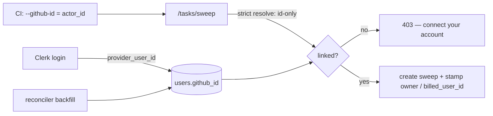

# GitHub-ID Linkage — Architecture (corrected after review)

Branch `feat/github-id-linkage-gate` (PR #559) · feeds Quotas PR #542.
Companion: [linkage-gate-review.md](linkage-gate-review.md) (bug details).

## Goal

1. **Connect** — a GitHub account maps to one org user (`users.github_id`).
2. **Gate** — a run passing a `github_id` not connected to any org user → **403**, always, independent of `quota_mode`.
3. **Attribute** — quota bills each run to the user the `github_id` resolves to.

Why `github_id`, not the handle: handles get renamed, the numeric id never does, and CI hands it to you natively (`${{ github.actor_id }}`). Anti-spoofing is a non-goal — the gate checks *linkage*, not *ownership*.

## Design

| Layer | Where | Rule |
|---|---|---|
| **Store** | `backend/models.py`, migration `g1h2i3j4k5l6` | `users.github_id`, unique + indexed per org |
| **Capture** | `backend/auth/provisioning.py` | Clerk `provider_user_id` → `github_id` at login, via `_set_github_id_if_absent` (org collision guard; inactive rows release their id) |
| **Catch-up** | `backend/backfill_github_id.py` ← reconciler | the **only** background fill: 200 users/sweep, throttled, keyset-paged |
| **Transport** | `oddish` CLI `--github-id` → `TaskSweepSubmission.github_id` | CI passes `github.actor_id` |
| **Gate** | `backend/api/routers/tasks.py` sweep routes | `github_id` supplied + strict-resolve = no user → **403 before any rows are written** |
| **Resolve** | `task_submission.py` `_resolve_connected_user` | **strict**: id supplied → id-only lookup; handle fallback *only* when no id sent; duplicate handle → no owner |
| **Pre-flight** | `GET /github/linkage` | plain read of stored state; Action UX only, never the authority |
| **Attribute** | Quotas #542 S2/S5 | `billed_user_id` from the same resolution; unattributed → 403 under enforce |

## Fix plan (vs. what's on the branch today)

| # | Change | Files | Fixes |
|---|---|---|---|
| **F1** | Strict resolver: id supplied → id-only, no handle fallback | `task_submission.py` (+ tests) | review bug 1 |
| **F2** | Server-side 403 gate on `/tasks/sweep` + `/batch`, pre-insert, quota-independent; CLI renders the detail | `tasks.py`, `oddish/cli/api.py` (+ tests) | review bug 2 |
| **F3** | `GET /github/linkage` → plain read (drop org-wide Clerk fan-out + write side effects) | `github_linkage.py` (+ tests) | review bugs 3, 5 |
| **F4** | Inactive clash rows release their `github_id` so rejoining users can relink | `provisioning.py` (+ tests) | review bug 4 |

## Accepted tradeoffs

- **Unbackfilled window**: a pre-deploy user who never re-logs-in is gated until the backfill reaches them (minutes–hours). The 403 message says so.
- **No ownership check**: passing someone else's `github_id` attributes to them. Accepted; the quota PR owns any billing-invariant tightening.
- **TOCTOU eliminated by construction**: the server gate is the authority; the Action pre-flight is cosmetic.
